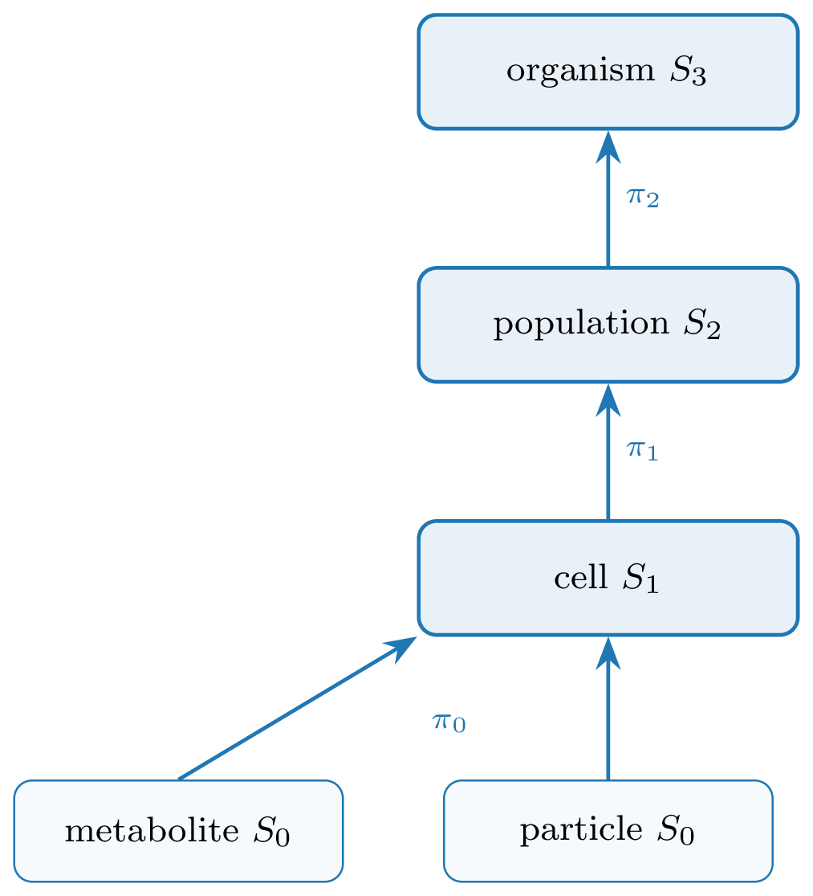

The container is built from two kinds of object — **sets** and **fields** — and
a small algebra of **operators** that move state between them. This is the
missing primitive: the place where particle mechanics, cellular interaction,
neural dynamics, and reaction networks all become the same kind of thing.

## Two entities: sets and fields

A **set** $S_k$ is a discrete collection of like entities at scale $k$ —
metabolites, particles, cells, populations, organisms. Adjacent scales are linked
by **parent maps**

$$\pi_k : S_k \longrightarrow S_{k+1},$$

where $\pi_k(x)$ is the higher-level object that contains $x$. A cell is built
from two kinds of $S_0$ entity — its **particles** (mechanics) and its
**metabolites** (chemistry) — and $\pi_0$ sends each of them to the cell it
belongs to, so $\pi_0(x)=c$ reads *"$x$ belongs to cell $c$"*. The constituents
of a given cell $c$ are its **fibre**, the set of everything that maps to $c$,

$$\pi_0^{-1}(c)=\{\,x\in S_0 : \pi_0(x)=c\,\},$$

so a cell simply *is* the collection of its particles and metabolites.

{width=58%}

A **field** $f:\Omega\to\mathbb{R}^q$ is a continuous quantity defined on its own
grid — morphogen concentration, pressure, substrate stiffness. Fields are *not*
part of the containment hierarchy: they neither contain nor are contained by
cells. Instead, each field is bound to exactly one set level through an
**exchange** relation (particle–grid transfer, cell sampling, or population-level
secretion and sensing); these couplings are the operators below.

## Four operators

A GNN is an **operator** $\mathcal{O}$ returning a time-derivative contribution,
dispatched by the relation it acts on. We use four kinds, one per relation the
container admits:

$$
\begin{aligned}
\textbf{Lateral}\quad   & \mathcal{O}_E,\ E\subseteq S_k\times S_k
  && \text{(ODE interaction } + \text{ graph Laplacian)}\\
\textbf{Aggregate}\ \uparrow\quad & \textstyle\sum_{\pi}: S_k \to S_{k+1}
  && \text{(reduction over fibres of } \pi)\\
\textbf{Broadcast}\ \downarrow\quad & \pi^{*}: S_{k+1}\to S_k
  && \text{(lift along } \pi)\\
\textbf{Exchange}\quad  & \mathcal{S},\mathcal{G}: S_k \leftrightarrow F
  && \text{(scatter / gather; bipartite)}
\end{aligned}
$$

Two pieces of notation: $S_k\times S_k$ is the set of all node *pairs*, so an
edge set $E\subseteq S_k\times S_k$ is simply a graph on $S_k$ — which nodes
interact (e.g. neighbours within a cutoff radius, or a fixed connectome). And
$\mathcal{S},\mathcal{G}$ are the two halves of a field coupling: *scatter*
$\mathcal{S}:S_k\to F$ writes object state into the field, while *gather*
$\mathcal{G}:F\to S_k$ reads it back.

**Lateral $\mathcal{O}_E$.** Message passing *within* one scale along the edges
$E$. It carries the within-scale physics: pairwise interactions (forces,
adhesion, signalling) plus a graph Laplacian that diffuses or smooths quantities
over the edges. Examples: particle–particle elasticity, cell–cell flocking or
adhesion, neuron–neuron signal propagation.

**Aggregate $\textstyle\sum_\pi$ (up).** Pools each parent's fibre into one
quantity — a cell's position is the mean of its particles, its metabolic state
the sum over its molecules. This is how fine-scale dynamics are summarised into,
and so move, the coarser object above.

**Broadcast $\pi^{*}$ (down).** The adjoint of Aggregate: it copies a parent's
state to every child in its fibre, so a decision taken at the cell level (a body
force, a polarity, a signalling output) is applied identically to all of that
cell's particles. Aggregate and Broadcast are a matched up/down pair on the same
map $\pi$.

**Exchange $\mathcal{S},\mathcal{G}$.** Couples a set to a field: scatter
$\mathcal{S}$ deposits/secretes object state into the field, gather $\mathcal{G}$
samples/senses the field back onto the objects. The relation is bipartite
(objects $\leftrightarrow$ grid); it is exactly the MPM particle–grid transfer
(P2G/G2P) and chemotactic secretion/sensing.

{width=100%}

## Dynamics: a schedule

A simulation is a multi-rate composition of operators, declared as a
`Schedule`. In math terms, one tick is the composition

$$\Phi=\mathcal{O}_n\circ\cdots\circ\mathcal{O}_1,$$

and the dynamics is its iteration $x_{t+1}=\Phi(x_t)$ — a discrete flow (with
"multi-rate" meaning some operators fire only on every $k$-th tick). Each operator
is **pure**: instead of editing the state in place, it only *returns its
contribution* — a delta $\Delta_i$ (a time-derivative term) for the sets it
touches. The schedule sums the deltas acting on each set and integrates once per
tick,

$$x_{t+1}=x_t+\Delta t\textstyle\sum_i\Delta_i.$$

Two consequences follow: several operators may act on the same set in one tick
(their deltas simply add — none overwrites another), and because nothing is
mutated in place, gradients flow through the sums and the integrator, so the
whole rollout stays **differentiable**. The LLM searches over schedules and
operator parameterizations — one well-defined action space instead of per-domain
code.

## Glossary

| Concept | Set/operator term | Symbol | Code |
|---|---|---|---|
| collection of like nodes | set (level) | $S_k$ | `Level` |
| a single node | element | $x\in S_k$ | row of `Level.state` |
| learnable per-node code | embedding | $a_i$ | `Level.embedding` |
| containment | partition | $\pi_k\!:\!S_k\!\to\!S_{k+1}$ | `Level.parent` |
| within-set links | relation | $E\subseteq S_k\times S_k$ | `Level.edge_index` |
| continuum quantity | field | $f:\Omega\to\mathbb{R}^c$ | `Field` |
| dynamics (GNN) | operator: ODE+Laplacian | $\mathcal{O}$ | `Operator` |
| within-set op | lateral | $\mathcal{O}_E$ | `Lateral` |
| up op | reduction over fibres | $\sum_\pi$ | `Aggregate` |
| down op | lift | $\pi^{*}$ | `Broadcast` |
| set $\leftrightarrow$ field op | transfer | $\mathcal{S},\mathcal{G}$ | `Exchange` |
| the container | hierarchy | $(S_\bullet,F_\bullet,\pi_\bullet)$ | `Hierarchy` |
| the model | composition of ops | $\mathcal{O}_n\!\circ\!\cdots\!\circ\!\mathcal{O}_1$ | `Schedule` |
