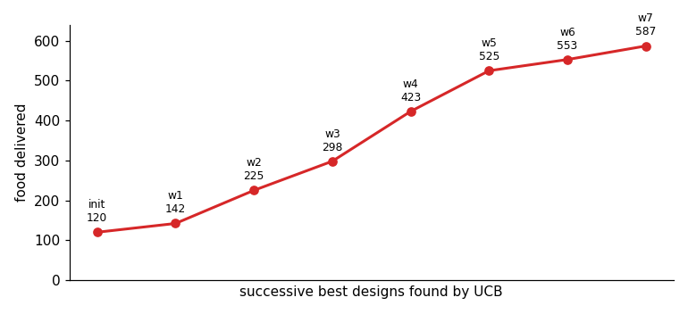

Once the vocabulary existed, qualitatively different behaviours were *just
different specs* over the same code — breadth comes from the intermediate
representation, not from new code. Each simulation is 100–600 cells of ~100
MLS-MPM particles (the two cell types in two colours over the shaded chemical
field). All simulations below use a **periodic** (toroidal) domain.

## Two simulations from one registry

Only the operator choices and their parameters differ; the engine, the
operators, and the schedule grammar are identical.

::: {layout-ncol=2}



:::

## Emergent ant trails

Adding the `trail` operator (a Physarum/Jones three-sensor rule: each ant samples
pheromone ahead-left / ahead / ahead-right and turns toward the strongest, while
`motility` drives it forward and `secrete` lays pheromone) yields self-reinforcing
trails that grow, are followed, and coarsen over long runs — classic stigmergy.



The full simulation:

```yaml
name: ant
seed: 0
n_frames: 1500
sets:
  cell:
    n: 150
    types: {soft: {fraction: 0.6, youngs: 60}, stiff: {fraction: 0.4, youngs: 300}}
  particle: {parent: cell, per_parent: 60, radius: 0.012}
fields:
  pheromone: {frame: grid, res: 160, diffusion: 0.02, decay: 0.04, couples_to: cell}
operators:
  - {op: motility, at: cell, speed: 300.0, rot: 0.06}            # persistent forward motion
  - {op: trail,  at: "cell[type=soft]", from: pheromone, turn: 0.4, sensor_dist: 0.04, sensor_angle: 0.5}
  - {op: secrete, at: "cell[type=soft]", to: pheromone, rate: 2.0}
  - {op: mpm, at: particle, n_grid: 128, substeps: 8, a_max: 1200, drag: 0.6}
schedule: [aggregate, trail, motility, secrete, pheromone.diffuse, mpm]
```

### Two variants, same code

Each variant is the same `trail` + `motility` + `secrete` code with a few
parameters changed (turn rate, sensor reach/angle, pheromone diffusion/decay,
deposit rate, rotational noise).

::: {layout-ncol=2}



:::

## Cells in a maze: foraging and optimization

A harder simulation exercises more of the language: two rigid cell populations
start at *home* (bottom-left), navigate a walled *maze* to *food* (top-right),
pick food up, and carry it back. It adds three constructs — `obstacles`, a
per-cell `loaded` state, and state-gated selectors (`cell[loaded=0]` seeks food,
`cell[loaded=1]` returns home) — and answers the design question *how does one
model an obstacle*: a wall is not a pairwise force but a **static occupancy mask
reused as a boundary condition** by machinery already present. The same mask
(i) zeroes the MPM grid velocity inside walls, so rigid cells cannot enter, and
(ii) imposes no-flux on field diffusion, so a chemical *routes around* the walls.
Two such fields — one sourced at food, one at home — become navigation gradients
that solve the maze; unloaded and loaded cells climb opposite ones.

### Optimizing the colony

Because the whole simulation is differentiable and the spec is tiny, the colony
can be *optimized*: search the behavioural parameters to deliver food as fast as
possible. The objective — units delivered — comes from a discrete
pick-up/drop-off and is therefore non-differentiable, so we use a black-box
**UCB** search over eight levers (motility speed and rotation, sense gain, MPM
drag and force cap, cell stiffness and size, colony size). Over a few dozen
simulations it improves delivery roughly five-fold.

This echoes the differentiable-simulator design literature, where a *smooth*
objective is optimized by gradients through the rollout; the general recipe is
**both** — UCB or CEM for the discrete and structural choices, and
gradient-through-rollout on a smooth surrogate for the continuous interior.

{width=72%}

The optimizer keeps a log of every accepted improvement, which is itself the
finding — it shows *what makes a good forager*:

| # | food | speed | gain | drag | rot | youngs | a_max | radius | $n$ |
|---|---|---|---|---|---|---|---|---|---|
| init | 120 | 40 | 180 | 2.00 | 0.30 | 550 | 700 | 0.01 | 60 |
| 1 | 142 | 74 | 379 | 2.54 | 0.10 | 517 | 454 | 0.02 | 46 |
| 2 | 225 | 106 | 253 | 1.25 | 0.31 | 36 | 599 | 0.01 | 88 |
| 3 | 298 | 83 | 270 | 0.97 | 0.48 | 78 | 1362 | 0.01 | 93 |
| 4 | 423 | 49 | 391 | 1.55 | 0.18 | 160 | 1438 | 0.01 | 106 |
| 5 | 525 | 21 | 341 | 2.99 | 0.40 | 24 | 1633 | 0.01 | 120 |
| 6 | 553 | 52 | 400 | 0.92 | 0.56 | 20 | 880 | 0.01 | 116 |
| 7 | 587 | 46 | 342 | 1.70 | 0.39 | 20 | 988 | 0.01 | 120 |

: The optimization log: the initial design and each significantly-better foraging design UCB found, with the eight tuned parameters. Food delivered rises from 120 to 587 (~5×).

Two parameters move monotonically to their bounds — the colony grows to its cap
($n\approx120$: more foragers deliver more food) and the cells soften to the
floor ($\text{youngs}\to20$: soft, deformable cells squeeze through the maze far
better than the rigid ones we started from). Chemotaxis stays strong throughout
($\text{gain}\sim340$–$400$) and the cell radius sits at its minimum (smaller
cells clear the gaps). The remaining knobs are traded off rather than maximized:
the best design (`winner_7`) is a balanced, moderate-speed, moderate-drag colony,
not any extreme. The headline is that the search rediscovered, with nothing
hand-coded, that a *large swarm of small, soft, strongly-chemotactic cells*
forages a maze best.

### Initial vs. optimized

The difference is visible in the trails themselves: the initial colony barely
establishes a route, whereas the optimized one lays a strong chemoattractant
highway that threads both maze gaps from home to food.

::: {layout-ncol=2}



:::

## Racing through pillars and a maze

Two harder navigation tasks reuse the same machinery and the same UCB optimizer.
In both, a colony must reach an exit line on the right; the score is how many
cells escape, and how fast. The behavioural levers — now including the three
`boids` weights (cohesion / align / separate) for collision avoidance — are tuned
exactly as the forager was, from a hand-set **initial** run to the best
**optimized** design found.

### Pillars (porous medium)

200 cells squeeze through a dense field of obstacles toward the exit, pulled by a
self-generated attractant gradient (cells consume it as they pass, sharpening the
gradient behind them). The optimizer learns the body-and-behaviour that threads
the gaps without jamming.





### Maze (self-generated gradient)

A walled labyrinth solved by the Tweedy *self-generated-gradient* mechanism:
cells consume a diffusing attractant, so dead ends deplete and cannot refill
while through-routes stay replenished — the colony effectively "sees around
corners". The optimizer drives the consumption rate, diffusion, and motility into
the band where this works.




