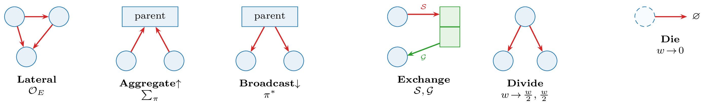

::: {.callout-note appearance="simple"}
**Operators adapted from prior work.** Plexus re-implements published simulation code
as registered operators: attraction–repulsion and boids from
[ParticleGraph](https://github.com/allierc/ParticleGraph); the slime-mould (Physarum)
agent from [Sebastian Lague's Slime-Simulation](https://github.com/SebLague/Slime-Simulation);
the field PDEs — reaction–diffusion, acoustics, Navier–Stokes, and active matter — from
[*The Well*](https://github.com/PolymathicAI/the_well) (Ohana et al., NeurIPS 2024); and
the ciliate microswimmer from
[Liu, Costello & Kanso](https://github.com/jingyiliu1900/Flow-Physics-drives-functional-design-of-microswimmers)
(*Nat. Commun.* 2025).
:::

Biology is not a single graph.

A graph fixes *one* kind of node and *one* kind of edge — particles and the
forces between them, cells and their contacts, neurons and synapses,
molecular species and reactions. Each existing framework commits to one such
graph and models that layer alone. But a living system is several of these at once, nested inside one
another: particles make up cells, and cells make up tissues and populations.
And every level is coupled to continuous fields — a morphogen gradient, a
pressure field, a chemical signal — that the discrete entities both shape and
read. Choose any single graph and you capture one slice — the couplings
*between* slices, where much of the biology lives, fall outside it.

Rather than building another domain-specific simulator, Plexus introduces a
common representation based on **hierarchical sets**, **continuous fields**, and
a small collection of **operators** acting between them. Cells contain particles
and metabolites. State moves through just four operators — **lateral** (within a
set), **aggregate** (upward), **broadcast** (downward), and **exchange** (between
sets and fields). Complex simulations emerge from composing a few primitive
operations.

{width=70% fig-align="center"}

## A language *and* a calculus — two layers that never touch

Plexus is two things at once, kept strictly apart:

- a **language** — a small, declarative *specification* (`spec.yaml`) that names
  the sets, fields, operators, and schedule of a system. This is *what* a living
  system is.
- a **calculus** — the registered operators and the engine that composes and
  integrates them. A simulation is a multi-rate composition of operators,
  declared as a `Schedule`; in math terms, one tick is the composition
  $\Phi = \mathcal{O}_n \circ \cdots \circ \mathcal{O}_1$, iterated as
  $x_{t+1}=\Phi(x_t)$ and kept differentiable throughout. This is *how* it
  evolves.

Both layers are built from **explicit, named primitives** — not the latent
variables a world model learns for prediction. And because those primitives are
explicit *and* differentiable, the same language serves prediction, inverse
inference, and the optimization of biological designs alike.

The two meet at exactly one place — the validated spec — and **never touch
directly**. The LLM owns everything *above* the spec (intent → specification);
the code owns everything *below* it (the operators). The LLM never writes engine
code; the engine never sees natural language. The spec is the contract between
them: small, typed, and human-auditable.

The practical payoff: a new behaviour is a new sentence in the language, not a
new program. A short prompt becomes a running, differentiable simulation **with
no code written** —

> **Prompt** — *"100 cells; the soft ones secrete a chemical and climb it, so
> they clump together; the stiff ones ignore it."*

the LLM compiles it to a specification:

```yaml
name: aggregate
sets:
  cell: {n: 100, types: {soft: {fraction: 0.5, youngs: 12}, stiff: {fraction: 0.5, youngs: 300}}}
  particle: {parent: cell, per_parent: 100, radius: 0.02}
fields:
  chemical: {frame: grid, res: 96, diffusion: 0.1, decay: 0.05, couples_to: cell}
operators:
  - {op: secrete, at: "cell[type=soft]", to: chemical, rate: 1.0}    # only soft cells make it
  - {op: sense,   at: "cell[type=soft]", from: chemical, gain: 150}  # only soft cells follow it
  - {op: mpm,     at: particle, n_grid: 128, a_max: 800, drag: 4}
schedule: [aggregate, secrete, chemical.diffuse, sense, mpm]
```

and the engine resolves each `op` against the registry and runs it — producing
the *aggregate* result shown below. No operator was written; the selector
`cell[type=soft]` did the work of "only the soft ones". The full grammar, the
compilation rules, and how the contract fails loudly on a bad spec are on the
**[LLM ↔ registry](methodology.qmd)** page.

## Re-converging four frameworks

Plexus re-converges four sibling frameworks that all forked from
[`ParticleGraph`](https://github.com/allierc/ParticleGraph) and then drifted —
each implements *one* graph type; a tissue needs them coexisting.

| Framework | Domain | Becomes (in Plexus) |
|---|---|---|
| **CellGraph** | collective cell interactions | `Lateral` operators @ cell level |
| **NeuralGraph** | neural / signalling networks | `Lateral` operators @ cell level |
| **MPMGraph** | tissue mechanics, deformable matter | `Exchange` (P2G/G2P) @ particle level |
| **MetabolismGraph** | bipartite reaction networks | `Exchange` (stoichiometry) @ molecule level |

## What it looks like

Qualitatively different collective behaviours, all produced from the *same code*
by changing only a ~20-line specification — no new software per phenomenon.

```{=html}
<style>
.home-2x2{display:grid;grid-template-columns:repeat(2,1fr);gap:1rem;max-width:660px;margin:1.3rem auto .5rem}
.home-2x2 figure{margin:0}
.home-2x2 video{width:100%;aspect-ratio:1/1;object-fit:cover;border-radius:8px;background:#000;display:block}
.home-2x2 figcaption{margin-top:.4rem;font-size:.85em;color:#666;line-height:1.3}
.home-2x2 figcaption b{color:#333}
</style>
<div class="home-2x2">
  <figure><video src="gallery/boids_16.mp4" autoplay loop muted playsinline preload="metadata"></video><figcaption><b>flocking</b> — boids move as one from local rules</figcaption></figure>
  <figure><video src="gallery/slime_filaments.mp4" autoplay loop muted playsinline preload="metadata"></video><figcaption><b>networks</b> — a self-organizing Physarum web</figcaption></figure>
  <figure><video src="gallery/ph_crown_splash.mp4" autoplay loop muted playsinline preload="metadata"></video><figcaption><b>fluids</b> — an MPM drop crowns on impact</figcaption></figure>
  <figure><video src="gallery/rd_worms.mp4" autoplay loop muted playsinline preload="metadata"></video><figcaption><b>fields</b> — a Gray–Scott reaction–diffusion pattern</figcaption></figure>
</div>
```

And because every simulation is differentiable, biological designs can be
*optimized*. Below, a foraging colony in a maze is tuned by a UCB algorithm —
from a hand-set design (left) to the best found (right), which delivers food
roughly five-fold faster.

::: {layout-ncol=2}



:::

The same recipe scales to harder navigation — a porous **pillar** field and a
walled **maze**, each crossed by a self-generated attractant gradient and tuned
by the same optimizer. Each is shown from its starting point to the optimized
colony (see [Simulations](experiment.qmd) for the full runs):









## Read the blueprint

This site distils a working prototype into a single blueprint, in four parts:

- **[The abstraction](abstraction.qmd)** — the missing primitive: a hierarchical
  graph container stated in the language of sets, fields, and four operators.
- **[LLM ↔ registry](methodology.qmd)** — the two-layer contract and the small
  declarative language that lets an LLM drive a registry of operators.
- **[Simulations](experiment.qmd)** — ten distinct simulations, an emergent
  ant-trail model, and a maze-foraging colony optimized end-to-end.
- **[Building Plexus](building.qmd)** — the proposed repository methodology and
  the invariants that hold the line.

A static version with full schematics and glossary is in
[`paper/plexus.pdf`](paper/plexus.pdf).
