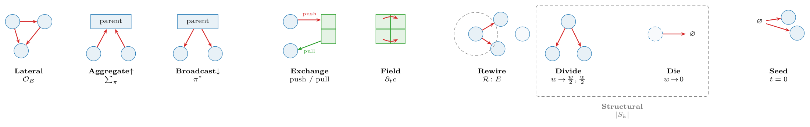

We introduce **Plexus**, a typed intermediate representation for biological
mechanisms. Rather than defining yet another simulator, Plexus defines a common
language whose primary objects are **biological operators**. Every operator specifies
the biological entities it acts upon, the states it requires, the relations between
these entities, and one or more numerical implementations. The Plexus research program
has three objectives. First, to define an **algebra of biological operators**. Second,
to **decompose the existing corpus** of simulation models into this common language.
Third, to construct **differentiable implementations** of these operators so that
mechanistic models can be directly inferred from biological data.

Just as compilers separate programming languages from their implementations
through an **intermediate representation**, Plexus separates biological mechanisms
from their numerical implementations. Every operator is defined by a **typed
signature** — *what* biological transformation it performs — and one or more
**implementations** — *how* it is numerically realized. The signature is the
biological contract; the implementation is a numerical choice.

Every operator may admit multiple implementations satisfying the same signature: a
mechanical interaction by Material Point Methods, finite elements, vertex or
phase-field models; a signalling operator by Hodgkin–Huxley equations, Neural ODEs
or graph neural networks. Because a mechanism is stated once, independently of its
solver, existing simulation frameworks become **complementary backends** implementing
a common intermediate representation rather than competing modelling paradigms.

## Four concepts, eight operators

The language is built around four fundamental concepts: **operators**, **sets**
(collections of biological entities across scales — proteins, cells, neurons,
synapses, tissues), the **states** each element carries, and **fields** (continuous
quantities defined over space — morphogens, pressure, potentials). A biological model
is a composition of operators acting on these objects.

The central hypothesis of Plexus is that a large fraction of existing biological
simulation models can be expressed as compositions of a small number of elementary
operator kinds. The proposed algebra consists of **eight**:

{width=100% fig-align="center"}

- **Lateral** — interactions within a biological set.
- **Aggregate ↑** and **Broadcast ↓** — many-to-one and one-to-many transformations
  across biological scales.
- **Exchange** — transformations between sets and fields.
- **Field** — a field's own dynamics: diffusion, decay, reaction.
- **Rewire** — modification of relations between biological entities.
- **Structural** — creation and removal of biological entities: **Divide** and **Die**.
- **Seed** — the initial state, written once and never again.

The first four kinds transform the state of a set and Field that of a field, all while
preserving the underlying organization; Rewire modifies the interaction graph; Structural
modifies the entities themselves; Seed writes what the others evolve. The full algebra — with typed signatures and the reference
implementation — is on **[The language](language.qmd)**.

## Composing mechanisms

Biological models are expressed as compositions of elementary operators. Plexus
represents a model as an ordered sequence of operator applications — a **schedule** —
specifying both the order and the frequency with which operators are evaluated.
Formally, one simulation step is the composition
$\Phi = \mathcal{O}_n \circ \cdots \circ \mathcal{O}_1$, whose repeated application
generates the system dynamics $x_{t+1}=\Phi(x_t)$. Different operators may evolve on
different time scales — mechanical interactions every step, diffusion, growth or
division less often — so a model is a *multi-rate* composition of biological
mechanisms rather than a monolithic solver.

Operators are **pure** transformations: rather than modifying state in place, each
returns its contribution $\Delta_i$ to the system evolution, and the complete update
$\Delta = \sum_i \Delta_i$ is passed to the numerical implementation. Introducing a
new mechanism is therefore adding a new operator to the schedule, never editing the
engine — and because nothing is mutated in place, gradients propagate through the
composition and the whole rollout stays **differentiable**.

## What it looks like

Qualitatively different dynamical systems, all expressed in the same operator
language. Each clip below is a single `spec.yaml` over the identical operators and
schedule grammar — **hover (or tab to) a title to read the exact spec that generated
it.**

```{=html}
<style>
.sim-gallery{display:grid;grid-template-columns:repeat(auto-fill,minmax(230px,1fr));gap:1.1rem;margin:.6rem 0 2.4rem}
.sim-gallery.g3{grid-template-columns:repeat(3,1fr)}
@media (max-width:560px){.sim-gallery.g3{grid-template-columns:repeat(2,1fr)}}
.sim-gallery.wide{grid-template-columns:1fr;max-width:900px;margin:.6rem auto 2.4rem}
.sim-gallery.wide .sim-card video{aspect-ratio:auto !important;height:auto !important;object-fit:contain !important}
.sim-card{margin:0}
.sim-card video{width:100%;border-radius:7px;background:#000;display:block;aspect-ratio:1/1;object-fit:cover}
.sim-card figcaption{margin-top:.4rem;line-height:1.3}
.sim-name{font-weight:600;cursor:help;position:relative;border-bottom:1px dotted #999}
.sim-cap{display:block;font-size:.84em;color:#777;margin-top:.12rem}
.sim-spec{display:none;position:absolute;left:0;top:1.5em;z-index:40;width:max(460px,150%);max-width:min(760px,88vw);max-height:440px;overflow:auto;
  background:#1e1e1e;border-radius:7px;box-shadow:0 8px 28px rgba(0,0,0,.4);padding:.5rem .7rem;text-align:left;cursor:auto}
.sim-name:hover .sim-spec,.sim-name:focus .sim-spec,.sim-name:focus-within .sim-spec{display:block}
.sim-spec pre{margin:0;font-size:.72em;line-height:1.3;white-space:pre-wrap;overflow-wrap:anywhere;color:#e9e9e9;background:none;border:none;padding:0}
.opk{font-size:.8em;color:#888;margin-bottom:.2rem}
.opk-ref{font-size:.76em;color:#999;font-style:italic;margin:.1rem 0 .2rem}
</style>

<h3>Interaction &amp; flocking</h3>
<p class="opk">Lateral operators over a radius neighbour graph: a per-type force law (attraction–repulsion) and the three boids rules that sum to flocking.</p>
<p class="opk-ref">Reference — boids is <a href="https://doi.org/10.1145/37402.37406">Reynolds (1987), <i>SIGGRAPH Comput. Graph.</i> 21(4):25–34</a>, the soft-core pair potential is <a href="https://doi.org/10.1103/PhysRevLett.96.104302">D’Orsogna et&nbsp;al. (2006), <i>Phys. Rev. Lett.</i> 96:104302</a>, and the alignment model is <a href="https://doi.org/10.1103/PhysRevLett.75.1226">Vicsek et&nbsp;al. (1995), <i>Phys. Rev. Lett.</i> 75:1226–1229</a>; the implementations are adapted from <a href="https://github.com/allierc/ParticleGraph">ParticleGraph</a> (Allier et&nbsp;al.).</p>
<div class="sim-gallery">
  <figure class="sim-card">
    <video src="gallery/attraction.mp4" autoplay loop muted playsinline preload="metadata"></video>
    <figcaption>
      <span class="sim-name" tabindex="0">attraction–repulsion<span class="sim-spec"><pre># Full match to ParticleGraph arbitrary_3_1: 3 types, 30000 particles, sigma=0.005,
# max_radius=0.075, periodic, first_derivative, dt=0.1, 250 frames. Now feasible
# because attraction_repulsion runs on a radius neighbour graph (O(E)), not dense.
general:
  name: arbitrary_3
  seed: 0
  n_frames: 250
  dt: 0.1
  boundary: periodic

sets:
  particle:
    n: 30000
    types:
      t0: {fraction: 0.34, p: [1.6233, 1.0413, 1.6012, 1.5615]}
      t1: {fraction: 0.33, p: [1.7667, 1.8308, 1.0855, 1.9055]}
      t2: {fraction: 0.33, p: [1.7226, 1.7850, 1.0584, 1.8579]}

fields: {}

operators:
  - {op: radius_graph,         at: particle, radius: 0.075}
  - {op: attraction_repulsion, at: particle, sigma: 0.005}

schedule: [radius_graph, attraction_repulsion]

plotting:                      # render STYLE (read by plexus.plot; engine ignores it)
  background: black
  colormap: tab10
  point_size: 2.0

# --- auto: video descriptions (gemma-4-12B) ---
descriptions:
  movie_particle:
    description: The simulation begins with a dense, uniform distribution of multicolored particles across
      the entire field. Over time, the particles begin to aggregate into distinct, circular clusters with
      dark centers. These clusters grow in size and number as the particles organize into a cellular-like
      structure. By the final frame, the particles have formed a highly structured network of interconnected
      circular domains.
    objects: The scene contains thousands of tiny, individual particles in blue, green, and orange. These
      particles are initially scattered randomly but eventually form large, circular clusters. Each cluster
      features a dark, empty center surrounded by a dense ring of multicolored particles. The final topology
      consists of a repeating, honeycomb-like pattern of these interconnected circular structures.</pre></span></span>
      <span class="sim-cap">a Lateral interaction — a per-type force law sorts the types into cells</span>
    </figcaption>
  </figure>
  <figure class="sim-card">
    <video src="gallery/boids.mp4" autoplay loop muted playsinline preload="metadata"></video>
    <figcaption>
      <span class="sim-name" tabindex="0">boids<span class="sim-spec"><pre># Exact reproduction of ParticleGraph boids reference graphs_data/boids/boids:
# 1792 particles, 16 types (112 each), 4000 frames, min_radius=0.001,
# max_radius=0.04, dt=0.5, periodic, 2nd_derivative, mean aggregation.
# Per-type p = [cohesion, alignment, separation].
general:
  name: boids_16
  seed: 0
  n_frames: 16000
  dt: 0.5
  boundary: periodic

sets:
  particle:
    n: 1792
    vel_init: 0.0004
    types:
      t00:
        {
          fraction: 0.0625,
          cohesion: 27.600000381469727,
          alignment: 92.5,
          separation: 48.20000076293945,
        }
      t01:
        {
          fraction: 0.0625,
          cohesion: 32.0,
          alignment: 51.79999923706055,
          separation: 29.799999237060547,
        }
      t02:
        {
          fraction: 0.0625,
          cohesion: 23.600000381469727,
          alignment: 35.0,
          separation: 13.5,
        }
      t03:
        {
          fraction: 0.0625,
          cohesion: 3.299999952316284,
          alignment: 76.4000015258789,
          separation: 13.0,
        }
      t04:
        {
          fraction: 0.0625,
          cohesion: 94.0,
          alignment: 78.69999694824219,
          separation: 30.799999237060547,
        }
      t05:
        {
          fraction: 0.0625,
          cohesion: 81.4000015258789,
          alignment: 34.599998474121094,
          separation: 2.200000047683716,
        }
      t06:
        {
          fraction: 0.0625,
          cohesion: 3.0999999046325684,
          alignment: 40.5,
          separation: 17.0,
        }
      t07:
        {
          fraction: 0.0625,
          cohesion: 88.80000305175781,
          alignment: 7.199999809265137,
          separation: 29.799999237060547,
        }
      t08:
        {
          fraction: 0.0625,
          cohesion: 32.70000076293945,
          alignment: 76.80000305175781,
          separation: 26.100000381469727,
        }
      t09:
        {
          fraction: 0.0625,
          cohesion: 14.5,
          alignment: 56.79999923706055,
          separation: 27.600000381469727,
        }
      t10:
        {
          fraction: 0.0625,
          cohesion: 63.29999923706055,
          alignment: 99.9000015258789,
          separation: 13.899999618530273,
        }
      t11:
        {
          fraction: 0.0625,
          cohesion: 32.5,
          alignment: 25.200000762939453,
          separation: 24.399999618530273,
        }
      t12:
        {
          fraction: 0.0625,
          cohesion: 97.5999984741211,
          alignment: 56.5,
          separation: 12.100000381469727,
        }
      t13:
        {
          fraction: 0.0625,
          cohesion: 62.20000076293945,
          alignment: 9.100000381469727,
          separation: 28.299999237060547,
        }
      t14:
        {
          fraction: 0.0625,
          cohesion: 76.4000015258789,
          alignment: 52.900001525878906,
          separation: 32.0,
        }
      t15:
        {
          fraction: 0.0625,
          cohesion: 48.099998474121094,
          alignment: 54.400001525878906,
          separation: 30.700000762939453,
        }

fields: {}

operators:
  - { op: radius_graph, at: particle, radius: 0.04, min_radius: 0.001 }
  - { op: cohesion, at: particle } # boids decomposed: the three steering rules
  - { op: velocity_align, at: particle, per_type: true } # are separate operators; the engine sums them
  - { op: separation, at: particle }

schedule: [radius_graph, cohesion, velocity_align, separation]

plotting:
  background: black
  colormap: tab20
  point_size: 6.0

# --- auto: video descriptions (gemma-4-12B) ---
descriptions:
  movie_particle:
    description: The simulation begins with a dense, uniform distribution of multi-colored particles across
      a black background. Over time, the particles begin to aggregate into distinct, circular clusters
      of varying sizes. These clusters appear to form and dissolve dynamically, with some growing larger
      while others shrink or dissipate. By the final frame, the particles are organized into several prominent,
      high-density circular formations surrounded by a sparse field of individual dots.
    objects: The scene contains thousands of small, circular particles of uniform size. These particles
      are colored in a variety of hues, including white, red, blue, green, orange, and pink. Initially,
      the particles are arranged in a random, scattered topology across the entire frame. As the simulation
      progresses, they form dense, concentric circular clusters that stand out against the black background.</pre></span></span>
      <span class="sim-cap">three Lateral rules — cohesion, alignment, separation — compose into flocking</span>
    </figcaption>
  </figure>
  <figure class="sim-card">
    <video src="gallery/active_matter.mp4" autoplay loop muted playsinline preload="metadata"></video>
    <figcaption>
      <span class="sim-name" tabindex="0">active matter (Vicsek)<span class="sim-spec"><pre># vicsek_flock -- Vicsek active matter (radius_graph + alignment + cruise): low noise -&gt; polar order (phi-&gt;1)
# Reproduces a prototype/well active-matter regime. Refs: Vicsek et al., PRL 75 (1995);
# The Well (Ohana et al., NeurIPS 2024). Ordered flock.
general: {name: vicsek_flock, seed: 0, n_frames: 1200, dt: 0.25, boundary: periodic}
sets:
  particle:
    n: 2000
    vel_init: 0.005
fields: {}
operators:
  - {op: radius_graph, at: particle, radius: 0.05}
  - {op: velocity_align,    at: particle, a: 0.5}          # Vicsek nominal (gate=none, per_type=false)
  - {op: velocity_cruise,  at: particle, v0: 0.005, noise: 0.001, chirality: 0.0}
schedule: [radius_graph, velocity_align, velocity_cruise]
plotting:
  background: black
  marker: triangle
  triangle_size: 0.01
  colormap: tab10

# --- auto: video descriptions (gemma-4-12B) ---
descriptions:
  movie_particle:
    description: The simulation shows a collection of blue triangular particles moving in a complex, fluid-like
      motion. Over time, the particles form swirling patterns and dense clusters that shift and evolve
      across the black background. The flow exhibits turbulent characteristics, with some areas showing
      high concentration and others remaining sparse. The overall movement suggests a dynamic system governed
      by collective behavior or fluid dynamics.
    objects: The scene contains numerous small, blue triangular particles distributed across a black field.
      These particles are arranged in irregular, swirling clusters and elongated filaments that suggest
      a flow field. Each individual triangle is uniform in size and color, providing a consistent visual
      representation of the data. The topology of the objects changes as they aggregate into dense regions
      and disperse into more scattered formations.</pre></span></span>
      <span class="sim-cap">a Lateral alignment operator — self-propelled agents order into a polar swarm</span>
    </figcaption>
  </figure>
</div>

<h3>Turing — Gray–Scott reaction–diffusion</h3>
<p class="opk">Reaction–diffusion on the cell–cell adjacency graph (<code>graph_diffuse</code> → <code>react</code>) — Turing's two-species activator–inhibitor system, on a 2D cell disc: the coral regime, a fine maze (small χ), and a diverging activator view (high → red, low → blue, balanced → white).</p>
<p class="opk-ref">Reference — the Gray–Scott system of <a href="https://doi.org/10.1016/0009-2509(83)80132-8">Gray &amp; Scott (1983), <i>Chem. Eng. Sci.</i> 38:29–43</a>, in the reaction–diffusion form and parameter map of <a href="https://doi.org/10.1126/science.261.5118.189">Pearson (1993), <i>Science</i> 261:189–192</a>; the Brusselator is <a href="https://doi.org/10.1063/1.1668896">Prigogine &amp; Lefever (1968), <i>J. Chem. Phys.</i> 48:1695–1700</a>.</p>
<div class="sim-gallery g3">
  <figure class="sim-card">
    <video src="gallery/turing_coral.mp4" autoplay loop muted playsinline preload="metadata"></video>
    <figcaption>
      <span class="sim-name" tabindex="0">coral<span class="sim-spec"><pre>general:
  name: turing2d_coral
  seed: 0
  n_frames: 6000
  dt: 1.0
  boundary: free
  dim: 2
  world:
  - 49.4
  - 49.4
sets:
  cell:
    n: 4000
    state:
      chem:
        width: 2
        integration: first_order
        boundary: free
      xyz:
        width: 2
        integration: none
        boundary: free
fields: {}
operators:
- op: aggregate_seed
  at: cell
  mode: disc
  radius: 19.0
  k: 6
  seed_frac: 0.12
  before_frame: 1
- op: graph_diffuse
  at: cell
  d_a: 0.08
  d_h: 0.16
  chi: 0.4
- op: react
  at: cell
  implementation: gray_scott
  F: 0.055
  kk: 0.062
schedule:
- aggregate_seed
- graph_diffuse
- react</pre></span></span>
      <span class="sim-cap">graph-diffusion + reaction — the coral regime (F=0.055)</span>
    </figcaption>
  </figure>
  <figure class="sim-card">
    <video src="gallery/turing_chi_small.mp4" autoplay loop muted playsinline preload="metadata"></video>
    <figcaption>
      <span class="sim-name" tabindex="0">fine maze (χ=0.2)<span class="sim-spec"><pre>general:
  name: turing2d_chi_small
  seed: 0
  n_frames: 6000
  dt: 1.0
  boundary: free
  dim: 2
  world:
  - 49.4
  - 49.4
sets:
  cell:
    n: 4000
    state:
      chem:
        width: 2
        integration: first_order
        boundary: free
      xyz:
        width: 2
        integration: none
        boundary: free
fields: {}
operators:
- op: aggregate_seed
  at: cell
  mode: disc
  radius: 19.0
  k: 6
  seed_frac: 0.12
  before_frame: 1
- op: graph_diffuse
  at: cell
  d_a: 0.08
  d_h: 0.16
  chi: 0.2
- op: react
  at: cell
  implementation: gray_scott
  F: 0.037
  kk: 0.06
schedule:
- aggregate_seed
- graph_diffuse
- react</pre></span></span>
      <span class="sim-cap">the same reaction (F=0.037) at half the diffusion coupling χ — a finer-wavelength maze</span>
    </figcaption>
  </figure>
  <figure class="sim-card">
    <video src="gallery/turing_two_species.mp4" autoplay loop muted playsinline preload="metadata"></video>
    <figcaption>
      <span class="sim-name" tabindex="0">two species<span class="sim-spec"><pre>general:
  name: turing2d_two_species
  seed: 0
  n_frames: 6000
  dt: 1.0
  boundary: free
  dim: 2
  world:
  - 49.4
  - 49.4
sets:
  cell:
    n: 4000
    state:
      chem:
        width: 2
        integration: first_order
        boundary: free
      xyz:
        width: 2
        integration: none
        boundary: free
fields: {}
operators:
- op: aggregate_seed
  at: cell
  mode: disc
  radius: 19.0
  k: 6
  seed_frac: 0.12
  before_frame: 1
- op: graph_diffuse
  at: cell
  d_a: 0.08
  d_h: 0.16
  chi: 0.4
- op: react
  at: cell
  implementation: gray_scott
  F: 0.039
  kk: 0.058
schedule:
- aggregate_seed
- graph_diffuse
- react</pre></span></span>
      <span class="sim-cap">Turing's activator–inhibitor as a diverging map — activator high (red), low (blue), balanced (white)</span>
    </figcaption>
  </figure>
</div>

<h3>Epithelial mechanics — a true vertex model</h3>
<p class="opk">An explicit vertex model, via <b>Tyssue</b>. Unlike a self-propelled Voronoi tissue (each cell a single point), here cells are polygons that <b>share junction vertices</b>, and those junction vertices — not the cell centres — are the mechanical degrees of freedom. An area + line-tension shape energy (<code>shape_energy</code>) relaxes the mesh toward force balance, with growth, division and cell death as explicit operations on the mesh.</p>
<p class="opk-ref">Reference — active vertex model after Farhadifar et&nbsp;al. (2007), on the space-filling polyhedra of Honda et&nbsp;al. (2004), and the T1 exchanges are the reversible network reconnection of <a href="https://doi.org/10.1007/s10237-012-0430-7">Okuda et&nbsp;al. (2013), <i>Biomech. Model. Mechanobiol.</i> 12:627–644</a>.</p>
<div class="sim-gallery g3">
  <figure class="sim-card">
    <video src="gallery/tyssue_spheroid_00.mp4" autoplay loop muted playsinline preload="metadata"></video>
    <figcaption>
      <span class="sim-name" tabindex="0">grow &amp; divide<span class="sim-spec"><pre>what: &#x27;the epithelium of the nominal run, alone: no basement membrane, no matrix,
  no adhesion&#x27;
tissue_cache: log/okuda_ECM/_tissue/cellfix_B_new_f401_x4_2cedf4bcc6.npz
grown_for: 153_nominal_material_E100
pass1:
  frames: 401
  buffer_x: 4
  myosin: 1.0
  name: cellfix_B_new
operators_exercised:
- seed_mesh_3d
- cell_geometry_3d
- grow_3d
- shape_energy_3d
- divide_3d
- reconnect_t1_3d
- topo_snapshot_3d
drawn_frames: 200
measures:
- n_cells
- r_apical
- r_eq/r_ax
- t1 rate</pre></span></span>
      <span class="sim-cap">the vertex model on its own: 200 cells and 396 vertices to 6,076 and ~12,000 over 402 frames, the apical radius x3.56 and the shell still round (aspect 1.02), through 1,384 T1 neighbour exchanges. 3D first, then the true cross-section -- one cell deep, hollow</span>
    </figcaption>
  </figure>
  <figure class="sim-card">
    <video src="gallery/tyssue_apoptose.mp4" autoplay loop muted playsinline preload="metadata"></video>
    <figcaption>
      <span class="sim-name" tabindex="0">apoptosis<span class="sim-spec"><pre>general:   # run-level settings
  name: tyssue_apop_apoptose   # run name (-&gt; archive/&lt;name&gt;/)
  seed: 0   # RNG seed
  n_frames: 150   # number of simulation frames
  dt: 1.0   # time step (a label: the bounded-Euler relaxation is per-frame)
  boundary: free   # domain boundary (free = unbounded; border vertices are pinned)
  dim: 2   # spatial dimension
  world:   # world box size
  - 13.0
  - 14.0
sets:   # the biological SETS (Levels) of the model
  vertex:   # VERTEX set: mesh-vertex positions -- the mechanical DOF
    n: 142   # buffer size (max elements)
fields: {}   # continuous fields
operators:   # the operators to instantiate (each realises one mechanism)
- op: mesh_seed   # build the honeycomb half-edge mesh on the vertex set (frame 0)
  at: vertex   # the set this operator acts on
  nx: 9   # lattice columns (cell centres)
  ny: 10   # lattice rows
  a: 1.0   # cell spacing (sets the base cell size)
  border: 1   # rings of border cells to drop (their vertices are pinned)
  jitter: 0.12   # initial positional disorder
  p0: 3.72   # target shape index -- the rigidity knob (&lt; ~3.81 solid, &gt; ~3.81 fluid)
  seed: 0   # RNG seed
  before_frame: 1   # run this operator once, before the given frame
- op: shape_energy   # AVM shape-energy force on the vertices (bounded Euler); reads target area a0 from the cell set
  at: vertex   # the set this operator acts on
  p0: 3.72   # target shape index -- the rigidity knob (&lt; ~3.81 solid, &gt; ~3.81 fluid)
  K_A: 1.0   # area-elasticity stiffness
  K_P: 1.0   # perimeter-elasticity stiffness
  Lambda: 0.12
  Gamma: 0.05
  mu: 1.0   # mobility (overdamped)
  dt: 1.0   # time step (a label: the bounded-Euler relaxation is per-frame)
  relax_iters: 8   # inner bounded-Euler relaxation steps per frame
  eta: 0.08   # relaxation step size
  cap_frac: 0.15   # max per-step move as a fraction of mean edge (the stability cap)
- op: apoptosis
  at: vertex   # the set this operator acts on
  cells:
  - 24
  shrink_rate: 0.03
  critical_frac: 0.45
  a0_base: 0.8660254037844386   # base target area (the reset value after division)
  p0: 3.72   # target shape index -- the rigidity knob (&lt; ~3.81 solid, &gt; ~3.81 fluid)
- op: t1_transition   # reversible T1 neighbour swaps: reconnect edges shorter than l_th
  at: vertex   # the set this operator acts on
  l_th: 0.16   # T1 threshold: an edge shorter than this reconnects
  p0: 3.72   # target shape index -- the rigidity knob (&lt; ~3.81 solid, &gt; ~3.81 fluid)
  every: 2   # run this operator every N frames
- op: topo_snapshot   # record the per-tick topology so a movie can be rendered
  at: vertex   # the set this operator acts on
schedule:   # the order the operators run each frame
- mesh_seed
- shape_energy
- apoptosis
- t1_transition
- topo_snapshot</pre></span></span>
      <span class="sim-cap">programmed cell death — targeted cells shrink out of the sheet and their neighbours close the gap</span>
    </figcaption>
  </figure>
  <figure class="sim-card">
    <video src="gallery/tyssue_morphogen_bulge.mp4" autoplay loop muted playsinline preload="metadata"></video>
    <figcaption>
      <span class="sim-name" tabindex="0">morphogen bulge<span class="sim-spec"><pre>general:   # run-level settings
  name: tyssue_cell_morphogen_bulge   # run name (-&gt; archive/&lt;name&gt;/)
  seed: 0   # RNG seed
  n_frames: 120   # number of simulation frames
  dt: 1.0   # time step (a label: the bounded-Euler relaxation is per-frame)
  boundary: free   # domain boundary (free = unbounded; border vertices are pinned)
  dim: 2   # spatial dimension
  world:   # world box size
  - 20.0
  - 22.0
sets:   # the biological SETS (Levels) of the model
  vertex:   # VERTEX set: mesh-vertex positions -- the mechanical DOF
    n: 503   # buffer size (max elements)
  cell:   # CELL set: per-cell biological state (the plexus2 two-level hierarchy)
    n: 222   # buffer size (max elements)
    state:   # per-element state blocks (name: {width, integration})
      a0:   # target cell area (biological state; drives shape_energy)
        width: 1   # number of scalar columns in this state block
      chem:
        width: 2   # number of scalar columns in this state block
      ctype:   # cell type / fate (0 = wild-type, 1 = clone)
        width: 1   # number of scalar columns in this state block
      area:   # cell area (aggregate readout from vertices)
        width: 1   # number of scalar columns in this state block
      perim:   # cell perimeter (aggregate readout)
        width: 1   # number of scalar columns in this state block
      cen:   # cell centroid (aggregate readout)
        width: 2   # number of scalar columns in this state block
fields: {}   # continuous fields
operators:   # the operators to instantiate (each realises one mechanism)
- op: mesh_seed   # build the honeycomb half-edge mesh on the vertex set (frame 0)
  at: vertex   # the set this operator acts on
  nx: 16   # lattice columns (cell centres)
  ny: 18   # lattice rows
  a: 1.0   # cell spacing (sets the base cell size)
  border: 1   # rings of border cells to drop (their vertices are pinned)
  jitter: 0.1   # initial positional disorder
  p0: 3.72   # target shape index -- the rigidity knob (&lt; ~3.81 solid, &gt; ~3.81 fluid)
  seed: 0   # RNG seed
  before_frame: 1   # run this operator once, before the given frame
- op: cell_seed   # init the cell set from the mesh: one live cell/face, a0=base, type=0
  at: cell   # the set this operator acts on
  a: 1.0   # cell spacing (sets the base cell size)
  before_frame: 1   # run this operator once, before the given frame
- op: cell_geometry   # AGGREGATE vertices -&gt; per-cell area / perimeter / centroid (readouts)
  at: cell   # the set this operator acts on
- op: cell_morphogen
  at: cell   # the set this operator acts on
  amp: 1.0
  sigma: 1.5
  before_frame: 3   # run this operator once, before the given frame
- op: morphogen_growth
  at: cell   # the set this operator acts on
  g: 1.6
  rho: 1.0
  a_sw: 0.4
  hill_n: 4.0
  a0_base: 0.8660254037844386   # base target area (the reset value after division)
- op: shape_energy   # AVM shape-energy force on the vertices (bounded Euler); reads target area a0 from the cell set
  at: vertex   # the set this operator acts on
  p0: 3.72   # target shape index -- the rigidity knob (&lt; ~3.81 solid, &gt; ~3.81 fluid)
  K_A: 1.0   # area-elasticity stiffness
  K_P: 1.0   # perimeter-elasticity stiffness
  mu: 1.0   # mobility (overdamped)
  dt: 1.0   # time step (a label: the bounded-Euler relaxation is per-frame)
  relax_iters: 8   # inner bounded-Euler relaxation steps per frame
  eta: 0.08   # relaxation step size
  cap_frac: 0.15   # max per-step move as a fraction of mean edge (the stability cap)
schedule:   # the order the operators run each frame
- mesh_seed
- cell_seed
- cell_geometry
- cell_morphogen
- morphogen_growth
- shape_energy</pre></span></span>
      <span class="sim-cap">a morphogen raises the target area in a central patch, so the sheet bulges outward there</span>
    </figcaption>
  </figure>
</div>

<p class="opk">Cell death as a <b>sculptor</b>, not as cleanup. Death is one of the eight elementary operator families, and it was the only one this vesicle lacked: growth inflates and division subdivides, so every mechanism it owned pushed the surface <b>outward</b>. A dying cell shrinks, sheds its neighbours through T1 exchanges until it is a triangle, and is then extruded by a T2 collapse — the sheet closing over the gap by force balance alone. Cells marked to die are drawn <b>blue</b>. Removing 71&nbsp;% of the cells leaves the surface closed, Euler&nbsp;2, with no broken face.</p>
<p class="opk-ref">Reference — apoptotic force driving epithelial folding after Monier et&nbsp;al., <i>Nature</i> <b>518</b>:245 (2015).</p>
<div class="sim-gallery g3">
  <figure class="sim-card">
    <video src="gallery/apop_patch_big_v5.mp4" autoplay loop muted playsinline preload="metadata"></video>
    <figcaption>
      <span class="sim-name" tabindex="0">a dying big patch<span class="sim-spec"><pre>general:
  name: apop_patch_big
  seed: 0
  n_frames: 900
  dt: 1.0
  record_cap: 902
  record_every: 1
  boundary: free
  dim: 3
  world:
  - 80.0
  - 80.0
  - 80.0
_run:
  target_cells: 60000
  seed_cells: 2000
sets:
  vertex:
    n: 120000
  cell:
    n: 60000
    state:
      chem:
        width: 2
        integration: first_order
      cen:
        width: 3
      area:
        width: 1
fields: {}
operators:
- op: mesh_seed
  at: vertex
  cell_set: cell
  before_frame: 1
  n_cells: 2000
  seed: 0
  vseed_cv: 0.15
  radius: 5.0
  jitter: 0.15
  p0: 3.5
- op: cell_geometry
  at: cell
- op: cell_mechanics
  at: vertex
  K_A: 1.0
  K_P: 1.0
  K_V: 20.0
  K_R: 0.0
  Lambda: 0.5
  Gamma: 0.4
  p0: 3.5
  mu: 1.0
  dt: 1.0
  relax_iters: 30
  eta: 0.08
  cap_frac: 0.12
  K_bend: 0.0
  K_lumen: 0.0
- op: cell_die
  at: vertex
  cell_set: cell
  p0: 3.5
  mode: cone
  cone_deg: 45.0
  shrink_rate: 0.05
  critical_frac: 0.15
- op: edge_flip
  at: vertex
  l_th_frac: 0.28
  every: 1
  max_flips: 300
- op: topo_record
  at: vertex
  every: 1
schedule:
- mesh_seed
- cell_geometry
- cell_mechanics
- cell_die
- edge_flip
- topo_record
_basis:
  chem: none
  mat: static
  mech: plain
  grid: 4 chemistry x 2 material x 2 mechanics
  why: chemistry=none, material=static, mechanics=plain -- one cell of the basis grid
    written by make_basis.py; every value not on an axis is shared with the other
    fifteen.</pre></span></span>
      <span class="sim-cap">seen from the pole: 293 cells (blue) are marked to die, and the surface is drawn <b>inward</b> where they go — an invagination, the one deformation growth cannot make</span>
    </figcaption>
  </figure>
  <figure class="sim-card">
    <video src="gallery/apop_rings9_v5.mp4" autoplay loop muted playsinline preload="metadata"></video>
    <figcaption>
      <span class="sim-name" tabindex="0">nine dying rings<span class="sim-spec"><pre>general:
  name: apop_rings9
  seed: 0
  n_frames: 600
  dt: 1.0
  record_cap: 602
  record_every: 1
  boundary: free
  dim: 3
  world:
  - 80.0
  - 80.0
  - 80.0
_run:
  target_cells: 60000
  seed_cells: 2000
sets:
  vertex:
    n: 120000
  cell:
    n: 60000
    state:
      chem:
        width: 2
        integration: first_order
      cen:
        width: 3
      area:
        width: 1
fields: {}
operators:
- op: mesh_seed
  at: vertex
  cell_set: cell
  before_frame: 1
  n_cells: 2000
  seed: 0
  vseed_cv: 0.15
  radius: 5.0
  jitter: 0.15
  p0: 3.5
- op: cell_geometry
  at: cell
- op: cell_mechanics
  at: vertex
  K_A: 1.0
  K_P: 1.0
  K_V: 20.0
  K_R: 0.0
  Lambda: 0.5
  Gamma: 0.4
  p0: 3.5
  mu: 1.0
  dt: 1.0
  relax_iters: 30
  eta: 0.08
  cap_frac: 0.12
  K_bend: 0.0
  K_lumen: 0.0
- op: cell_die
  at: vertex
  cell_set: cell
  p0: 3.5
  mode: band
  band_deg: 4.0
  shrink_rate: 0.05
  critical_frac: 0.15
  n_bands: 9
- op: edge_flip
  at: vertex
  l_th_frac: 0.28
  every: 1
  max_flips: 300
- op: topo_record
  at: vertex
  every: 1
schedule:
- mesh_seed
- cell_geometry
- cell_mechanics
- cell_die
- edge_flip
- topo_record
_basis:
  chem: none
  mat: static
  mech: plain
  grid: 4 chemistry x 2 material x 2 mechanics
  why: chemistry=none, material=static, mechanics=plain -- one cell of the basis grid
    written by make_basis.py; every value not on an axis is shared with the other
    fifteen.</pre></span></span>
      <span class="sim-cap">895 deaths in nine bands: the vesicle does not fall apart, it closes over every gap and shrinks</span>
    </figcaption>
  </figure>
  <figure class="sim-card">
    <video src="gallery/apop_half_v5.mp4" autoplay loop muted playsinline preload="metadata"></video>
    <figcaption>
      <span class="sim-name" tabindex="0">half the sheet<span class="sim-spec"><pre>general:
  name: apopgeo_half
  seed: 0
  n_frames: 600
  dt: 1.0
  record_cap: 602
  record_every: 1
  boundary: free
  dim: 3
  world:
  - 80.0
  - 80.0
  - 80.0
_run:
  target_cells: 4000
  seed_cells: 400
sets:
  vertex:
    n: 8000
  cell:
    n: 4000
    state:
      chem:
        width: 2
        integration: first_order
      cen:
        width: 3
      area:
        width: 1
fields: {}
operators:
- op: mesh_seed
  at: vertex
  cell_set: cell
  before_frame: 1
  n_cells: 400
  seed: 0
  vseed_cv: 0.15
  radius: 5.0
  jitter: 0.15
  p0: 3.5
- op: cell_geometry
  at: cell
- op: cell_die
  at: vertex
  cell_set: cell
  p0: 3.5
  shrink_rate: 0.05
  critical_frac: 0.15
  min_age: 0
  mode: band
  band_deg: 45.0
  n_bands: 1
- op: cell_mechanics
  at: vertex
  K_A: 1.0
  K_P: 1.0
  K_V: 20.0
  K_R: 0.0
  Lambda: 0.5
  Gamma: 0.4
  p0: 3.5
  mu: 1.0
  dt: 1.0
  relax_iters: 30
  eta: 0.08
  cap_frac: 0.12
- op: edge_flip
  at: vertex
  l_th_frac: 0.28
  every: 1
  max_flips: 300
- op: topo_record
  at: vertex
  every: 1
schedule:
- mesh_seed
- cell_geometry
- cell_die
- cell_mechanics
- edge_flip
- topo_record
_apopgeo:
  geometry: half
  selector:
    mode: band
    band_deg: 45.0
    n_bands: 1
  why: death is the only mechanism in this composition, so the cell count can only
    fall and n_apop must equal 400 - cells_final exactly</pre></span></span>
      <span class="sim-cap">285 of 400 cells extruded — the topology survives, and what is left is an ellipsoid pulled from a sphere</span>
    </figcaption>
  </figure>
</div>

<h3>Vertex + Turing — patterning &amp; shaping a growing tissue</h3>
<p class="opk">Growth and reaction–diffusion on a deformable vertex shell: the tissue first proliferates by growth and division to a couple of thousand cells, then reaction–diffusion chemistry both <b>colours</b> the surface and <b>drives its shape</b> — each regime buckling the shell a different way.</p>
<p class="opk-ref">Reference — this is the experiment of <a href="https://www.nature.com/articles/s41598-018-20678-6">Okuda et&nbsp;al. (2018), <i>Sci. Rep.</i> 8:2386</a> — Turing patterning on a 3D vertex model — rebuilt as Plexus operators on the <a href="https://github.com/DamCB/tyssue">Tyssue</a> mesh; the chemistry is the Gray–Scott system cited in the Turing section above.</p>
<div class="sim-gallery g3">
  <figure class="sim-card">
    <video src="gallery/turing_grow_divide_v4.mp4" autoplay loop muted playsinline preload="metadata"></video>
    <figcaption>
      <span class="sim-name" tabindex="0">grow &amp; divide<span class="sim-spec"><pre>general:
  name: grow_divide
  seed: 0
  n_frames: 1800
  dt: 1.0
  record_cap: 1802
  record_every: 1
  boundary: free
  dim: 3
  world:
  - 80.0
  - 80.0
  - 80.0
_run:
  target_cells: 50000
  seed_cells: 2000
sets:
  vertex:
    n: 130004
  cell:
    n: 65004
    state:
      chem:
        width: 2
        integration: first_order
      cen:
        width: 3
      area:
        width: 1
fields: {}
operators:
- op: mesh_seed
  at: vertex
  cell_set: cell
  before_frame: 1
  n_cells: 2000
  radius: 5.0
  jitter: 0.15
  seed: 0
  vseed_cv: 0.15
  p0: 3.5
- op: cell_geometry
  at: cell
- op: cell_mechanics
  at: vertex
  p0: 3.5
  K_A: 1.0
  K_P: 1.0
  Gamma: 0.4
  Lambda: 0.5
  K_V: 20.0
  K_R: 0.0
  K_bend: 0.0
  K_lumen: 0.0
  antiinv: 0.0
  mu: 1.0
  dt: 1.0
  relax_iters: 30
  eta: 0.08
  cap_frac: 0.12
- op: edge_flip
  at: vertex
  l_th_frac: 0.28
  every: 1
  max_flips: 300
- op: cell_grow
  at: vertex
  cell_set: cell
  rate: 0.000866
  a_sw: 0.0
  hill: 4.0
  rho: 1.0
  vth_frac: 2.5
  after_frame: 100
  conserve_amount: false
- op: cell_divide
  at: vertex
  factor: 2.0
  reset_noise: 0.12
  cycle_cv: 0.15
  p0: 3.5
  every: 4
  cell_set: cell
  min_cycle: 4
  max_cycle: 1000000000
  after_frame: 100
  orient_iface: false
  orient_asw: 0.6
  g1_ramp: false
  engine_clock: true
- op: topo_record
  at: vertex
  every: 1
schedule:
- mesh_seed
- cell_geometry
- cell_mechanics
- edge_flip
- cell_grow
- cell_divide
- topo_record</pre></span></span>
      <span class="sim-cap">Growth that no morphogen gates, and division following it: 2,000 cells to 25,079, and the shell stays a sphere (reduced volume 1.00)</span>
    </figcaption>
  </figure>
  <figure class="sim-card">
    <video src="gallery/turing_coral_v4.mp4" autoplay loop muted playsinline preload="metadata"></video>
    <figcaption>
      <span class="sim-name" tabindex="0">coral<span class="sim-spec"><pre>general:
  name: r021_12
  seed: 0
  n_frames: 1800
  dt: 1.0
  record_cap: 1802
  record_every: 1
  boundary: free
  dim: 3
  world:
  - 80.0
  - 80.0
  - 80.0
_run:
  target_cells: 60000
  seed_cells: 2000
sets:
  vertex:
    n: 260004
  cell:
    n: 130004
    state:
      chem:
        width: 2
        integration: first_order
      cen:
        width: 3
      area:
        width: 1
fields: {}
operators:
- op: mesh_seed
  at: vertex
  cell_set: cell
  before_frame: 1
  n_cells: 2000
  seed: 0
  vseed_cv: 0.15
  radius: 5.0
  jitter: 0.15
  p0: 3.5
- op: cell_geometry
  at: cell
- op: cell_neighbours
  at: cell
- op: cell_chem_seed
  at: cell
  seed: 0
  before_frame: 3
  mode: scatter
  seed_frac: 0.06
- op: cell_chem_diffuse
  at: cell
  implementation: graph_laplacian
  d_a: 0.08
  d_h: 0.16
  chi: 1.3
- op: cell_chem_react
  at: cell
  model: gray_scott
  F: 0.046
  kk: 0.062
  rate: 1.0
- op: cell_chem_from_shape
  at: cell
  model: curvature
  vertex_set: vertex
  beta: 0.0
  F0: 0.046
  rate: 1.0
- op: cell_grow
  at: vertex
  cell_set: cell
  rate: 0.000866
  a_sw: 0.35
  hill: 4.0
  rho: 0.1
  vth_frac: 2.5
  after_frame: 100
  conserve_amount: false
- op: cell_mechanics
  at: vertex
  K_A: 1.0
  K_P: 1.0
  K_V: 20.0
  K_R: 0.0
  Lambda: 0.5
  Gamma: 0.4
  p0: 3.5
  mu: 1.0
  dt: 1.0
  relax_iters: 30
  eta: 0.08
  cap_frac: 0.12
  K_bend: 0.0
  K_lumen: 0.0
- op: cell_divide
  at: vertex
  cell_set: cell
  factor: 2.0
  cycle_cv: 0.15
  min_cycle: 4
  max_cycle: 1000000000
  p0: 3.5
  every: 4
  engine_clock: true
- op: edge_flip
  at: vertex
  l_th_frac: 0.28
  every: 1
  max_flips: 300
- op: topo_record
  at: vertex
  every: 1
schedule:
- mesh_seed
- cell_geometry
- cell_neighbours
- cell_chem_seed
- cell_chem_diffuse
- cell_chem_react
- cell_chem_from_shape
- cell_grow
- cell_mechanics
- cell_divide
- edge_flip
- topo_record
_basis:
  chem: gs
  mat: gated
  mech: plain
  death: false
  gate: soft
  hill: 4.0
  drive: lo
  rho_gated: 0.1
  grid: 4 chemistry x 2 material x 2 mechanics, + a death twin of each Route A base
  why: chemistry=gs, material=gated, mechanics=plain -- one cell of the basis grid
    written by make_basis.py; every value not on an axis is shared with the other
    fifteen.</pre></span></span>
      <span class="sim-cap">A Gray–Scott pattern riding a growing shell: red stripes wander across 4,199 cells and the shell stays round (protrusion peak 1.03)</span>
    </figcaption>
  </figure>
  <figure class="sim-card">
    <video src="gallery/turing_morphogen_v6.mp4" autoplay loop muted playsinline preload="metadata"></video>
    <figcaption>
      <span class="sim-name" tabindex="0">morphogen + growth<span class="sim-spec"><pre>general:
  name: r005_06
  seed: 0
  n_frames: 1800
  dt: 1.0
  record_cap: 1802
  record_every: 1
  boundary: free
  dim: 3
  world:
  - 80.0
  - 80.0
  - 80.0
_run:
  target_cells: 50000
  seed_cells: 2000
sets:
  vertex:
    n: 130004
  cell:
    n: 65004
    state:
      chem:
        width: 2
        integration: first_order
      cen:
        width: 3
      area:
        width: 1
fields: {}
operators:
- op: mesh_seed
  at: vertex
  cell_set: cell
  before_frame: 1
  n_cells: 2000
  radius: 5.0
  jitter: 0.15
  seed: 0
  vseed_cv: 0.15
  p0: 3.5
- op: cell_geometry
  at: cell
- op: cell_chem_seed
  at: cell
  mode: scatter
  n_spots: 1
  cone_deg: 8.0
  seed: 0
  before_frame: 3
  seed_frac: 0.06
- op: cell_neighbours
  at: cell
- op: cell_chem_diffuse
  at: cell
  implementation: graph_laplacian
  d_a: 0.08
  d_h: 0.16
  chi: 1.3
- op: cell_chem_react
  at: cell
  model: gray_scott
  rate: 0.5
  F: 0.023
  kk: 0.062
- op: cell_chem_from_shape
  at: cell
  model: curvature
  vertex_set: vertex
  beta: 0.5
  F0: 0.046
  rate: 1.0
- op: cell_grow
  at: vertex
  cell_set: cell
  rate: 0.000866
  a_sw: 0.35
  hill: 8.0
  rho: 0.1
  vth_frac: 2.5
  after_frame: 100
  conserve_amount: false
- op: cell_mechanics
  at: vertex
  p0: 3.5
  K_A: 1.0
  K_P: 1.0
  Gamma: 0.4
  Lambda: 0.5
  K_V: 20.0
  K_R: 0.0
  K_bend: 0.0
  K_lumen: 0.0
  antiinv: 0.0
  mu: 1.0
  dt: 1.0
  relax_iters: 30
  eta: 0.08
  cap_frac: 0.12
- op: interface_tension
  at: vertex
  cell_set: cell
  K_purse: 1.0
  a_sw: 0.6
  eta: 0.05
  iters: 4
  after_frame: 100
- op: edge_flip
  at: vertex
  l_th_frac: 0.28
  every: 1
  max_flips: 300
- op: cell_divide
  at: vertex
  factor: 2.0
  reset_noise: 0.12
  cycle_cv: 0.15
  p0: 3.5
  every: 4
  cell_set: cell
  min_cycle: 4
  max_cycle: 1000000000
  after_frame: 100
  orient_iface: false
  orient_asw: 0.6
  g1_ramp: false
  engine_clock: true
- op: topo_record
  at: vertex
  every: 1
schedule:
- mesh_seed
- cell_geometry
- cell_chem_seed
- cell_neighbours
- cell_chem_diffuse
- cell_chem_react
- cell_chem_from_shape
- cell_grow
- cell_mechanics
- interface_tension
- edge_flip
- cell_divide
- topo_record
_discovery:
  comp_hash: C6959d539c0f
  structure:
    operators:
    - id: cell_chem_diffuse0
      op: cell_chem_diffuse
      impl: graph_laplacian
    - id: cell_chem_from_shape0
      op: cell_chem_from_shape
      impl: curvature
    - id: cell_chem_react0
      op: cell_chem_react
      impl: gray_scott
    - id: cell_chem_seed0
      op: cell_chem_seed
      impl: cone
    - id: cell_divide0
      op: cell_divide
      impl: hertwig
    - id: cell_geometry0
      op: cell_geometry
    - id: cell_grow0
      op: cell_grow
      impl: hill_conserve_amount
    - id: cell_mechanics0
      op: cell_mechanics
      impl: default
    - id: cell_neighbours0
      op: cell_neighbours
    - id: edge_flip0
      op: edge_flip
    - id: interface_tension0
      op: interface_tension
    - id: mesh_seed0
      op: mesh_seed
    connections:
    - src_op: cell_chem_react
      dst_op: cell_grow
      slot: gate
    - src_op: cell_chem_react
      dst_op: interface_tension
      slot: site
  region: emergent RD + purse-string
  defect_fixes:
  - D1 engine owns the clock (every=1)
  - D2 one global dt=1.0
  - D3 topo_snapshot every=1 == position stride</pre></span></span>
      <span class="sim-cap">Growth gated by the activator, and the arms grow where it sits: 4,764 cells with 6 of them counted as tubes, protrusion peak 1.52</span>
    </figcaption>
  </figure>
</div>


<!-- BEGIN vertex-turing-shapes (generated by discovery_okuda/ops/minisite_section.py) -->
<div class="sim-gallery g3">
  <figure class="sim-card">
    <video src="gallery/turing_flower_v3.mp4" autoplay loop muted playsinline preload="metadata"></video>
    <figcaption>
      <span class="sim-name" tabindex="0">purse-string, k = 0.062<span class="sim-spec"><pre>general:
  name: r013_05
  seed: 0
  n_frames: 1800
  dt: 1.0
  record_cap: 1802
  record_every: 1
  boundary: free
  dim: 3
  world:
  - 80.0
  - 80.0
  - 80.0
_run:
  target_cells: 50000
  seed_cells: 2000
sets:
  vertex:
    n: 130004
  cell:
    n: 65004
    state:
      chem:
        width: 2
        integration: first_order
      cen:
        width: 3
      area:
        width: 1
fields: {}
operators:
- op: mesh_seed
  at: vertex
  cell_set: cell
  before_frame: 1
  n_cells: 2000
  radius: 5.0
  jitter: 0.15
  seed: 0
  vseed_cv: 0.15
  p0: 3.5
- op: cell_geometry
  at: cell
- op: cell_chem_seed
  at: cell
  mode: scatter
  n_spots: 1
  cone_deg: 8.0
  seed: 0
  before_frame: 3
  seed_frac: 0.06
- op: cell_neighbours
  at: cell
- op: cell_chem_diffuse
  at: cell
  implementation: graph_laplacian
  d_a: 0.08
  d_h: 0.16
  chi: 1.3
- op: cell_chem_react
  at: cell
  model: gray_scott
  rate: 0.5
  F: 0.046
  kk: 0.062
- op: cell_chem_from_shape
  at: cell
  model: curvature
  vertex_set: vertex
  beta: 0.5
  F0: 0.046
  rate: 1.0
- op: cell_grow
  at: vertex
  cell_set: cell
  rate: 0.000866
  a_sw: 0.35
  hill: 4.0
  rho: 0.1
  vth_frac: 2.5
  after_frame: 100
  conserve_amount: false
- op: cell_mechanics
  at: vertex
  p0: 3.5
  K_A: 1.0
  K_P: 1.0
  Gamma: 0.4
  Lambda: 0.5
  K_V: 80.0
  K_R: 0.0
  K_bend: 0.02
  K_lumen: 0.5
  antiinv: 0.0
  mu: 1.0
  dt: 1.0
  relax_iters: 30
  eta: 0.08
  cap_frac: 0.12
- op: interface_tension
  at: vertex
  cell_set: cell
  K_purse: 1.0
  a_sw: 0.6
  eta: 0.05
  iters: 4
  after_frame: 100
- op: edge_flip
  at: vertex
  l_th_frac: 0.28
  every: 1
  max_flips: 300
- op: cell_divide
  at: vertex
  factor: 2.0
  reset_noise: 0.12
  cycle_cv: 0.15
  p0: 3.5
  every: 4
  cell_set: cell
  min_cycle: 4
  max_cycle: 1000000000
  after_frame: 100
  orient_iface: false
  orient_asw: 0.6
  g1_ramp: false
  engine_clock: true
- op: topo_record
  at: vertex
  every: 1
schedule:
- mesh_seed
- cell_geometry
- cell_chem_seed
- cell_neighbours
- cell_chem_diffuse
- cell_chem_react
- cell_chem_from_shape
- cell_grow
- cell_mechanics
- interface_tension
- edge_flip
- cell_divide
- topo_record
_discovery:
  comp_hash: Cec78a828e4a
  structure:
    operators:
    - id: cell_adjacency0
      op: cell_neighbours
    - id: cell_diffuse0
      op: cell_chem_diffuse
      impl: graph_laplacian
    - id: cell_geometry_3d0
      op: cell_geometry
    - id: cell_react0
      op: cell_chem_react
      impl: gray_scott
    - id: divide_3d0
      op: cell_divide
      impl: hertwig
    - id: grow_3d0
      op: cell_grow
      impl: hill_conserve_amount
    - id: interface_line_tension_3d0
      op: interface_tension
    - id: reconnect_t1_3d0
      op: edge_flip
    - id: seed_cell_rd0
      op: cell_chem_seed
      impl: cone
    - id: seed_mesh_3d0
      op: mesh_seed
    - id: shape_energy_3d0
      op: cell_mechanics
      impl: default
    - id: shape_to_chem0
      op: cell_chem_from_shape
      impl: curvature
    connections:
    - src_op: cell_chem_react
      dst_op: cell_grow
      slot: gate
    - src_op: cell_chem_react
      dst_op: interface_tension
      slot: site
  region: emergent RD + purse-string
  defect_fixes:
  - D1 engine owns the clock (every=1)
  - D2 one global dt=1.0
  - D3 topo_snapshot every=1 == position stride</pre></span></span>
      <span class="sim-cap">Eight arms from one activator: 12,201 cells, protrusion peak 1.41</span>
    </figcaption>
  </figure>
  <figure class="sim-card">
    <video src="gallery/turing_lobes_v3.mp4" autoplay loop muted playsinline preload="metadata"></video>
    <figcaption>
      <span class="sim-name" tabindex="0">purse-string, k = 0.031<span class="sim-spec"><pre>general:
  name: r016_01
  seed: 0
  n_frames: 1800
  dt: 1.0
  record_cap: 1802
  record_every: 1
  boundary: free
  dim: 3
  world:
  - 80.0
  - 80.0
  - 80.0
_run:
  target_cells: 50000
  seed_cells: 2000
sets:
  vertex:
    n: 130004
  cell:
    n: 65004
    state:
      chem:
        width: 2
        integration: first_order
      cen:
        width: 3
      area:
        width: 1
fields: {}
operators:
- op: mesh_seed
  at: vertex
  cell_set: cell
  before_frame: 1
  n_cells: 2000
  radius: 5.0
  jitter: 0.15
  seed: 0
  vseed_cv: 0.15
  p0: 3.5
- op: cell_geometry
  at: cell
- op: cell_chem_seed
  at: cell
  mode: scatter
  n_spots: 1
  cone_deg: 8.0
  seed: 0
  before_frame: 3
  seed_frac: 0.06
- op: cell_neighbours
  at: cell
- op: cell_chem_diffuse
  at: cell
  implementation: graph_laplacian
  d_a: 0.08
  d_h: 0.16
  chi: 1.3
- op: cell_chem_react
  at: cell
  model: gray_scott
  rate: 0.25
  F: 0.046
  kk: 0.031
- op: cell_chem_from_shape
  at: cell
  model: curvature
  vertex_set: vertex
  beta: 0.5
  F0: 0.023
  rate: 1.0
- op: cell_grow
  at: vertex
  cell_set: cell
  rate: 0.000866
  a_sw: 0.35
  hill: 4.0
  rho: 0.1
  vth_frac: 2.5
  after_frame: 100
  conserve_amount: false
- op: cell_mechanics
  at: vertex
  p0: 3.5
  K_A: 1.0
  K_P: 1.0
  Gamma: 0.4
  Lambda: 0.5
  K_V: 80.0
  K_R: 0.0
  K_bend: 0.02
  K_lumen: 0.5
  antiinv: 0.0
  mu: 1.0
  dt: 1.0
  relax_iters: 30
  eta: 0.08
  cap_frac: 0.12
- op: interface_tension
  at: vertex
  cell_set: cell
  K_purse: 1.0
  a_sw: 0.6
  eta: 0.05
  iters: 4
  after_frame: 100
- op: edge_flip
  at: vertex
  l_th_frac: 0.28
  every: 1
  max_flips: 300
- op: cell_divide
  at: vertex
  factor: 2.0
  reset_noise: 0.12
  cycle_cv: 0.15
  p0: 3.5
  every: 4
  cell_set: cell
  min_cycle: 4
  max_cycle: 1000000000
  after_frame: 100
  orient_iface: false
  orient_asw: 0.6
  g1_ramp: false
  engine_clock: true
- op: topo_record
  at: vertex
  every: 1
schedule:
- mesh_seed
- cell_geometry
- cell_chem_seed
- cell_neighbours
- cell_chem_diffuse
- cell_chem_react
- cell_chem_from_shape
- cell_grow
- cell_mechanics
- interface_tension
- edge_flip
- cell_divide
- topo_record
_discovery:
  comp_hash: Cec78a828e4a
  structure:
    operators:
    - id: cell_adjacency0
      op: cell_neighbours
    - id: cell_diffuse0
      op: cell_chem_diffuse
      impl: graph_laplacian
    - id: cell_geometry_3d0
      op: cell_geometry
    - id: cell_react0
      op: cell_chem_react
      impl: gray_scott
    - id: divide_3d0
      op: cell_divide
      impl: hertwig
    - id: grow_3d0
      op: cell_grow
      impl: hill_conserve_amount
    - id: interface_line_tension_3d0
      op: interface_tension
    - id: reconnect_t1_3d0
      op: edge_flip
    - id: seed_cell_rd0
      op: cell_chem_seed
      impl: cone
    - id: seed_mesh_3d0
      op: mesh_seed
    - id: shape_energy_3d0
      op: cell_mechanics
      impl: default
    - id: shape_to_chem0
      op: cell_chem_from_shape
      impl: curvature
    connections:
    - src_op: cell_chem_react
      dst_op: cell_grow
      slot: gate
    - src_op: cell_chem_react
      dst_op: interface_tension
      slot: site
  region: emergent RD + purse-string
  defect_fixes:
  - D1 engine owns the clock (every=1)
  - D2 one global dt=1.0
  - D3 topo_snapshot every=1 == position stride</pre></span></span>
      <span class="sim-cap">The same graph at half the Gray–Scott k, and it lobes and branches instead: 22,231 cells</span>
    </figcaption>
  </figure>
  <figure class="sim-card">
    <video src="gallery/turing_noline_v3.mp4" autoplay loop muted playsinline preload="metadata"></video>
    <figcaption>
      <span class="sim-name" tabindex="0">no purse-string<span class="sim-spec"><pre>general:
  name: r017_00_ctrl
  seed: 0
  n_frames: 1800
  dt: 1.0
  record_cap: 1802
  record_every: 1
  boundary: free
  dim: 3
  world:
  - 80.0
  - 80.0
  - 80.0
_run:
  target_cells: 50000
  seed_cells: 2000
sets:
  vertex:
    n: 130004
  cell:
    n: 65004
    state:
      chem:
        width: 2
        integration: first_order
      cen:
        width: 3
      area:
        width: 1
fields: {}
operators:
- op: mesh_seed
  at: vertex
  cell_set: cell
  before_frame: 1
  n_cells: 2000
  radius: 5.0
  jitter: 0.15
  seed: 0
  vseed_cv: 0.15
  p0: 3.5
- op: cell_geometry
  at: cell
- op: cell_chem_seed
  at: cell
  mode: scatter
  n_spots: 1
  cone_deg: 8.0
  seed: 0
  before_frame: 3
  seed_frac: 0.06
- op: cell_neighbours
  at: cell
- op: cell_chem_diffuse
  at: cell
  implementation: graph_laplacian
  d_a: 0.08
  d_h: 0.16
  chi: 1.3
- op: cell_chem_react
  at: cell
  model: gray_scott
  rate: 0.25
  F: 0.046
  kk: 0.031
- op: cell_chem_from_shape
  at: cell
  model: curvature
  vertex_set: vertex
  beta: 0.5
  F0: 0.046
  rate: 1.0
- op: cell_grow
  at: vertex
  cell_set: cell
  rate: 0.000866
  a_sw: 0.35
  hill: 4.0
  rho: 0.1
  vth_frac: 2.5
  after_frame: 100
  conserve_amount: false
- op: cell_mechanics
  at: vertex
  p0: 3.5
  K_A: 1.0
  K_P: 1.0
  Gamma: 0.4
  Lambda: 0.5
  K_V: 80.0
  K_R: 0.0
  K_bend: 0.02
  K_lumen: 0.5
  antiinv: 0.0
  mu: 1.0
  dt: 1.0
  relax_iters: 30
  eta: 0.08
  cap_frac: 0.12
- op: edge_flip
  at: vertex
  l_th_frac: 0.28
  every: 1
  max_flips: 300
- op: cell_divide
  at: vertex
  factor: 2.0
  reset_noise: 0.12
  cycle_cv: 0.15
  p0: 3.5
  every: 4
  cell_set: cell
  min_cycle: 4
  max_cycle: 1000000000
  after_frame: 100
  orient_iface: false
  orient_asw: 0.6
  g1_ramp: false
  engine_clock: true
- op: topo_record
  at: vertex
  every: 1
schedule:
- mesh_seed
- cell_geometry
- cell_chem_seed
- cell_neighbours
- cell_chem_diffuse
- cell_chem_react
- cell_chem_from_shape
- cell_grow
- cell_mechanics
- edge_flip
- cell_divide
- topo_record
_discovery:
  comp_hash: Cb1d43f47b83
  structure:
    operators:
    - id: cell_adjacency0
      op: cell_neighbours
    - id: cell_diffuse0
      op: cell_chem_diffuse
      impl: graph_laplacian
    - id: cell_geometry_3d0
      op: cell_geometry
    - id: cell_react0
      op: cell_chem_react
      impl: gray_scott
    - id: divide_3d0
      op: cell_divide
      impl: hertwig
    - id: grow_3d0
      op: cell_grow
      impl: hill_conserve_amount
    - id: reconnect_t1_3d0
      op: edge_flip
    - id: seed_cell_rd0
      op: cell_chem_seed
      impl: cone
    - id: seed_mesh_3d0
      op: mesh_seed
    - id: shape_energy_3d0
      op: cell_mechanics
      impl: default
    - id: shape_to_chem0
      op: cell_chem_from_shape
      impl: curvature
    connections:
    - src_op: cell_chem_react
      dst_op: cell_grow
      slot: gate
  region: growth-driven emergent (target mechanism)
  defect_fixes:
  - D1 engine owns the clock (every=1)
  - D2 one global dt=1.0
  - D3 topo_snapshot every=1 == position stride</pre></span></span>
      <span class="sim-cap">The interface tension removed, so growth acts alone: 5,511 cells and the longest arms of the three, peak 1.83</span>
    </figcaption>
  </figure>
</div>
<!-- END vertex-turing-shapes -->

<!-- BEGIN vertex-turing-rate (generated by discovery_okuda/ops/minisite_section.py) -->
<div class="sim-gallery g3">
  <figure class="sim-card">
    <video src="gallery/turing_folds_v3.mp4" autoplay loop muted playsinline preload="metadata"></video>
    <figcaption>
      <span class="sim-name" tabindex="0">reaction rate 0.75<span class="sim-spec"><pre>general:
  name: r020_01
  seed: 0
  n_frames: 1800
  dt: 1.0
  record_cap: 1802
  record_every: 1
  boundary: free
  dim: 3
  world:
  - 80.0
  - 80.0
  - 80.0
_run:
  target_cells: 50000
  seed_cells: 2000
sets:
  vertex:
    n: 130004
  cell:
    n: 65004
    state:
      chem:
        width: 2
        integration: first_order
      cen:
        width: 3
      area:
        width: 1
fields: {}
operators:
- op: mesh_seed
  at: vertex
  cell_set: cell
  before_frame: 1
  n_cells: 2000
  radius: 5.0
  jitter: 0.15
  seed: 0
  vseed_cv: 0.15
  p0: 3.5
- op: cell_geometry
  at: cell
- op: cell_chem_seed
  at: cell
  mode: scatter
  n_spots: 1
  cone_deg: 8.0
  seed: 0
  before_frame: 3
  seed_frac: 0.06
- op: cell_neighbours
  at: cell
- op: cell_chem_diffuse
  at: cell
  implementation: graph_laplacian
  d_a: 0.08
  d_h: 0.16
  chi: 1.3
- op: cell_chem_react
  at: cell
  model: gray_scott
  rate: 0.75
  F: 0.046
  kk: 0.031
- op: cell_chem_from_shape
  at: cell
  model: curvature
  vertex_set: vertex
  beta: 0.5
  F0: 0.046
  rate: 1.0
- op: cell_grow
  at: vertex
  cell_set: cell
  rate: 0.000866
  a_sw: 0.35
  hill: 4.0
  rho: 0.1
  vth_frac: 2.5
  after_frame: 100
  conserve_amount: false
- op: cell_mechanics
  at: vertex
  p0: 3.5
  K_A: 1.0
  K_P: 1.0
  Gamma: 0.4
  Lambda: 0.5
  K_V: 80.0
  K_R: 0.0
  K_bend: 0.02
  K_lumen: 0.5
  antiinv: 0.0
  mu: 1.0
  dt: 1.0
  relax_iters: 30
  eta: 0.08
  cap_frac: 0.12
- op: edge_flip
  at: vertex
  l_th_frac: 0.28
  every: 1
  max_flips: 300
- op: cell_divide
  at: vertex
  factor: 2.0
  reset_noise: 0.12
  cycle_cv: 0.15
  p0: 3.5
  every: 4
  cell_set: cell
  min_cycle: 4
  max_cycle: 1000000000
  after_frame: 100
  orient_iface: false
  orient_asw: 0.6
  g1_ramp: false
  engine_clock: true
- op: topo_record
  at: vertex
  every: 1
schedule:
- mesh_seed
- cell_geometry
- cell_chem_seed
- cell_neighbours
- cell_chem_diffuse
- cell_chem_react
- cell_chem_from_shape
- cell_grow
- cell_mechanics
- edge_flip
- cell_divide
- topo_record
_discovery:
  comp_hash: Cb1d43f47b83
  structure:
    operators:
    - id: cell_adjacency0
      op: cell_neighbours
    - id: cell_diffuse0
      op: cell_chem_diffuse
      impl: graph_laplacian
    - id: cell_geometry_3d0
      op: cell_geometry
    - id: cell_react0
      op: cell_chem_react
      impl: gray_scott
    - id: divide_3d0
      op: cell_divide
      impl: hertwig
    - id: grow_3d0
      op: cell_grow
      impl: hill_conserve_amount
    - id: reconnect_t1_3d0
      op: edge_flip
    - id: seed_cell_rd0
      op: cell_chem_seed
      impl: cone
    - id: seed_mesh_3d0
      op: mesh_seed
    - id: shape_energy_3d0
      op: cell_mechanics
      impl: default
    - id: shape_to_chem0
      op: cell_chem_from_shape
      impl: curvature
    connections:
    - src_op: cell_chem_react
      dst_op: cell_grow
      slot: gate
  region: growth-driven emergent (target mechanism)
  defect_fixes:
  - D1 engine owns the clock (every=1)
  - D2 one global dt=1.0
  - D3 topo_snapshot every=1 == position stride</pre></span></span>
      <span class="sim-cap">Chemistry fast against growth: the shell folds rather than forming arms, and carries 24,661 cells</span>
    </figcaption>
  </figure>
  <figure class="sim-card">
    <video src="gallery/turing_arms_v3.mp4" autoplay loop muted playsinline preload="metadata"></video>
    <figcaption>
      <span class="sim-name" tabindex="0">reaction rate 0.5<span class="sim-spec"><pre>general:
  name: r019_02
  seed: 0
  n_frames: 1800
  dt: 1.0
  record_cap: 1802
  record_every: 1
  boundary: free
  dim: 3
  world:
  - 80.0
  - 80.0
  - 80.0
_run:
  target_cells: 50000
  seed_cells: 2000
sets:
  vertex:
    n: 130004
  cell:
    n: 65004
    state:
      chem:
        width: 2
        integration: first_order
      cen:
        width: 3
      area:
        width: 1
fields: {}
operators:
- op: mesh_seed
  at: vertex
  cell_set: cell
  before_frame: 1
  n_cells: 2000
  radius: 5.0
  jitter: 0.15
  seed: 0
  vseed_cv: 0.15
  p0: 3.5
- op: cell_geometry
  at: cell
- op: cell_chem_seed
  at: cell
  mode: scatter
  n_spots: 1
  cone_deg: 8.0
  seed: 0
  before_frame: 3
  seed_frac: 0.06
- op: cell_neighbours
  at: cell
- op: cell_chem_diffuse
  at: cell
  implementation: graph_laplacian
  d_a: 0.08
  d_h: 0.16
  chi: 1.3
- op: cell_chem_react
  at: cell
  model: gray_scott
  rate: 0.5
  F: 0.046
  kk: 0.031
- op: cell_chem_from_shape
  at: cell
  model: curvature
  vertex_set: vertex
  beta: 0.5
  F0: 0.046
  rate: 1.0
- op: cell_grow
  at: vertex
  cell_set: cell
  rate: 0.000866
  a_sw: 0.35
  hill: 4.0
  rho: 0.1
  vth_frac: 2.5
  after_frame: 100
  conserve_amount: false
- op: cell_mechanics
  at: vertex
  p0: 3.5
  K_A: 1.0
  K_P: 1.0
  Gamma: 0.4
  Lambda: 0.5
  K_V: 80.0
  K_R: 0.0
  K_bend: 0.02
  K_lumen: 0.5
  antiinv: 0.0
  mu: 1.0
  dt: 1.0
  relax_iters: 30
  eta: 0.08
  cap_frac: 0.12
- op: edge_flip
  at: vertex
  l_th_frac: 0.28
  every: 1
  max_flips: 300
- op: cell_divide
  at: vertex
  factor: 2.0
  reset_noise: 0.12
  cycle_cv: 0.15
  p0: 3.5
  every: 4
  cell_set: cell
  min_cycle: 4
  max_cycle: 1000000000
  after_frame: 100
  orient_iface: false
  orient_asw: 0.6
  g1_ramp: false
  engine_clock: true
- op: topo_record
  at: vertex
  every: 1
schedule:
- mesh_seed
- cell_geometry
- cell_chem_seed
- cell_neighbours
- cell_chem_diffuse
- cell_chem_react
- cell_chem_from_shape
- cell_grow
- cell_mechanics
- edge_flip
- cell_divide
- topo_record
_discovery:
  comp_hash: Cb1d43f47b83
  structure:
    operators:
    - id: cell_adjacency0
      op: cell_neighbours
    - id: cell_diffuse0
      op: cell_chem_diffuse
      impl: graph_laplacian
    - id: cell_geometry_3d0
      op: cell_geometry
    - id: cell_react0
      op: cell_chem_react
      impl: gray_scott
    - id: divide_3d0
      op: cell_divide
      impl: hertwig
    - id: grow_3d0
      op: cell_grow
      impl: hill_conserve_amount
    - id: reconnect_t1_3d0
      op: edge_flip
    - id: seed_cell_rd0
      op: cell_chem_seed
      impl: cone
    - id: seed_mesh_3d0
      op: mesh_seed
    - id: shape_energy_3d0
      op: cell_mechanics
      impl: default
    - id: shape_to_chem0
      op: cell_chem_from_shape
      impl: curvature
    connections:
    - src_op: cell_chem_react
      dst_op: cell_grow
      slot: gate
  region: growth-driven emergent (target mechanism)
  defect_fixes:
  - D1 engine owns the clock (every=1)
  - D2 one global dt=1.0
  - D3 topo_snapshot every=1 == position stride</pre></span></span>
      <span class="sim-cap">A third slower, and the folds become thick arms — four of them counted as tubes, at 16,828 cells</span>
    </figcaption>
  </figure>
  <figure class="sim-card">
    <video src="gallery/turing_spikes_v3.mp4" autoplay loop muted playsinline preload="metadata"></video>
    <figcaption>
      <span class="sim-name" tabindex="0">rate 0.25, growth doubled<span class="sim-spec"><pre>general:
  name: r021_06
  seed: 1006
  n_frames: 1800
  dt: 1.0
  record_cap: 1802
  record_every: 1
  boundary: free
  dim: 3
  world:
  - 80.0
  - 80.0
  - 80.0
_run:
  target_cells: 50000
  seed_cells: 2000
sets:
  vertex:
    n: 130004
  cell:
    n: 65004
    state:
      chem:
        width: 2
        integration: first_order
      cen:
        width: 3
      area:
        width: 1
fields: {}
operators:
- op: mesh_seed
  at: vertex
  cell_set: cell
  before_frame: 1
  n_cells: 2000
  radius: 5.0
  jitter: 0.15
  seed: 1006
  vseed_cv: 0.15
  p0: 3.5
- op: cell_geometry
  at: cell
- op: cell_chem_seed
  at: cell
  mode: scatter
  n_spots: 1
  cone_deg: 8.0
  seed: 1006
  before_frame: 3
  seed_frac: 0.06
- op: cell_neighbours
  at: cell
- op: cell_chem_diffuse
  at: cell
  implementation: graph_laplacian
  d_a: 0.08
  d_h: 0.16
  chi: 1.3
- op: cell_chem_react
  at: cell
  model: gray_scott
  rate: 0.25
  F: 0.046
  kk: 0.031
- op: cell_chem_from_shape
  at: cell
  model: curvature
  vertex_set: vertex
  beta: 0.5
  F0: 0.046
  rate: 1.0
- op: cell_grow
  at: vertex
  cell_set: cell
  rate: 0.001732
  a_sw: 0.35
  hill: 4.0
  rho: 0.1
  vth_frac: 2.5
  after_frame: 100
  conserve_amount: false
- op: cell_mechanics
  at: vertex
  p0: 3.5
  K_A: 1.0
  K_P: 1.0
  Gamma: 0.4
  Lambda: 0.5
  K_V: 80.0
  K_R: 0.0
  K_bend: 0.02
  K_lumen: 0.5
  antiinv: 0.0
  mu: 1.0
  dt: 1.0
  relax_iters: 30
  eta: 0.08
  cap_frac: 0.12
- op: edge_flip
  at: vertex
  l_th_frac: 0.28
  every: 1
  max_flips: 300
- op: cell_divide
  at: vertex
  factor: 2.0
  reset_noise: 0.12
  cycle_cv: 0.15
  p0: 3.5
  every: 4
  cell_set: cell
  min_cycle: 4
  max_cycle: 1000000000
  after_frame: 100
  orient_iface: false
  orient_asw: 0.6
  g1_ramp: false
  engine_clock: true
- op: topo_record
  at: vertex
  every: 1
schedule:
- mesh_seed
- cell_geometry
- cell_chem_seed
- cell_neighbours
- cell_chem_diffuse
- cell_chem_react
- cell_chem_from_shape
- cell_grow
- cell_mechanics
- edge_flip
- cell_divide
- topo_record
_discovery:
  comp_hash: Cb1d43f47b83
  structure:
    operators:
    - id: cell_adjacency0
      op: cell_neighbours
    - id: cell_diffuse0
      op: cell_chem_diffuse
      impl: graph_laplacian
    - id: cell_geometry_3d0
      op: cell_geometry
    - id: cell_react0
      op: cell_chem_react
      impl: gray_scott
    - id: divide_3d0
      op: cell_divide
      impl: hertwig
    - id: grow_3d0
      op: cell_grow
      impl: hill_conserve_amount
    - id: reconnect_t1_3d0
      op: edge_flip
    - id: seed_cell_rd0
      op: cell_chem_seed
      impl: cone
    - id: seed_mesh_3d0
      op: mesh_seed
    - id: shape_energy_3d0
      op: cell_mechanics
      impl: default
    - id: shape_to_chem0
      op: cell_chem_from_shape
      impl: curvature
    connections:
    - src_op: cell_chem_react
      dst_op: cell_grow
      slot: gate
  region: growth-driven emergent (target mechanism)
  defect_fixes:
  - D1 engine owns the clock (every=1)
  - D2 one global dt=1.0
  - D3 topo_snapshot every=1 == position stride</pre></span></span>
      <span class="sim-cap">Slower still, with growth doubled: five long thin arms, 21,832 cells. This one reseeds as well, so it is the ratio that compares and not the shape</span>
    </figcaption>
  </figure>
</div>
<!-- END vertex-turing-rate -->

<!-- BEGIN vertex-turing-second-field (generated by discovery_okuda/ops/minisite_section.py) -->
<div class="sim-gallery g3">
  <figure class="sim-card">
    <video src="gallery/turing_death_v5.mp4" autoplay loop muted playsinline preload="metadata"></video>
    <figcaption>
      <span class="sim-name" tabindex="0">B kills<span class="sim-spec"><pre>general:
  name: tsd_max
  seed: 0
  n_frames: 1800
  dt: 1.0
  record_cap: 1802
  record_every: 1
  boundary: free
  dim: 3
  world:
  - 80.0
  - 80.0
  - 80.0
_run:
  target_cells: 50000
  seed_cells: 2000
sets:
  vertex:
    n: 130004
  cell:
    n: 65004
    state:
      chem:
        width: 4
        integration: first_order
      cen:
        width: 3
      area:
        width: 1
fields: {}
operators:
- op: mesh_seed
  at: vertex
  cell_set: cell
  before_frame: 1
  n_cells: 2000
  radius: 5.0
  jitter: 0.15
  seed: 0
  vseed_cv: 0.15
  p0: 3.5
- op: cell_geometry
  at: cell
- op: cell_chem_seed
  at: cell
  mode: scatter
  n_spots: 1
  cone_deg: 8.0
  seed: 0
  before_frame: 3
  seed_frac: 0.06
- op: cell_chem_seed
  at: cell
  before_frame: 3
  chan: 2
  mode: scatter
  seed_frac: 0.12
  seed: 7
- op: cell_neighbours
  at: cell
- op: cell_chem_diffuse
  at: cell
  implementation: graph_laplacian
  d_a: 0.08
  d_h: 0.16
  chi: 1.3
- op: cell_chem_diffuse
  at: cell
  implementation: graph_laplacian
  chan: 2
  d_a: 0.16
  d_h: 0.32
  chi: 1.3
- op: cell_chem_react
  at: cell
  model: gray_scott
  rate: 1.0
  F: 0.046
  kk: 0.062
- op: cell_chem_react
  at: cell
  model: gray_scott
  chan: 2
  F: 0.039
  kk: 0.058
  rate: 1.0
- op: cell_chem_from_shape
  at: cell
  model: curvature
  vertex_set: vertex
  beta: 0.5
  F0: 0.046
  rate: 1.0
- op: cell_grow
  at: vertex
  cell_set: cell
  rate: 0.000866
  a_sw: 0.35
  hill: 4.0
  rho: 0.2
  vth_frac: 2.5
  after_frame: 100
  conserve_amount: false
  chan: 0
- op: cell_die
  at: vertex
  cell_set: cell
  p0: 3.5
  mode: chem_low
  chan: 2
  a_sw: 0.25
  max_mark_frac: 0.25
  min_age: 4
  shrink_rate: 0.15
  critical_frac: 0.15
  after_frame: 180
- op: cell_mechanics
  at: vertex
  p0: 3.5
  K_A: 1.0
  K_P: 1.0
  Gamma: 0.4
  Lambda: 0.5
  K_V: 20.0
  K_R: 0.0
  K_bend: 0.0
  K_lumen: 0.0
  antiinv: 0.0
  mu: 1.0
  dt: 1.0
  relax_iters: 30
  eta: 0.08
  cap_frac: 0.12
- op: interface_tension
  at: vertex
  cell_set: cell
  K_purse: 1.0
  a_sw: 0.6
  eta: 0.05
  iters: 4
  after_frame: 100
- op: edge_flip
  at: vertex
  l_th_frac: 0.28
  every: 1
  max_flips: 300
- op: cell_divide
  at: vertex
  factor: 2.0
  cycle_cv: 0.15
  p0: 3.5
  every: 4
  cell_set: cell
  min_cycle: 4
  max_cycle: 1000000000
  after_frame: 100
  orient_iface: false
  orient_asw: 0.6
  g1_ramp: false
  engine_clock: true
- op: topo_record
  at: vertex
  every: 1
schedule:
- mesh_seed
- cell_geometry
- cell_chem_seed
- cell_chem_seed
- cell_neighbours
- cell_chem_diffuse
- cell_chem_diffuse
- cell_chem_react
- cell_chem_react
- cell_chem_from_shape
- cell_grow
- cell_die
- cell_mechanics
- interface_tension
- edge_flip
- cell_divide
- topo_record
_two_species:
  base: r001_03
  growth_reads_chan: 0
  death_reads_chan: 2
  death_after_frame: 180
  max_mark_frac: 0.25
  shrink_rate: 0.15
  why: species A (chem 0,1) and species B (chem 2,3) are independent RD systems in
    one buffer; B has 2x the diffusivities so its wavelength is coarser. A single-species
    run cannot put growth and death in different places, because every operator reads
    the same field.</pre></span></span>
      <span class="sim-cap">B marks cells to die instead, from frame 180 — under half the cells the inhibited run keeps, from the same growth law. 2,895 cells from 2,000 seeded</span>
    </figcaption>
  </figure>
  <figure class="sim-card">
    <video src="gallery/turing_antiphase_v5.mp4" autoplay loop muted playsinline preload="metadata"></video>
    <figcaption>
      <span class="sim-name" tabindex="0">one field, in antiphase<span class="sim-spec"><pre>general:
  name: sc_antiphase
  seed: 0
  n_frames: 1800
  dt: 1.0
  record_cap: 1802
  record_every: 1
  boundary: free
  dim: 3
  world:
  - 80.0
  - 80.0
  - 80.0
_run:
  target_cells: 50000
  seed_cells: 2000
sets:
  vertex:
    n: 130004
  cell:
    n: 65004
    state:
      chem:
        width: 2
        integration: first_order
      cen:
        width: 3
      area:
        width: 1
fields: {}
operators:
- op: mesh_seed
  at: vertex
  cell_set: cell
  before_frame: 1
  n_cells: 2000
  radius: 5.0
  jitter: 0.15
  seed: 0
  vseed_cv: 0.15
  p0: 3.5
- op: cell_geometry
  at: cell
- op: cell_chem_seed
  at: cell
  mode: scatter
  n_spots: 1
  cone_deg: 8.0
  seed: 0
  before_frame: 3
  seed_frac: 0.06
- op: cell_neighbours
  at: cell
- op: cell_chem_diffuse
  at: cell
  implementation: graph_laplacian
  d_a: 0.08
  d_h: 0.16
  chi: 1.3
- op: cell_chem_react
  at: cell
  model: gray_scott
  rate: 1.0
  F: 0.046
  kk: 0.062
- op: cell_chem_from_shape
  at: cell
  model: curvature
  vertex_set: vertex
  beta: 0.5
  F0: 0.046
  rate: 1.0
- op: cell_grow
  at: vertex
  cell_set: cell
  rate: 0.000866
  a_sw: 0.35
  hill: 4.0
  rho: 0.2
  vth_frac: 2.5
  after_frame: 100
  conserve_amount: false
- op: cell_die
  at: vertex
  cell_set: cell
  p0: 3.5
  max_mark_frac: 0.05
  shrink_rate: 0.15
  critical_frac: 0.15
  min_age: 4
  mode: chem_low
  a_sw: 0.45
  after_frame: 600
- op: cell_mechanics
  at: vertex
  p0: 3.5
  K_A: 1.0
  K_P: 1.0
  Gamma: 0.4
  Lambda: 0.5
  K_V: 20.0
  K_R: 0.0
  K_bend: 0.0
  K_lumen: 0.0
  antiinv: 0.0
  mu: 1.0
  dt: 1.0
  relax_iters: 30
  eta: 0.08
  cap_frac: 0.12
- op: interface_tension
  at: vertex
  cell_set: cell
  K_purse: 1.0
  a_sw: 0.6
  eta: 0.05
  iters: 4
  after_frame: 100
- op: edge_flip
  at: vertex
  l_th_frac: 0.28
  every: 1
  max_flips: 300
- op: cell_divide
  at: vertex
  factor: 2.0
  cycle_cv: 0.15
  p0: 3.5
  every: 4
  cell_set: cell
  min_cycle: 4
  max_cycle: 1000000000
  after_frame: 100
  orient_iface: false
  orient_asw: 0.6
  g1_ramp: false
  engine_clock: true
- op: topo_record
  at: vertex
  every: 1
schedule:
- mesh_seed
- cell_geometry
- cell_chem_seed
- cell_neighbours
- cell_chem_diffuse
- cell_chem_react
- cell_chem_from_shape
- cell_grow
- cell_die
- cell_mechanics
- interface_tension
- edge_flip
- cell_divide
- topo_record
_sculpt:
  base: r001_03
  death:
    mode: chem_low
    a_sw: 0.45
  after_frame: 600
  two_species: false
  k_purse: null
  asks: &#x27;the finger hypothesis: grow at the spots, remove the flanks, and a bulge
    should sharpen&#x27;</pre></span></span>
      <span class="sim-cap">One field: death fires where growth's own chemical is low, so it can only land between the spots. Top view, where the network is. 2,387 cells from 2,000 seeded</span>
    </figcaption>
  </figure>
</div>
<!-- END vertex-turing-second-field -->

<!-- BEGIN spheroid-bm-ecm (generated by discovery_okuda/ops/minisite_section.py) -->
<h3>Three levels in one composition</h3>
<p class="opk">The demonstration here is that <b>three levels interact</b> in one composition.
<b>Molecules</b>: four proteases (MT1-MMP, proMMP-2, MMP-2, TIMP-2/3) as fields on the membrane's own
faces, integrins as bonds that load and unbind under force, myosin on the junctions. <b>Cells</b>: a
vertex model, polyhedra sharing walls, dividing, each deciding where its enzyme sits and owning its
own adhesions. <b>Tissue</b>: a spheroid whose growth stretches a triangulated elastic membrane into
an MPM stroma. Each level is written where it belongs and none is a parameter of another — which is
why a cell's enzyme choice ends as a hole of a particular size in a sheet the cell never touches.</p>
<p class="opk-ref">Reference — load path,
<a href="https://doi.org/10.1083/jcb.104.3.611">Keene et&nbsp;al. (1987)</a>; adhesions are clusters
at ~555&nbsp;nm, <a href="https://doi.org/10.1002/bies.201600123">Changede &amp; Sheetz (2017)</a>;
protease network, <a href="https://doi.org/10.1074/jbc.M403627200">Karagiannis &amp; Popel
(2004)</a>, with the inhibitor held in the matrix rather than dissolved in it,
<a href="https://doi.org/10.1074/jbc.M000907200">Yu et&nbsp;al. (2000)</a>. Note:
<code>discovery_okuda/note_spheroid_bm_ecm.pdf</code>.</p>
<div class="sim-gallery g3">
  <figure class="sim-card">
    <video src="gallery/spheroid_bm_ecm_07i2.mp4" autoplay loop muted playsinline preload="metadata"></video>
    <figcaption>
      <span class="sim-name" tabindex="0">three entities, three solvers<span class="sim-spec"><pre>general:
  name: 07i_ramp
  rig: Rig07i
  module: __main__
  frames: 401
  device: cuda:0
  dtype: float64
  git_commit: 2a2ea638
  units:
    length_um: 1171.0
    time_s: 600.0
    force_nN: null
    note: 1 box = length_um across; 1 frame = time_s. force is NOT declared by these rigs, so no result
      here may be quoted in nN.
sets:
  bm_node:
    n: 163842
    subdiv: 4
  bm_face:
    n: 108064
    thickness_um: 0.1
    carries:
    - mass
    - rest metric
  epithelium:
    driver: replay
    cache: log/okuda_ECM/_tissue/cellfix_B_new_f401_x4_c4a5698982.npz
    vertices_frame0: 396
    nodes: 18227
    triangles: 36450
    box_scale: 0.008527021940730722
  plaque:
    n: 72400
    law: one adhesion patch per live sheet node, clutch kinetics
    stale_plq_attr: 104
material:
  sheet:
    youngs: 400.0
    poisson: 0.3
    thickness_box: 0.002
    rho0: 1.0
    beta_stiffening: 0.0
    mobility: 2.0926834120197926
    tau_relax: 0.0
    substep_target: 1.0
    max_refine: 3
    edge_trigger: 1.45
    tau_bm: 40.0
    rho_crit: 0.0
    secretion_mode: homeostatic
  adhesion:
    k_drive: 50.0
operators:
- bm_elastic (StVK on the rest metric)
- &#x27;plaque (edge set: bm_node -&gt; epithelial face)&#x27;
- epi_drive (replay toward the recorded surface)
- bm_secrete (homeostatic)
- bm_refine (1-&gt;4 split, edge_trigger 1.45)
rendered_against:
  matrix: 06_spheroid_ecm
  note: &#x27;the 2x2&#x27;&#x27;s other three panels come from this run&#x27;&#x27;s traj.npz, re-drawn and never re-run: there
    is no BM-ECM coupling, so nothing here reaches the matrix.&#x27;
run:
  seeding: &#x27;staggered: at most `ramp` new plaques per cell per frame&#x27;
  cull: no bonds and out of reach, OR beyond cull_l0 rest lengths
  kind: cell-owned adhesion + local refinement
  N0: 12
  split_budget: 150
  splits: 102944</pre></span></span>
      <span class="sim-cap">200 cells to 6,077, and every level grows with them: the membrane from 5,120 faces to 108,064, its adhesions from 2,400 plaques to 72,400, and 54,794 integrin bonds under load at the end</span>
    </figcaption>
  </figure>
  <figure class="sim-card">
    <video src="gallery/bm_07k_breach_hole.mp4" autoplay loop muted playsinline preload="metadata"></video>
    <figcaption>
      <span class="sim-name" tabindex="0">a breach that opens<span class="sim-spec"><pre>general:
  name: 07k_breach_hole
  rig: Rig07k
  module: __main__
  frames: 401
  device: cuda:0
  dtype: float64
  git_commit: f439d2d6
  units:
    length_um: 1171.0
    time_s: 600.0
    force_nN: null
    note: 1 box = length_um across; 1 frame = time_s. force is NOT declared by these rigs, so no result
      here may be quoted in nN.
sets:
  bm_node:
    n: 163842
    subdiv: 4
  bm_face:
    n: 83269
    thickness_um: 0.1
    carries:
    - mass
    - rest metric
    - proMMP2
    - MMP2
    - TIMP2
    - TIMP3
  epithelium:
    driver: replay
    cache: log/okuda_ECM/_tissue/cellfix_B_new_f401_x4_c4a5698982.npz
    vertices_frame0: 396
    nodes: 14798
    triangles: 29592
    box_scale: 0.008527021940730722
  plaque:
    n: 57570
    law: one adhesion patch per live sheet node, clutch kinetics
    stale_plq_attr: 104
material:
  sheet:
    youngs: 400.0
    poisson: 0.3
    thickness_box: 0.002
    rho0: 1.0
    beta_stiffening: 0.0
    mobility: 2.0927428325816706
    tau_relax: 0.0
    substep_target: 1.0
    max_refine: 3
    edge_trigger: 1.45
    tau_bm: 40.0
    rho_crit: 0.35
    secretion_mode: homeostatic
  adhesion:
    k_drive: 50.0
chemistry:
  K_timp: 0.001
  k_act: 0.5
  k_inhib: 200.0
  k_deg: 100.0
  s_pro: 0.002
  s_timp: 5.0e-05
  s_timp3: 1.4999999999999999e-05
  s_mmp: 0.0
  s_mt1: 0.0
  mt1_frac: 0.25
  hetero: 1.0
  tau_pro: 8.0
  tau_mmp: 8.0
  tau_timp: 8.0
  tau_timp3: 40.0
  D_mmp_box2_per_frame: 0.013126795362740758
  D_timp_box2_per_frame: 0.013126795362740758
  species:
    MT1-MMP: per-cell state, tethered, no transport
    proMMP2: field on bm_face, D_mmp
    MMP2: field on bm_face, D_mmp
    TIMP2: field on bm_face, D_timp
    TIMP3: per-face state, no transport
  mt1_field: smooth random field, 6 modes, rebuilt per cell
operators:
- bm_elastic (StVK on the rest metric)
- &#x27;plaque (edge set: bm_node -&gt; epithelial face)&#x27;
- epi_drive (replay toward the recorded surface)
- bm_secrete (homeostatic)
- bm_refine (1-&gt;4 split, edge_trigger 1.45)
- protease_secrete
- protease_diffuse (semi-implicit, face Laplacian)
- protease_activate (ternary, bell)
- protease_inhibit (1:1)
- bm_degrade
- bm_tear (rho/rho0 &lt; rho_crit)
rendered_against:
  matrix: 06_spheroid_ecm
  note: &#x27;the 2x2&#x27;&#x27;s other three panels come from this run&#x27;&#x27;s traj.npz, re-drawn and never re-run: there
    is no BM-ECM coupling, so nothing here reaches the matrix.&#x27;
run:
  kind: protease + gated cell-owned adhesion
  N0: 12
  split_budget: 150
  splits: 78392
  twin_of: 06_hole
  mt1_field: smooth random field, 6 modes, rebuilt per cell
  kdeg: 100.0
  what: the rate whose hole did not stop</pre></span></span>
      <span class="sim-cap">the sheet perforates where the enzyme is: 7.7% of the faces gone by frame 187, in 54 rim loops, the first at frame 40. It has not arrested — the torn fraction still creeps 0.9 points over the last third</span>
    </figcaption>
  </figure>
  <figure class="sim-card">
    <video src="gallery/bm_07j_hole_tiny.mp4" autoplay loop muted playsinline preload="metadata"></video>
    <figcaption>
      <span class="sim-name" tabindex="0">the smallest one<span class="sim-spec"><pre>general:
  name: 07j_hole_tiny
  rig: Rig07j
  module: __main__
  frames: 401
  device: cuda:0
  dtype: float64
  git_commit: 3745f162
  units:
    length_um: 1171.0
    time_s: 600.0
    force_nN: null
    note: 1 box = length_um across; 1 frame = time_s. force is NOT declared by these rigs, so no result
      here may be quoted in nN.
sets:
  bm_node:
    n: 163842
    subdiv: 4
  bm_face:
    n: 105203
    thickness_um: 0.1
    carries:
    - mass
    - rest metric
    - proMMP2
    - MMP2
    - TIMP2
    - TIMP3
  epithelium:
    driver: replay
    cache: log/okuda_ECM/_tissue/cellfix_B_new_f401_x4_c4a5698982.npz
    vertices_frame0: 396
    nodes: 18227
    triangles: 36450
    box_scale: 0.008527021940730722
  plaque:
    n: 72246
    law: one adhesion patch per live sheet node, clutch kinetics
    stale_plq_attr: 104
material:
  sheet:
    youngs: 400.0
    poisson: 0.3
    thickness_box: 0.002
    rho0: 1.0
    beta_stiffening: 0.0
    mobility: 2.0928763253739784
    tau_relax: 0.0
    substep_target: 1.0
    max_refine: 3
    edge_trigger: 1.45
    tau_bm: 40.0
    rho_crit: 0.35
    secretion_mode: homeostatic
  adhesion:
    k_drive: 50.0
chemistry:
  K_timp: 0.001
  k_act: 0.5
  k_inhib: 200.0
  k_deg: 150.0
  s_pro: 0.002
  s_timp: 5.0e-05
  s_timp3: 1.4999999999999999e-05
  s_mmp: 0.0
  s_mt1: 0.0
  mt1_frac: 0.25
  hetero: 1.0
  tau_pro: 8.0
  tau_mmp: 8.0
  tau_timp: 8.0
  tau_timp3: 40.0
  D_mmp_box2_per_frame: 0.013126795362740758
  D_timp_box2_per_frame: 0.013126795362740758
  species:
    MT1-MMP: per-cell state, tethered, no transport
    proMMP2: field on bm_face, D_mmp
    MMP2: field on bm_face, D_mmp
    TIMP2: field on bm_face, D_timp
    TIMP3: per-face state, no transport
  mt1_field: single Gaussian cap, theta 20.0 deg
operators:
- bm_elastic (StVK on the rest metric)
- &#x27;plaque (edge set: bm_node -&gt; epithelial face)&#x27;
- epi_drive (replay toward the recorded surface)
- bm_secrete (homeostatic)
- bm_refine (1-&gt;4 split, edge_trigger 1.45)
- protease_secrete
- protease_diffuse (semi-implicit, face Laplacian)
- protease_activate (ternary, bell)
- protease_inhibit (1:1)
- bm_degrade
- bm_tear (rho/rho0 &lt; rho_crit)
rendered_against:
  matrix: 06_spheroid_ecm
  note: &#x27;the 2x2&#x27;&#x27;s other three panels come from this run&#x27;&#x27;s traj.npz, re-drawn and never re-run: there
    is no BM-ECM coupling, so nothing here reaches the matrix.&#x27;
run:
  kind: protease + cell-owned adhesion
  N0: 12
  split_budget: 150
  splits: 100524
  twin_of: 06_hole_tiny
  mt1_field: single Gaussian cap, theta 20.0 deg</pre></span></span>
      <span class="sim-cap">a localised source, and the hole stays small: 2.0% of the faces gone by frame 201, in 6 rim loops, the first at frame 34. It has not arrested — the torn fraction still creeps 1.6 points over the last third</span>
    </figcaption>
  </figure>
  <figure class="sim-card">
    <video src="gallery/bm_07k_breach_torn.mp4" autoplay loop muted playsinline preload="metadata"></video>
    <figcaption>
      <span class="sim-name" tabindex="0">and one that runs away<span class="sim-spec"><pre>general:
  name: 07k_breach_torn
  rig: Rig07k
  module: __main__
  frames: 401
  device: cuda:0
  dtype: float64
  git_commit: f439d2d6
  units:
    length_um: 1171.0
    time_s: 600.0
    force_nN: null
    note: 1 box = length_um across; 1 frame = time_s. force is NOT declared by these rigs, so no result
      here may be quoted in nN.
sets:
  bm_node:
    n: 163842
    subdiv: 4
  bm_face:
    n: 15321
    thickness_um: 0.1
    carries:
    - mass
    - rest metric
    - proMMP2
    - MMP2
    - TIMP2
    - TIMP3
  epithelium:
    driver: replay
    cache: log/okuda_ECM/_tissue/cellfix_B_new_f401_x4_c4a5698982.npz
    vertices_frame0: 396
    nodes: 18227
    triangles: 36450
    box_scale: 0.008527021940730722
  plaque:
    n: 44065
    law: one adhesion patch per live sheet node, clutch kinetics
    stale_plq_attr: 104
material:
  sheet:
    youngs: 400.0
    poisson: 0.3
    thickness_box: 0.002
    rho0: 1.0
    beta_stiffening: 0.0
    mobility: 2.0929465195534434
    tau_relax: 0.0
    substep_target: 1.0
    max_refine: 3
    edge_trigger: 1.45
    tau_bm: 40.0
    rho_crit: 0.35
    secretion_mode: homeostatic
  adhesion:
    k_drive: 50.0
chemistry:
  K_timp: 0.001
  k_act: 0.5
  k_inhib: 200.0
  k_deg: 300.0
  s_pro: 0.002
  s_timp: 5.0e-05
  s_timp3: 1.4999999999999999e-05
  s_mmp: 0.0
  s_mt1: 0.0
  mt1_frac: 0.25
  hetero: 1.0
  tau_pro: 8.0
  tau_mmp: 8.0
  tau_timp: 8.0
  tau_timp3: 40.0
  D_mmp_box2_per_frame: 0.013126795362740758
  D_timp_box2_per_frame: 0.013126795362740758
  species:
    MT1-MMP: per-cell state, tethered, no transport
    proMMP2: field on bm_face, D_mmp
    MMP2: field on bm_face, D_mmp
    TIMP2: field on bm_face, D_timp
    TIMP3: per-face state, no transport
  mt1_field: smooth random field, 6 modes, rebuilt per cell
operators:
- bm_elastic (StVK on the rest metric)
- &#x27;plaque (edge set: bm_node -&gt; epithelial face)&#x27;
- epi_drive (replay toward the recorded surface)
- bm_secrete (homeostatic)
- bm_refine (1-&gt;4 split, edge_trigger 1.45)
- protease_secrete
- protease_diffuse (semi-implicit, face Laplacian)
- protease_activate (ternary, bell)
- protease_inhibit (1:1)
- bm_degrade
- bm_tear (rho/rho0 &lt; rho_crit)
rendered_against:
  matrix: 06_spheroid_ecm
  note: &#x27;the 2x2&#x27;&#x27;s other three panels come from this run&#x27;&#x27;s traj.npz, re-drawn and never re-run: there
    is no BM-ECM coupling, so nothing here reaches the matrix.&#x27;
run:
  kind: protease + gated cell-owned adhesion
  N0: 12
  split_budget: 150
  splits: 14467
  twin_of: 06_torn
  mt1_field: smooth random field, 6 modes, rebuilt per cell
  kdeg: 300.0
  what: the rate that destroyed the membrane</pre></span></span>
      <span class="sim-cap">the same chemistry with nothing holding it: 86.6% of the faces gone by frame 201, in 36 rim loops, the first at frame 14. It has not arrested — the torn fraction still creeps 1.5 points over the last third</span>
    </figcaption>
  </figure>
</div>
<!-- END spheroid-bm-ecm -->

<h3>Continuum mechanics — MLS-MPM</h3>
<p class="opk">The same particle Level, now a material: the decomposed MLS-MPM cycle (strain → scatter → grid solve → gather) carries elastic, fluid, and granular bodies. Each clip plays the default <b>material</b> render; most also show the run coloured by <b>deformation</b> (‖F‖), then <b>stress</b>.</p>
<p class="opk-ref">Reference — the MLS-MPM solver is our PyTorch port (<a href="https://github.com/saalfeldlab/MPM_pytorch">saalfeldlab/MPM_pytorch</a>) of Yuanming&nbsp;Hu’s <a href="https://github.com/yuanming-hu/taichi_mpm">taichi_mpm</a>, implementing MLS-MPM (Hu et&nbsp;al. 2018).</p>
<div class="sim-gallery g3">
  <figure class="sim-card">
    <video src="gallery/material_multi.mp4" autoplay loop muted playsinline preload="metadata"></video>
    <figcaption>
      <span class="sim-name" tabindex="0">multi-material<span class="sim-spec"><pre># mpm3d_multimaterial -- three materials side by side in one 3D box (the spirit of
# MPM_pytorch&#x27;s multimaterial_1_3D, trimmed to three blocks for a quick inspect):
# an elastic jelly cube, a liquid water cube and a plastic snow cube fall together.
# Three cells, one material type each (assigned by `fraction`), each block-filled.
# Tests multi-object / multi-material 3D in a single grid solve.
general: {name: material_3d_multimaterial, seed: 0, n_frames: 360, dt: 0.0032, boundary: wall, dim: 3, world: [1.0, 1.0, 1.0]}
sets:
  cell:
    n: 3
    start: [[0.24, 0.6, 0.5], [0.5, 0.6, 0.5], [0.76, 0.6, 0.5]]
    types:
      jelly: {fraction: 0.3334, youngs: 260, block: [0.14, 0.50, 0.40, 0.34, 0.72, 0.60]}
      water:
        fraction: 0.3333
        youngs: 200
        block: [0.40, 0.50, 0.40, 0.60, 0.72, 0.60]
        layers: [{frac: 1.0, youngs: 200, material: liquid}]
      snow:
        fraction: 0.3333
        youngs: 90
        block: [0.66, 0.50, 0.40, 0.86, 0.72, 0.60]
        layers: [{frac: 1.0, youngs: 90, material: snow}]
  mpm_particle: {parent: cell, per_parent: 6000, radius: 0.16, density: 1.0}
fields:
  mpm_grid: {frame: mpm_grid, n_grid: 64}
operators:
- {op: aggregate, at: cell}
- {op: gravity, at: cell, g: 16.0}
- {op: mpm_strain, at: mpm_particle}
- {op: mpm_scatter, at: mpm_particle, to: mpm_grid, drag: 0.05, a_max: 200}
- {op: mpm_grid_update, at: mpm_grid, wall_damp: 0.7}
- {op: mpm_gather, at: mpm_particle, from: mpm_grid, wall_damp: 0.7, wall_contact: 0.04, vmax: 1000000000.0}
schedule:
- aggregate
- gravity
- {substep_dt: 0.0002, steps: [mpm_strain, mpm_scatter, mpm_grid_update, mpm_gather]}
plotting:
  background: black
  up_axis: 1
  camera_elev: 1.18
  camera_zoom: 0.0
  box_frame: true
  fps: 60
  hide_sets: [cell]
  dot_size: 1.2
  render_3d: dots
  splat_size: 2.4
  splat_res: 600
  camera_turns: 0.0
  colors: {jelly: [0.40, 0.85, 0.55], water: [0.30, 0.62, 1.0], snow: [0.95, 0.96, 1.0]}

# --- auto: video descriptions (gemma-4-12B) ---
descriptions:
  movie_mpm_particle:
    description: Initially, three distinct clusters of particles are arranged in a linear sequence along a diagonal axis. Over time, the central blue cluster begins to expand and flatten, spreading across the bottom plane of the bounding box. The green and white clusters remain relatively stationary as the blue cluster grows to encompass the area beneath them. By the final frame, the blue particles form a large, thin sheet on the floor while the green and white clusters sit atop it.
    objects: &#x27;There are three primary clusters of particles: one green, one blue, and one white. The green cluster is a compact, roughly spherical mass located on the left side of the scene. The white cluster is a similar compact, spherical mass located on the right side of the scene. The blue cluster starts as a compact sphere in the center but transforms into a large, flat, two-dimensional sheet that covers the bottom of the cube.&#x27;</pre></span></span>
      <span class="sim-cap">Exchange particle↔grid (MLS-MPM) — elastic, fluid, and granular matter in one solver</span>
    </figcaption>
  </figure>
  <figure class="sim-card">
    <video src="gallery/material_map.mp4" autoplay loop muted playsinline preload="metadata"></video>
    <figcaption>
      <span class="sim-name" tabindex="0">material map (4 quadrants)<span class="sim-spec"><pre>fields:
  activation: {frame: grid, res: 128}
  mpm_grid: {frame: mpm_grid, n_grid: 128}
  stiffness_map: {frame: image, source: material/map_four_quadrants.tif}
general: {boundary: wall, dt: 0.002, n_frames: 250, name: material_map_four_quadrants, seed: 0}
operators:
- {at: cell, op: aggregate}
- {op: apply_material_map, at: mpm_particle, from: stiffness_map, target: youngs, min: 20, max: 200}
- {at: activation, duration: 30, name: beat, op: pacemaker, period: 150, phase: 0}
- at: activation
  center: [0.5, 0.5]
  clock: beat
  op: activation_pulse
  radius: 0.12
- {amplitude: 20.0, at: mpm_particle, from: activation, mode: inward, op: active_force}
- {at: mpm_particle, k: 30.0, op: drag, emit: mpm_acceleration}
- {at: mpm_particle, op: mpm_strain}
- {a_max: 200, at: mpm_particle, drag: 0.0, op: mpm_scatter, to: mpm_grid}
- {at: mpm_grid, op: mpm_grid_update, wall_contact: 0.06, wall_damp: 0.5}
- {at: mpm_particle, from: mpm_grid, op: mpm_gather, wall_contact: 0.06, wall_damp: 0.5}
schedule:
- aggregate
- apply_material_map
- pacemaker
- activation_pulse
- active_force
- drag
- substep_dt: 0.0002
  steps: [mpm_strain, mpm_scatter, mpm_grid_update, mpm_gather]
sets:
  cell:
    n: 1
    start:
    - [0.5, 0.5]
    types:
      sheet:
        block: [0.15, 0.15, 0.85, 0.85]
        fraction: 1.0
        youngs: 80
  mpm_particle: {density: 1.0, parent: cell, per_parent: 16384}

# --- auto: video descriptions (gemma-4-12B) ---
descriptions:
  movie_activation:
    description: A single greyish-white circular blob appears in the center of a black background. The blob remains stationary and maintains its shape throughout the duration of the video. There is no movement, expansion, or contraction of the object over time. The scene remains static with no changes in lighting or environment.
    objects: The scene contains a single circular object located in the center of the frame. The object is a soft-edged, greyish-white sphere or disk. It is relatively small compared to the overall black background. The object is isolated and does not interact with any other elements.
  movie_cell:
    description: The simulation begins with a uniform distribution of blue particles within a square boundary. Over time, a subtle inward migration occurs, causing the density of particles to increase toward the center of the frame. This central concentration creates a darker, more saturated blue region as the particles cluster together. By the final frame, the central core is noticeably denser than the surrounding periphery.
    objects: The scene contains a large collection of small, individual blue particles. These particles are arranged in a roughly square formation with a porous, speckled texture. The color of the particles is a consistent medium blue against a white background. The size of each individual particle is very small and uniform, creating a granular appearance across the entire field.
  movie_mpm_particle:
    description: The simulation shows a large collection of blue particles distributed within a square boundary. Over time, the particles exhibit a subtle inward migration toward the center of the frame. The density of the particles increases slightly in the middle region as the simulation progresses. The overall distribution remains largely stochastic, with no significant structural formation or large-scale movement.
    objects: The scene contains thousands of small, individual blue dots representing particles. These particles are arranged in a roughly uniform, two-dimensional distribution across a white background. Each particle is approximately the same size and maintains a consistent blue color throughout the sequence. The particles are not connected to one another, forming a discrete point cloud rather than a continuous field.
plotting:
  background: black</pre></span></span>
      <span class="sim-cap">an exchange field sets per-region stiffness (four quadrants); each pacemaker pulse contracts the tissue inward, then it relaxes elastically between beats</span>
    </figcaption>
  </figure>
  <figure class="sim-card">
    <video src="gallery/material_water_lots.mp4" autoplay loop muted playsinline preload="metadata"></video>
    <figcaption>
      <span class="sim-name" tabindex="0">water (deep pool)<span class="sim-spec"><pre># material_3d_water_lots_x10 -- 27 liquid cubes (3x3x3), per_parent=35000 -&gt; ~945000 particles,
# each cube a DISTINCT colour (same material -&gt; colour just tags the cube so you can watch
# them merge/mix), launched with per-cube velocity and dropped in a box -&gt; a large splash.
general: {name: material_3d_water_lots_x10, seed: 0, n_frames: 1280, dt: 0.0036, boundary: wall, dim: 3, world: [1.0, 1.0, 1.0]}
sets:
  cell:
    n: 27
    types:
      w00: {fraction: 0.037037, youngs: 200, block: [0.11, 0.11, 0.11, 0.19, 0.19, 0.19], layers: [{frac: 1.0, youngs: 200, material: liquid}]}
      w01: {fraction: 0.037037, youngs: 200, block: [0.36, 0.11, 0.11, 0.44, 0.19, 0.19], layers: [{frac: 1.0, youngs: 200, material: liquid}]}
      w02: {fraction: 0.037037, youngs: 200, block: [0.61, 0.11, 0.11, 0.69, 0.19, 0.19], layers: [{frac: 1.0, youngs: 200, material: liquid}]}
      w03: {fraction: 0.037037, youngs: 200, block: [0.11, 0.36, 0.11, 0.19, 0.44, 0.19], layers: [{frac: 1.0, youngs: 200, material: liquid}]}
      w04: {fraction: 0.037037, youngs: 200, block: [0.36, 0.36, 0.11, 0.44, 0.44, 0.19], layers: [{frac: 1.0, youngs: 200, material: liquid}]}
      w05: {fraction: 0.037037, youngs: 200, block: [0.61, 0.36, 0.11, 0.69, 0.44, 0.19], layers: [{frac: 1.0, youngs: 200, material: liquid}]}
      w06: {fraction: 0.037037, youngs: 200, block: [0.11, 0.61, 0.11, 0.19, 0.69, 0.19], layers: [{frac: 1.0, youngs: 200, material: liquid}]}
      w07: {fraction: 0.037037, youngs: 200, block: [0.36, 0.61, 0.11, 0.44, 0.69, 0.19], layers: [{frac: 1.0, youngs: 200, material: liquid}]}
      w08: {fraction: 0.037037, youngs: 200, block: [0.61, 0.61, 0.11, 0.69, 0.69, 0.19], layers: [{frac: 1.0, youngs: 200, material: liquid}]}
      w09: {fraction: 0.037037, youngs: 200, block: [0.11, 0.11, 0.36, 0.19, 0.19, 0.44], layers: [{frac: 1.0, youngs: 200, material: liquid}]}
      w10: {fraction: 0.037037, youngs: 200, block: [0.36, 0.11, 0.36, 0.44, 0.19, 0.44], layers: [{frac: 1.0, youngs: 200, material: liquid}]}
      w11: {fraction: 0.037037, youngs: 200, block: [0.61, 0.11, 0.36, 0.69, 0.19, 0.44], layers: [{frac: 1.0, youngs: 200, material: liquid}]}
      w12: {fraction: 0.037037, youngs: 200, block: [0.11, 0.36, 0.36, 0.19, 0.44, 0.44], layers: [{frac: 1.0, youngs: 200, material: liquid}]}
      w13: {fraction: 0.037037, youngs: 200, block: [0.36, 0.36, 0.36, 0.44, 0.44, 0.44], layers: [{frac: 1.0, youngs: 200, material: liquid}]}
      w14: {fraction: 0.037037, youngs: 200, block: [0.61, 0.36, 0.36, 0.69, 0.44, 0.44], layers: [{frac: 1.0, youngs: 200, material: liquid}]}
      w15: {fraction: 0.037037, youngs: 200, block: [0.11, 0.61, 0.36, 0.19, 0.69, 0.44], layers: [{frac: 1.0, youngs: 200, material: liquid}]}
      w16: {fraction: 0.037037, youngs: 200, block: [0.36, 0.61, 0.36, 0.44, 0.69, 0.44], layers: [{frac: 1.0, youngs: 200, material: liquid}]}
      w17: {fraction: 0.037037, youngs: 200, block: [0.61, 0.61, 0.36, 0.69, 0.69, 0.44], layers: [{frac: 1.0, youngs: 200, material: liquid}]}
      w18: {fraction: 0.037037, youngs: 200, block: [0.11, 0.11, 0.61, 0.19, 0.19, 0.69], layers: [{frac: 1.0, youngs: 200, material: liquid}]}
      w19: {fraction: 0.037037, youngs: 200, block: [0.36, 0.11, 0.61, 0.44, 0.19, 0.69], layers: [{frac: 1.0, youngs: 200, material: liquid}]}
      w20: {fraction: 0.037037, youngs: 200, block: [0.61, 0.11, 0.61, 0.69, 0.19, 0.69], layers: [{frac: 1.0, youngs: 200, material: liquid}]}
      w21: {fraction: 0.037037, youngs: 200, block: [0.11, 0.36, 0.61, 0.19, 0.44, 0.69], layers: [{frac: 1.0, youngs: 200, material: liquid}]}
      w22: {fraction: 0.037037, youngs: 200, block: [0.36, 0.36, 0.61, 0.44, 0.44, 0.69], layers: [{frac: 1.0, youngs: 200, material: liquid}]}
      w23: {fraction: 0.037037, youngs: 200, block: [0.61, 0.36, 0.61, 0.69, 0.44, 0.69], layers: [{frac: 1.0, youngs: 200, material: liquid}]}
      w24: {fraction: 0.037037, youngs: 200, block: [0.11, 0.61, 0.61, 0.19, 0.69, 0.69], layers: [{frac: 1.0, youngs: 200, material: liquid}]}
      w25: {fraction: 0.037037, youngs: 200, block: [0.36, 0.61, 0.61, 0.44, 0.69, 0.69], layers: [{frac: 1.0, youngs: 200, material: liquid}]}
      w26: {fraction: 0.037038, youngs: 200, block: [0.61, 0.61, 0.61, 0.69, 0.69, 0.69], layers: [{frac: 1.0, youngs: 200, material: liquid}]}
  mpm_particle: {parent: cell, per_parent: 35000, radius: 0.05, density: 1.0, vel_init: 2.5}
fields:
  mpm_grid: {frame: mpm_grid, n_grid: 96}
operators:
- {op: aggregate, at: cell}
- {op: gravity, at: cell, g: 16.0}
- {op: mpm_strain, at: mpm_particle}
- {op: mpm_scatter, at: mpm_particle, to: mpm_grid, drag: 0.05, a_max: 200}
- {op: mpm_grid_update, at: mpm_grid, wall_damp: 0.9}
- {op: mpm_gather, at: mpm_particle, from: mpm_grid, wall_damp: 1.0, wall_contact: 0.04, vmax: 1000000000.0}
schedule:
- aggregate
- gravity
- {substep_dt: 0.0002, steps: [mpm_strain, mpm_scatter, mpm_grid_update, mpm_gather]}
plotting:
  background: black
  up_axis: 1
  camera_elev: 1.18
  camera_turns: 0.0
  camera_zoom: 0.0
  render_3d: dots
  dot_size: 1.2
  splat_res: 640
  box_frame: true
  fps: 60
  hide_sets: [cell]
  colors:
    w00: [1.0, 0.0, 0.0]
    w01: [1.0, 0.208, 0.0]
    w02: [1.0, 0.417, 0.0]
    w03: [1.0, 0.649, 0.0]
    w04: [1.0, 0.857, 0.0]
    w05: [0.911, 1.0, 0.0]
    w06: [0.703, 1.0, 0.0]
    w07: [0.471, 1.0, 0.0]
    w08: [0.263, 1.0, 0.0]
    w09: [0.031, 1.0, 0.0]
    w10: [0.0, 1.0, 0.177]
    w11: [0.0, 1.0, 0.409]
    w12: [0.0, 1.0, 0.617]
    w13: [0.0, 1.0, 0.849]
    w14: [0.0, 0.943, 1.0]
    w15: [0.0, 0.711, 1.0]
    w16: [0.0, 0.503, 1.0]
    w17: [0.0, 0.271, 1.0]
    w18: [0.0, 0.063, 1.0]
    w19: [0.169, 0.0, 1.0]
    w20: [0.378, 0.0, 1.0]
    w21: [0.609, 0.0, 1.0]
    w22: [0.818, 0.0, 1.0]
    w23: [0.996, 0.0, 0.946]
    w24: [1.0, 0.0, 0.742]
    w25: [1.0, 0.0, 0.511]
    w26: [1.0, 0.0, 0.302]

# --- auto: video descriptions (gemma-4-12B) ---
descriptions:
  movie_mpm_particle:
    description: The simulation begins with a discrete set of colored hexagonal particles distributed
      within a 3D bounding box. Over time, these particles rapidly transition into a dense, continuous
      field of points that settle toward the bottom plane of the volume. The field exhibits complex, swirling
      patterns and turbulent structures as it evolves. Eventually, the distribution stabilizes into a
      layered, multi-colored sheet with distinct peaks and valleys.
    objects: The scene contains a collection of hexagonal particles that are initially separated and scattered
      in space. These particles are rendered in a vibrant spectrum of colors including magenta, cyan,
      green, blue, and orange. As the simulation progresses, the individual hexagons merge into a massive,
      interconnected cloud of tiny points. The final state shows a large, flat surface of points with
      varying heights and intricate, nested color patterns.</pre></span></span>
      <span class="sim-cap">a deep body of water sloshes, settles, and fills the tank</span>
    </figcaption>
  </figure>
  <figure class="sim-card">
    <video src="gallery/material_visco.mp4" autoplay loop muted playsinline preload="metadata"></video>
    <figcaption>
      <span class="sim-name" tabindex="0">viscoelastic vs elastic<span class="sim-spec"><pre># material_viscoelastic_vs_elastic -- two identical-stiffness balls dropped in 2D to compare
# the NEW `viscoelastic` (Maxwell) material against pure `elastic`.
#
#   LEFT  ball = ELASTIC (orange): fixed-corotated spring; keeps full shape memory -&gt; bounces
#                repeatedly (wall_damp 1.0 = ~no wall loss, so only the material decides rebound).
#   RIGHT ball = VISCOELASTIC (purple): same youngs, but its deformation gradient F relaxes toward
#                isotropic with time-constant `tau` -&gt; stored shear stress DECAYS -&gt; it deforms on
#                impact, dissipates energy, and bounces lower each time (fast poke = solid, slow = flows).
#
# `tau` is the relaxation time (world time units). tau -&gt; inf recovers pure elastic; tau -&gt; 0 -&gt; liquid.
# `general.dt` = sim-time per FRAME (lower for slow-mo); `substep_dt` = CFL micro-step (dt/substep_dt subs/frame).
general: {name: material_viscoelastic_vs_elastic, seed: 0, n_frames: 6000, dt: 0.0015, boundary: wall}
sets:
  cell:
    n: 2
    start: [[0.3, 0.76], [0.7, 0.76]]         # cell 0 (left)=elastic, cell 1 (right)=viscoelastic
    types:
      elastic:                                 # LEFT ball -- pure elastic reference
        fraction: 0.5
        youngs: 400
      visco:                                   # RIGHT ball -- viscoelastic (Maxwell), same stiffness
        fraction: 0.5
        youngs: 400
        layers:
          - {frac: 1.0, youngs: 400, material: viscoelastic, tau: 0.05}
  mpm_particle: {parent: cell, per_parent: 3000, radius: 0.09, density: 1.0}
fields:
  mpm_grid: {frame: mpm_grid, n_grid: 128}
operators:
  - {op: aggregate, at: cell}
  - {op: gravity, at: cell, g: 9.0}
  - {op: mpm_strain, at: mpm_particle}
  - {op: mpm_scatter, at: mpm_particle, to: mpm_grid, drag: 0.0, a_max: 200}
  - {op: mpm_grid_update, at: mpm_grid, surface_tension: 0.0, wall_damp: 1.0}
  - {op: mpm_gather, at: mpm_particle, from: mpm_grid, wall_damp: 1.0, wall_contact: 0.04, vmax: 1000000000.0}
schedule:
  - aggregate
  - gravity
  - {substep_dt: 0.0001, steps: [mpm_strain, mpm_scatter, mpm_grid_update, mpm_gather]}
plotting:
  background: black
  colors: {elastic: [0.95, 0.55, 0.2], visco: [0.38, 0.10, 0.52]}   # elastic=orange, viscoelastic=DARK PURPLE
  fps: 30                # movie playback frames/sec (NEW plotting param; lower = slower bouncing)
  movie_max_frames: 600  # keep up to 600 recorded frames -&gt; ~20 s smooth (was 120 -&gt; ~4 s)</pre></span></span>
      <span class="sim-cap">two balls, same stiffness — the elastic one (orange) rings, the viscoelastic one (purple) creeps and damps</span>
    </figcaption>
  </figure>
  <figure class="sim-card">
    <video src="gallery/material_obstacle.mp4" autoplay loop muted playsinline preload="metadata"></video>
    <figcaption>
      <span class="sim-name" tabindex="0">sphere obstacle<span class="sim-spec"><pre># material_3d_obstacle_sphere -- 3D MLS-MPM with fixed obstacles (no-slip box/sphere solids).
general:
  name: material_3d_obstacle_sphere
  seed: 0
  n_frames: 320
  dt: 0.0036
  boundary: wall
  dim: 3
  world: [1.0, 1.0, 1.0]
  obstacles:
  - [0.5, 0.3, 0.5, 0.13]
sets:
  cell:
    n: 1
    types:
      water: {fraction: 1.0, youngs: 200, block: [0.36, 0.58, 0.36, 0.64, 0.86, 0.64], layers: [{frac: 1.0, youngs: 200, material: liquid}]}
  mpm_particle: {parent: cell, per_parent: 16000, radius: 0.05, density: 1.0}
fields:
  mpm_grid: {frame: mpm_grid, n_grid: 96}
operators:
- {op: aggregate, at: cell}
- {op: gravity, at: cell, g: 14.0}
- {op: mpm_strain, at: mpm_particle}
- {op: mpm_scatter, at: mpm_particle, to: mpm_grid, drag: 0.05, a_max: 200}
- {op: mpm_grid_update, at: mpm_grid, wall_damp: 0.9}
- {op: mpm_gather, at: mpm_particle, from: mpm_grid, wall_damp: 0.9, wall_contact: 0.04, vmax: 1000000000.0}
schedule:
- aggregate
- gravity
- {substep_dt: 0.0002, steps: [mpm_strain, mpm_scatter, mpm_grid_update, mpm_gather]}
plotting:
  background: black
  up_axis: 1
  camera_elev: 1.18
  camera_turns: 0.0
  camera_zoom: 0.0
  render_3d: dots
  dot_size: 1.2
  splat_res: 620
  box_frame: true
  fps: 60
  hide_sets: [cell]
  colors:
    water: [0.30, 0.62, 1.0]

# --- auto: video descriptions (gemma-4-12B) ---
descriptions:
  movie_mpm_particle:
    description: A blue cluster of particles initially occupies the upper half of a cubic volume. Over time, the cluster descends toward the bottom surface, gradually flattening into a thin layer. A smaller, spherical cluster of grey particles is positioned directly beneath the blue mass and is eventually enveloped by it. By the final frame, the blue particles have spread out to cover the entire bottom face of the cube.
    objects: The primary object is a large, dense cluster of blue particles that changes shape from a cube to a flat sheet. A secondary, smaller spherical cluster of grey particles is located in the center of the cube. Both sets of particles are contained within a large, transparent white wireframe cube. The blue particles are significantly more numerous and larger in total volume than the grey particles.</pre></span></span>
      <span class="sim-cap">grid boundary conditions — material pours and piles around an obstacle</span>
    </figcaption>
  </figure>
  <figure class="sim-card">
    <video src="gallery/material_two_drops.mp4" autoplay loop muted playsinline preload="metadata"></video>
    <figcaption>
      <span class="sim-name" tabindex="0">two drops (surface tension)<span class="sim-spec"><pre>general: {name: material_two_drops_st, seed: 0, n_frames: 4000, dt: 0.0028, boundary: wall}
sets:
  cell:
    n: 2
    start:
    - [0.39, 0.5]
    - [0.61, 0.5]
    types:
      a:
        fraction: 0.5
        youngs: 200
        layers:
        - {frac: 1.0, youngs: 200, material: liquid}
      b:
        fraction: 0.5
        youngs: 200
        layers:
        - {frac: 1.0, youngs: 200, material: liquid}
  mpm_particle: {parent: cell, per_parent: 3000, radius: 0.11, density: 1.0}
fields:
  mpm_grid: {frame: mpm_grid, n_grid: 128}
operators:
- {op: aggregate, at: cell}
- {op: gravity, at: cell, g: 0.0}
- {op: mpm_strain, at: mpm_particle}
- {op: mpm_scatter, at: mpm_particle, to: mpm_grid, drag: 0.1, a_max: 200}
- {op: mpm_grid_update, at: mpm_grid, surface_tension: 120.0, wall_damp: 1.0}
- {op: mpm_gather, at: mpm_particle, from: mpm_grid, wall_damp: 1.0, wall_contact: 0.04, vmax: 1000000000.0}
schedule:
- aggregate
- gravity
- substep_dt: 0.0002
  steps: [mpm_strain, mpm_scatter, mpm_grid_update, mpm_gather]

# --- auto: video descriptions (gemma-4-12B) ---
descriptions:
  movie_cell:
    description: Two separate circular particles initially move toward each other from the left and right sides of the frame. They collide and begin to merge into a single, unified shape. As they fuse, the boundary between the two colors becomes irregular and complex. Finally, the two particles completely integrate into a single, multi-colored blob.
    objects: The scene contains two primary circular particles that are initially distinct and separate. One particle is light blue and the other is light orange, both having a similar diameter. As the simulation progresses, the two circles overlap and deform into a single, larger irregular shape. The final object is a single composite blob featuring both blue and orange colors with a jagged internal boundary.
  movie_mpm_particle:
    description: Two separate blue and orange circular clusters of particles initially exist side-by-side. They begin to move toward each other and merge into a single, unified spherical mass. As they merge, the blue and orange particles intermix to form a composite globe-like structure. The final frames show a stable, integrated sphere where the two colors are distributed across the surface.
    objects: The scene contains two distinct sets of particles, one blue and one orange. Initially, the blue and orange particles are arranged in two separate, adjacent circular clusters. As the simulation progresses, the particles reorganize into a single spherical topology. The final object is a single sphere composed of both blue and orange particles of uniform size.
plotting:
  background: black</pre></span></span>
      <span class="sim-cap">grid-level surface tension — two drops coalesce</span>
    </figcaption>
  </figure>
</div>

<!-- BEGIN vertex-mpm (generated by discovery_okuda/ops/minisite_section.py) -->
<h3>Vertex + MPM</h3>
<p class="opk">Two Levels, two solvers, one interface: a <b>triangulated surface</b> with mass and
springs, pressed into a <b>block of MPM material</b> and coupled particle-to-face, so the reaction
returns to the mesh and not only to the material. Three loadings — <b>press</b>, <b>drag</b>,
<b>breach</b>. Each clip plays the 3D view, then a cross-section.</p>
<p class="opk-ref">Reference — contact:
<a href="https://doi.org/10.1016/j.cma.2015.04.005">ICFEMP, Chen et&nbsp;al. (2015)</a>, chosen over
grid-node coupling (<a href="https://doi.org/10.1016/j.cma.2011.07.014">Lian et&nbsp;al. 2011</a>),
which needs mesh and grid cells of a size ours are not; solid:
<a href="https://doi.org/10.1145/3197517.3201293">MLS-MPM, Hu et&nbsp;al. (2018)</a>; surface: the
vertex mesh of
<a href="https://www.nature.com/articles/s41598-018-20678-6">Okuda et&nbsp;al. (2018)</a>. Rig and
operators ours (<code>discovery_okuda/ops</code>).</p>
<div class="sim-gallery g3">
  <figure class="sim-card">
    <video src="gallery/vertex_mpm_press.mp4" autoplay loop muted playsinline preload="metadata"></video>
    <figcaption>
      <span class="sim-name" tabindex="0">press<span class="sim-spec"><pre>what: particle-to-surface contact between a triangulated patch and an MPM block
scheme: ICFEMP-style (Chen et al. 2015 CMAME 293:1); grid-node coupling (CFEMP, Lian
  et al. 2011) needs mesh/grid size consistency, which this prototype violates
simplification: flat axis-aligned patch, so face lookup is O(1); a general mesh needs
  a BVH
measures:
- momentum residual
- penetration depth in grid cells
- slip with and without friction
variant:
  floor: null
  hole_r: 0.0
  which: free block
  loading: press at 1 box units per unit time for 60% of the run, then lift at 0.7
rig:
  mesh_cell_over_dx: 1.6800003051757812
  n_grid: 64
  particles: 81202
  k_penalty: 2.1457672119140625
  mu: 0.4
  dt: 0.0001</pre></span></span>
      <span class="sim-cap">A free block, indented and released. 751 particles in contact at the deepest; momentum balances to 1.5e-07 of the applied force, and friction cuts the slip 3.2-fold against μ = 0</span>
    </figcaption>
  </figure>
  <figure class="sim-card">
    <video src="gallery/vertex_mpm_shear.mp4" autoplay loop muted playsinline preload="metadata"></video>
    <figcaption>
      <span class="sim-name" tabindex="0">drag<span class="sim-spec"><pre>what: &#x27;a triangulated patch pressed into an MPM block and then DRAGGED across it:
  the tangential half of the contact law, as a loading rather than as a number&#x27;
scheme: ICFEMP-style particle-to-surface contact (Chen et al. 2015 CMAME 293:1), the
  same interface as 03c; only the rim&#x27;s prescribed velocity and the grid boundary
  conditions differ
loading: press 2.6 grid cells, then translate 0.12 box units at constant depth
colour: von Mises of the Kirchhoff stress -- a drag is deviatoric, so |J-1| is blank
  where the shear band is
rig:
  mesh_cell_over_dx: 1.2000007629394531
  n_grid: 64
  particles: 93952
  k_penalty: 5.9604644775390625
  mu: 0.9
  dt: 0.0001
  floor: 0.18
  hole_r: 0.0
  walls: null
measured:
  momentum_residual_max: 1.0260407079598801e-07
  penetration_max_cells: 1.4166336059570312
  compression: 0.1543962709619502</pre></span></span>
      <span class="sim-cap">Pressed 5.9 cells in, then dragged 0.13 box units at that depth over a pinned base: it ploughs and shears. Von Mises, because a drag changes shape at constant volume</span>
    </figcaption>
  </figure>
  <figure class="sim-card">
    <video src="gallery/vertex_mpm_breach.mp4" autoplay loop muted playsinline preload="metadata"></video>
    <figcaption>
      <span class="sim-name" tabindex="0">breach<span class="sim-spec"><pre>what: &#x27;a triangulated patch with a hole pressed into a laterally CONFINED MPM block:
  with no rim to escape through, the matrix extrudes as a plug through the breach&#x27;
scheme: ICFEMP-style particle-to-surface contact (Chen et al. 2015 CMAME 293:1), the
  same interface as 03c; only the rim&#x27;s prescribed velocity and the grid boundary
  conditions differ
loading: press at 0.5 box units per unit time throughout, box closed on x and y
colour: &#x27;|J-1|, the volumetric strain: under a confined press the material cannot
  leave except through the hole&#x27;
rig:
  mesh_cell_over_dx: 1.8400001525878906
  n_grid: 64
  particles: 81202
  k_penalty: 15.258789062500004
  mu: 0.4
  dt: 0.0001
  floor: 0.18
  hole_r: 0.09
  walls:
  - 0.28
  - 0.72
measured:
  momentum_residual_max: 1.324563153324408e-07
  penetration_max_cells: 1.9284839630126953
  compression: 0.22596009093189695</pre></span></span>
      <span class="sim-cap">Closed on all four sides and nearly incompressible, so the matrix leaves through the hole: a plug 3.2 cells proud of a plate that has descended 6.3</span>
    </figcaption>
  </figure>
</div>
<!-- END vertex-mpm -->

<h3>Stigmergy — Physarum slime (one species, a disc colony)</h3>
<p class="opk">A set of agents coupled to a scalar field: agents deposit a trail, the field diffuses and decays, agents sense and steer up it — a self-reinforcing transport network (one schedule: <code>deposit → diffuse → decay → sense → steer</code>). Here a <b>single</b> species is seeded in a disc (<code>spawn: disc</code>), so the colony stays a bounded circular web; the three differ only in turn rate and sensor geometry.</p>
<p class="opk-ref">Reference — the model is <a href="https://doi.org/10.1162/artl.2010.16.2.16202">Jones (2010), <i>Artificial Life</i> 16(2):127–153</a>, whose sense-and-deposit agent this is; the implementation we adapted is <a href="https://github.com/SebLague/Slime-Simulation">Sebastian Lague’s Slime-Simulation</a>, and the name for the mechanism is Grassé’s (1959) stigmergy.</p>
<div class="sim-gallery g3">
  <figure class="sim-card">
    <video src="gallery/slime.mp4" autoplay loop muted playsinline preload="metadata"></video>
    <figcaption>
      <span class="sim-name" tabindex="0">slime (default)<span class="sim-spec"><pre># slime_default -- one species, the canonical Physarum transport network.
# The monolithic `slime` operator decomposed into 5 primitives over 1 set + 1 scalar
# field: deposit (set-&gt;field) | diffuse, decay (field-&gt;field) | sense (field-&gt;set,
# turns the heading) | glide (self-propelled move). Agents spawn in a central disc;
# stigmergy grows a self-reinforcing, coarsening network.
general: {name: slime_default, seed: 0, n_frames: 400, dt: 1.0, boundary: wall}
sets:
  cell:
    n: 12000
    spawn: disc
    spawn_radius: 0.3
    types:
      a: {fraction: 1.0, move_speed: 0.006, turn_speed: 0.45, sensor_angle: 28, sensor_dist: 0.025, sensor_size: 1}
fields:
  chemical: {frame: grid, res: 220, couples_to: cell}
operators:
- {op: deposit, at: cell, to: chemical, amount: 0.045}
- {op: diffuse, at: chemical,            rate: 0.0175}
- {op: decay,   at: chemical,            rate: 0.0006}
- {op: sense,   at: cell, from: chemical, cross: -1.0, noise: 1.0}
- {op: bounce,  at: cell}
- {op: glide, at: cell}
schedule: [deposit, diffuse, decay, sense, bounce, glide]
plotting:
  colors: {a: [0.2, 0.95, 0.65]}
  background: black
  gamma: 0.7

# --- auto: video descriptions (gemma-4-12B) ---
descriptions:
  movie_cell:
    description: A dense cloud of green particles initially forms a roughly spherical shape. Over time,
      the particles begin to organize into a complex, interconnected network of filaments. These filaments
      form a web-like structure that maintains a spherical overall boundary. The network becomes increasingly
      defined as the particles align into distinct paths.
    objects: The primary objects are small, bright green particles. These particles are arranged in a
      spherical cluster that occupies the center of the frame. They transition from a random distribution
      into a connected topology of curved lines and loops. The overall size of the cluster remains constant
      while the internal structure evolves from a cloud to a web.
  movie_chemical:
    description: The simulation begins with a dense, uniform cloud of green particles forming a circular
      shape. Over time, these particles begin to organize into a complex, interconnected network of filaments.
      The network structure becomes increasingly defined, forming a dense web of loops and strands within
      the central sphere. Finally, long, thin filaments extend outward from the central mass into the
      surrounding black space.
    objects: The primary object is a large, circular cluster of green filaments located in the center
      of the frame. These filaments are interconnected in a complex, web-like topology, creating a porous
      internal structure. Surrounding the central mass are numerous thin, thread-like strands that radiate
      outward in all directions. All objects are a consistent teal-green color and are set against a solid
      black background.</pre></span></span>
      <span class="sim-cap">exchange + lateral — deposit into a field, sense it, steer up it: a self-organizing network</span>
    </figcaption>
  </figure>
  <figure class="sim-card">
    <video src="gallery/slime_curly.mp4" autoplay loop muted playsinline preload="metadata"></video>
    <figcaption>
      <span class="sim-name" tabindex="0">curly<span class="sim-spec"><pre># slime_curly -- one species, high turn rate + short sensors -&gt; tight curly filaments
# (a fine, meandering network). Same 5 operators; only the `types:` scalars change.
general: {name: slime_curly, seed: 1, n_frames: 400, dt: 1.0, boundary: wall}
sets:
  cell:
    n: 12000
    spawn: disc
    spawn_radius: 0.32
    types:
      a: {fraction: 1.0, move_speed: 0.006, turn_speed: 0.95, sensor_angle: 45, sensor_dist: 0.013, sensor_size: 1}
fields:
  chemical: {frame: grid, res: 220, couples_to: cell}
operators:
- {op: deposit, at: cell, to: chemical, amount: 0.045}
- {op: diffuse, at: chemical,            rate: 0.015}
- {op: decay,   at: chemical,            rate: 0.00075}
- {op: sense,   at: cell, from: chemical, cross: -1.0, noise: 1.0}
- {op: bounce,  at: cell}
- {op: glide, at: cell}
schedule: [deposit, diffuse, decay, sense, bounce, glide]
plotting:
  colors: {a: [0.45, 0.75, 1.0]}
  background: black
  gamma: 0.7

# --- auto: video descriptions (gemma-4-12B) ---
descriptions:
  movie_cell:
    description: A large cluster of blue particles initially appears as a dense, uniform sphere. Over
      time, the particles begin to organize into distinct, interconnected looping structures. These loops
      expand and refine their shapes while maintaining a roughly spherical overall boundary. By the end
      of the sequence, the internal structure is clearly defined by a network of continuous, winding paths.
    objects: The primary objects are thousands of small, light-blue dots. These dots are arranged in a
      complex, interconnected network of closed loops and winding paths. The overall shape of the collection
      is a large, roughly spherical cluster against a black background. A few isolated dots and small
      linear trails appear outside the main spherical body.
  movie_chemical:
    description: The video begins with a nearly invisible, faint cluster of particles in the center of
      a black background. Over the course of the simulation, these particles rapidly brighten and organize
      into a dense, interconnected network of blue filaments. The structure expands slightly as the filaments
      become more defined and saturated in color. By the final frame, the central cluster is fully formed
      and surrounded by thin, radiating lines extending outward.
    objects: The primary object is a large, spherical cluster of interconnected blue filaments located
      in the center of the frame. These filaments are arranged in a complex, tangled topology resembling
      a neural network or a microscopic biological structure. Surrounding this central mass are several
      thin, faint blue lines that radiate outward like spokes. The color of the filaments is a consistent
      medium blue, contrasting sharply against the solid black background.</pre></span></span>
      <span class="sim-cap">the same operators, tighter turning — curled, looping trails</span>
    </figcaption>
  </figure>
  <figure class="sim-card">
    <video src="gallery/slime_filaments.mp4" autoplay loop muted playsinline preload="metadata"></video>
    <figcaption>
      <span class="sim-name" tabindex="0">filaments<span class="sim-spec"><pre># slime_filaments -- ported from prototype/slime to the decomposed src operators:
# deposit(set-&gt;field) / diffuse,decay(field-&gt;field) / sense(field-&gt;set) / bounce / glide.
general: {name: slime_filaments, seed: 0, n_frames: 450, dt: 1.0, boundary: wall}
sets:
  cell:
    n: 13000
    spawn: disc
    spawn_radius: 0.3
    types:
      a: {fraction: 1.0, move_speed: 0.007, turn_speed: 0.18, sensor_angle: 14, sensor_dist: 0.035, sensor_size: 1}
fields:
  chemical: {frame: grid, res: 220, couples_to: cell}
operators:
- {op: deposit, at: cell, to: chemical, amount: 0.045}
- {op: diffuse, at: chemical, rate: 0.015}
- {op: decay,   at: chemical, rate: 0.0005}
- {op: sense,   at: cell, from: chemical, cross: -1.0, noise: 1.0}
- {op: bounce,  at: cell}
- {op: glide, at: cell}
schedule: [deposit, diffuse, decay, sense, bounce, glide]
plotting:
  colors:
    a: [0.2, 0.95, 0.65]
  background: black
  gamma: 0.7

# --- auto: video descriptions (gemma-4-12B) ---
descriptions:
  movie_cell:
    description: A large number of cyan particles are initially distributed in a dense, roughly spherical
      cluster against a black background. Over time, these particles begin to organize into distinct,
      elongated filaments that radiate outward from the center. A prominent circular boundary forms, with
      many filaments crossing through its interior and extending beyond its perimeter. The simulation
      concludes with a complex network of interconnected paths and scattered points, maintaining the overall
      spherical symmetry.
    objects: The primary objects are thousands of tiny cyan dots that represent individual particles or
      data points. These particles are arranged into a dense central mass that gradually transitions into
      a web-like topology of curved lines. A large, circular ring of high particle density defines a central
      region where many filaments intersect. The filaments vary in length and curvature, extending from
      the core to the edges of the frame in a radial pattern.
  movie_chemical:
    description: A dense cluster of green particles initially forms a spherical shape against a black
      background. Over time, the particles begin to organize into a complex, interconnected network of
      filaments. These filaments extend outward from the central sphere, creating a radial, web-like structure.
      The final frames show a highly structured, glowing orb with long, thread-like tendrils reaching
      toward the edges of the frame.
    objects: The primary objects are thousands of small, cyan-colored particles. These particles are arranged
      in a spherical topology, transitioning from a random distribution to a structured lattice. The filaments
      are thin, elongated, and interconnected, forming a dense mesh in the center. The overall structure
      is large relative to the frame, occupying most of the central space with radiating extensions.</pre></span></span>
      <span class="sim-cap">the same operators, low turning — thin, radiating filaments</span>
    </figcaption>
  </figure>
</div>

<h3>Stigmergy — Physarum slime (many species, space-filling)</h3>
<p class="opk">The <b>same</b> schedule, but agents are now seeded <b>uniformly</b> across the field (<code>spawn: random</code>) and split into 4–8 species, each depositing and sensing its own trail channel with cross-species inhibition (<code>cross: −1</code>). That is why this row looks so unlike the discs above: instead of one bounded colony, the networks fill the whole plane and segregate into distinct interwoven colours.</p>
<p class="opk-ref">Reference — the model is <a href="https://doi.org/10.1162/artl.2010.16.2.16202">Jones (2010), <i>Artificial Life</i> 16(2):127–153</a>, whose sense-and-deposit agent this is; the implementation we adapted is <a href="https://github.com/SebLague/Slime-Simulation">Sebastian Lague’s Slime-Simulation</a>, and the name for the mechanism is Grassé’s (1959) stigmergy.</p>
<div class="sim-gallery g3">
  <figure class="sim-card">
    <video src="gallery/slime_four.mp4" autoplay loop muted playsinline preload="metadata"></video>
    <figcaption>
      <span class="sim-name" tabindex="0">four species<span class="sim-spec"><pre># slime_four -- ported from prototype/slime to the decomposed src operators:
# deposit(set-&gt;field) / diffuse,decay(field-&gt;field) / sense(field-&gt;set) / bounce / glide.
general: {name: slime_four, seed: 0, n_frames: 420, dt: 1.0, boundary: wall}
sets:
  cell:
    n: 14000
    spawn: random
    types:
      a: {fraction: 0.25, move_speed: 0.006, turn_speed: 0.42, sensor_angle: 28, sensor_dist: 0.032, sensor_size: 1}
      b: {fraction: 0.25, move_speed: 0.006, turn_speed: 0.42, sensor_angle: 28, sensor_dist: 0.032, sensor_size: 1}
      c: {fraction: 0.25, move_speed: 0.006, turn_speed: 0.42, sensor_angle: 28, sensor_dist: 0.032, sensor_size: 1}
      d: {fraction: 0.25, move_speed: 0.006, turn_speed: 0.42, sensor_angle: 28, sensor_dist: 0.032, sensor_size: 1}
fields:
  chemical: {frame: grid, res: 240, couples_to: cell}
operators:
- {op: deposit, at: cell, to: chemical, amount: 0.02}
- {op: diffuse, at: chemical, rate: 0.013}
- {op: decay,   at: chemical, rate: 0.002}
- {op: sense,   at: cell, from: chemical, cross: -1.0, noise: 1.0}
- {op: bounce,  at: cell}
- {op: glide, at: cell}
schedule: [deposit, diffuse, decay, sense, bounce, glide]
plotting:
  colors:
    a: [0.2, 0.95, 0.65]
    b: [1.0, 0.35, 0.45]
    c: [0.4, 0.65, 1.0]
    d: [1.0, 0.85, 0.3]
  background: black
  gamma: 0.7

# --- auto: video descriptions (gemma-4-12B) ---
descriptions:
  movie_cell:
    description: The simulation shows a collection of multi-colored particles moving in complex, fluid-like
      trajectories across a black background. Over time, the particles form elongated, winding filaments
      that twist and curve like smoke or flowing water. These filaments appear to interact and weave around
      one another, maintaining distinct paths while filling the space. The overall motion is continuous
      and smooth, creating a dynamic, organic pattern of flowing lines.
    objects: The scene contains thousands of tiny, point-like particles of varying colors including red,
      yellow, green, and blue. These particles are organized into long, continuous, thread-like structures
      that curve and loop throughout the frame. The filaments are densely packed in some areas and more
      sparse in others, creating a sense of depth and flow. Each individual particle is very small, but
      their collective arrangement forms large, sweeping paths that dominate the visual field.
  movie_chemical:
    description: The simulation shows a complex network of colorful, undulating lines moving across a
      black background. These lines appear to flow and twist in a fluid-like motion, maintaining their
      continuous paths throughout the sequence. The movement is smooth and organic, with the lines weaving
      over and under one another. Over time, the overall pattern remains stable while the individual curves
      shift and evolve dynamically.
    objects: The scene contains numerous thin, continuous lines that form a dense, tangled web. These
      lines are colored in a repeating palette of cyan, magenta, yellow, and green. Each line is of a
      uniform, small thickness, creating a delicate thread-like appearance. The lines are interconnected
      in a non-linear topology, filling the entire frame with a chaotic yet harmonious structure.</pre></span></span>
      <span class="sim-cap">four types over four trail channels, one shared schedule</span>
    </figcaption>
  </figure>
  <figure class="sim-card">
    <video src="gallery/slime_six.mp4" autoplay loop muted playsinline preload="metadata"></video>
    <figcaption>
      <span class="sim-name" tabindex="0">six species<span class="sim-spec"><pre># slime_six -- ported from prototype/slime to the decomposed src operators:
# deposit(set-&gt;field) / diffuse,decay(field-&gt;field) / sense(field-&gt;set) / bounce / glide.
general: {name: slime_six, seed: 0, n_frames: 420, dt: 1.0, boundary: wall}
sets:
  cell:
    n: 18000
    spawn: random
    types:
      a: {fraction: 0.16667, move_speed: 0.006, turn_speed: 0.42, sensor_angle: 28, sensor_dist: 0.032, sensor_size: 1}
      b: {fraction: 0.16667, move_speed: 0.006, turn_speed: 0.42, sensor_angle: 28, sensor_dist: 0.032, sensor_size: 1}
      c: {fraction: 0.16667, move_speed: 0.006, turn_speed: 0.42, sensor_angle: 28, sensor_dist: 0.032, sensor_size: 1}
      d: {fraction: 0.16667, move_speed: 0.006, turn_speed: 0.42, sensor_angle: 28, sensor_dist: 0.032, sensor_size: 1}
      e: {fraction: 0.16666, move_speed: 0.006, turn_speed: 0.42, sensor_angle: 28, sensor_dist: 0.032, sensor_size: 1}
      f: {fraction: 0.16666, move_speed: 0.006, turn_speed: 0.42, sensor_angle: 28, sensor_dist: 0.032, sensor_size: 1}
fields:
  chemical: {frame: grid, res: 240, couples_to: cell}
operators:
- {op: deposit, at: cell, to: chemical, amount: 0.019}
- {op: diffuse, at: chemical, rate: 0.0125}
- {op: decay,   at: chemical, rate: 0.0021}
- {op: sense,   at: cell, from: chemical, cross: -1.0, noise: 1.0}
- {op: bounce,  at: cell}
- {op: glide, at: cell}
schedule: [deposit, diffuse, decay, sense, bounce, glide]
plotting:
  colors:
    a: [0.2, 0.95, 0.65]
    b: [1.0, 0.35, 0.45]
    c: [0.4, 0.65, 1.0]
    d: [1.0, 0.85, 0.3]
    e: [0.95, 0.4, 0.95]
    f: [1.0, 0.6, 0.2]
  background: black
  gamma: 0.7

# --- auto: video descriptions (gemma-4-12B) ---
descriptions:
  movie_cell:
    description: The simulation begins with a dense, uniform distribution of multicolored particles scattered
      across a black background. Over time, the particles begin to organize into distinct, flowing streams
      that move in undulating, wave-like patterns. These streams gradually become more defined, forming
      intricate, intertwined loops and winding paths. By the final frame, the particles have settled into
      a complex network of coherent, swirling trajectories that fill the entire space.
    objects: The scene contains thousands of tiny, point-like particles of varying colors including yellow,
      cyan, magenta, and orange. These particles are initially arranged in a stochastic, disordered state
      with no clear spatial correlation. As the simulation progresses, they form elongated, continuous
      filaments that exhibit a fluid-like topology. The filaments are characterized by smooth, curved
      geometries and varying densities, creating a sense of dynamic flow.
  movie_chemical:
    description: The simulation shows a dense network of colorful, undulating lines moving across a black
      background. Over time, the lines shift and flow in a fluid, organic motion, creating a sense of
      constant, rhythmic turbulence. The paths of the lines appear to weave in and out of each other,
      maintaining a consistent density throughout the frame. The overall effect is a dynamic, abstract
      visualization of complex, interconnected trajectories.
    objects: The scene consists of numerous thin, continuous lines that are intertwined and overlapping.
      These lines are colored in a vibrant palette of pink, orange, yellow, and cyan. Each line follows
      a winding, non-linear path, creating a complex web-like topology. The lines are uniform in thickness
      and are distributed evenly across the entire field of view.</pre></span></span>
      <span class="sim-cap">six types coupled through cross-inhibition — richer networks</span>
    </figcaption>
  </figure>
  <figure class="sim-card">
    <video src="gallery/slime_eight.mp4" autoplay loop muted playsinline preload="metadata"></video>
    <figcaption>
      <span class="sim-name" tabindex="0">eight species<span class="sim-spec"><pre># slime_eight -- ported from prototype/slime to the decomposed src operators:
# deposit(set-&gt;field) / diffuse,decay(field-&gt;field) / sense(field-&gt;set) / bounce / glide.
general: {name: slime_eight, seed: 0, n_frames: 440, dt: 1.0, boundary: wall}
sets:
  cell:
    n: 24000
    spawn: random
    types:
      a: {fraction: 0.125, move_speed: 0.006, turn_speed: 0.42, sensor_angle: 28, sensor_dist: 0.034, sensor_size: 1}
      b: {fraction: 0.125, move_speed: 0.006, turn_speed: 0.42, sensor_angle: 28, sensor_dist: 0.034, sensor_size: 1}
      c: {fraction: 0.125, move_speed: 0.006, turn_speed: 0.42, sensor_angle: 28, sensor_dist: 0.034, sensor_size: 1}
      d: {fraction: 0.125, move_speed: 0.006, turn_speed: 0.42, sensor_angle: 28, sensor_dist: 0.034, sensor_size: 1}
      e: {fraction: 0.125, move_speed: 0.006, turn_speed: 0.42, sensor_angle: 28, sensor_dist: 0.034, sensor_size: 1}
      f: {fraction: 0.125, move_speed: 0.006, turn_speed: 0.42, sensor_angle: 28, sensor_dist: 0.034, sensor_size: 1}
      g: {fraction: 0.125, move_speed: 0.006, turn_speed: 0.42, sensor_angle: 28, sensor_dist: 0.034, sensor_size: 1}
      h: {fraction: 0.125, move_speed: 0.006, turn_speed: 0.42, sensor_angle: 28, sensor_dist: 0.034, sensor_size: 1}
fields:
  chemical: {frame: grid, res: 256, couples_to: cell}
operators:
- {op: deposit, at: cell, to: chemical, amount: 0.0165}
- {op: diffuse, at: chemical, rate: 0.012}
- {op: decay,   at: chemical, rate: 0.0025}
- {op: sense,   at: cell, from: chemical, cross: -1.0, noise: 1.0}
- {op: bounce,  at: cell}
- {op: glide, at: cell}
schedule: [deposit, diffuse, decay, sense, bounce, glide]
plotting:
  colors:
    a: [0.2, 0.95, 0.65]
    b: [1.0, 0.35, 0.45]
    c: [0.4, 0.65, 1.0]
    d: [1.0, 0.85, 0.3]
    e: [0.95, 0.4, 0.95]
    f: [1.0, 0.6, 0.2]
    g: [0.2, 0.85, 0.85]
    h: [0.65, 0.5, 1.0]
  background: black
  gamma: 0.7

# --- auto: video descriptions (gemma-4-12B) ---
descriptions:
  movie_cell:
    description: The simulation begins with a dense, chaotic distribution of multicolored particles scattered
      across a black background. Over time, the particles begin to organize into distinct, flowing streams
      and swirling patterns. These structures evolve into complex, interconnected filaments that resemble
      turbulent fluid flows or magnetic field lines. By the final frame, the particles have formed highly
      defined, undulating curves and nested loops that fill the entire space.
    objects: The scene contains thousands of tiny, point-like particles of varying colors including cyan,
      magenta, yellow, and green. Initially, these objects are arranged in a stochastic, high-entropy
      distribution with no clear spatial correlation. As the simulation progresses, the particles align
      into elongated, continuous trajectories that form a network of winding filaments. These filaments
      exhibit a nested topology, creating concentric loops and branching structures that mimic the behavior
      of a complex dynamical system.
  movie_chemical:
    description: The simulation begins with a dense, chaotic network of multicolored filaments intertwined
      in a dark space. Over time, these filaments appear to shift and undulate, maintaining their complex,
      tangled structure while subtly changing their positions. The movement is fluid and continuous, suggesting
      a dynamic flow or a field of interacting agents. By the final frame, the overall pattern remains
      consistent, showing a steady-state of turbulent, weaving lines.
    objects: The scene contains numerous thin, thread-like filaments that are densely packed and overlapping.
      These objects are arranged in a complex, non-linear topology, forming a tangled web of curves and
      loops. The filaments exhibit a vibrant color palette including shades of cyan, magenta, yellow,
      and orange. Each individual filament is very small in width but spans across large portions of the
      frame, creating a high-frequency texture.</pre></span></span>
      <span class="sim-cap">eight types — the most restrained deposit, the most finely channelled web</span>
    </figcaption>
  </figure>
</div>

<h3>Strange attractors</h3>
<p class="opk">A single lateral operator rides a whole cloud along a dissipative 3D chaotic flow ẋ = f(x); a tiny seed is stretched-and-folded until the cloud <em>is</em> the attractor. Ten systems ship; six shown.</p>
<p class="opk-ref">Reference — <a href="https://doi.org/10.1175/1520-0469(1963)020%3C0130:DNF%3E2.0.CO;2">Lorenz (1963), <i>J. Atmos. Sci.</i> 20:130–141</a>; <a href="https://doi.org/10.1142/S0218127499001383">Thomas (1999), <i>Int. J. Bifurc. Chaos</i> 9:1889–1905</a>; <a href="https://doi.org/10.1103/PhysRevE.50.R647">Sprott (1994), <i>Phys. Rev. E</i> 50:R647–R650</a>; <a href="https://doi.org/10.1016/j.physleta.2009.07.088">Dadras &amp; Momeni (2009), <i>Phys. Lett. A</i> 373:3637–3642</a>. The Halvorsen and Aizawa systems have no primary paper we can point at — they are catalogued rather than published, Halvorsen in Sprott’s <i>Chaos and Time-Series Analysis</i> (2003) — and are named here as folklore rather than cited as literature.</p>
<div class="sim-gallery g3">
  <figure class="sim-card">
    <video src="gallery/attractor_lorenz.mp4" autoplay loop muted playsinline preload="metadata"></video>
    <figcaption>
      <span class="sim-name" tabindex="0">Lorenz<span class="sim-spec"><pre># lorenz attractor -- Lorenz (1963) convection: THE butterfly, two spiralling lobes.
# A dense `cloud` is seeded in a tiny cube inside the basin; the `attractor_flow`
# operator rides every point along dx/dt = f(x) and the chaos unfolds the seed into
# the attractor. `boundary: free` -&gt; open space (the flow is bounded by its dissipation).
general:
  name: lorenz
  seed: 0
  n_frames: 10000
  dt: 0.004
  boundary: free
  dim: 3
  world: [50.0, 50.0, 50.0]
  record_cap: 800
sets:
  cloud:
    n: 60000
    start: [0.6, 0.6, 14.6, 1.4, 1.4, 15.4]
    types:
      c: {fraction: 1.0}
fields: {}
operators:
- {op: attractor_flow, at: cloud, system: lorenz, sigma: 10.0, rho: 28.0, beta: 2.6666667}
schedule: [attractor_flow]
plotting:
  background: black
  colors:
    c: [0.24, 1.0, 0.42]
  splat_size: 1.15
  splat_res: 820
  movie_max_frames: 700
  fps: 30
  camera_zoom: 0.25
  camera_azim: 0.4
  camera_elev: 0.95
  camera_elev_end: 1.4
  camera_turns: 0.08</pre></span></span>
      <span class="sim-cap">a Lateral flow ẋ = f(x) — the Lorenz butterfly</span>
    </figcaption>
  </figure>
  <figure class="sim-card">
    <video src="gallery/attractor_halvorsen.mp4" autoplay loop muted playsinline preload="metadata"></video>
    <figcaption>
      <span class="sim-name" tabindex="0">Halvorsen<span class="sim-spec"><pre># halvorsen attractor -- cyclically-symmetric (x-&gt;y-&gt;z) quadratic flow: a fat three-armed folded knot.
# A dense `cloud` is seeded in a tiny cube inside the basin; the `attractor_flow`
# operator rides every point along dx/dt = f(x) and the chaos unfolds the seed into
# the attractor. `boundary: free` -&gt; open space (the flow is bounded by its dissipation).
general:
  name: halvorsen
  seed: 0
  n_frames: 10000
  dt: 0.004
  boundary: free
  dim: 3
  world: [16.0, 16.0, 16.0]
  record_cap: 800
sets:
  cloud:
    n: 60000
    start: [-2.35, -2.35, -2.35, -1.65, -1.65, -1.65]
    types:
      c: {fraction: 1.0}
fields: {}
operators:
- {op: attractor_flow, at: cloud, system: halvorsen, a: 1.4}
schedule: [attractor_flow]
plotting:
  background: black
  colors:
    c: [1.0, 0.62, 0.16]
  splat_size: 1.15
  splat_res: 820
  movie_max_frames: 700
  fps: 30
  camera_zoom: 0.25
  camera_azim: 0.5
  camera_elev: 0.7
  camera_elev_end: 1.2
  camera_turns: 0.4</pre></span></span>
      <span class="sim-cap">the same operator, Halvorsen flow — a folded three-armed knot</span>
    </figcaption>
  </figure>
  <figure class="sim-card">
    <video src="gallery/attractor_aizawa.mp4" autoplay loop muted playsinline preload="metadata"></video>
    <figcaption>
      <span class="sim-name" tabindex="0">Aizawa<span class="sim-spec"><pre># aizawa attractor -- a torus with an axial spike drilling through a sphere.
# A dense `cloud` is seeded in a tiny cube inside the basin; the `attractor_flow`
# operator rides every point along dx/dt = f(x) and the chaos unfolds the seed into
# the attractor. `boundary: free` -&gt; open space (the flow is bounded by its dissipation).
general:
  name: aizawa
  seed: 0
  n_frames: 10000
  dt: 0.008
  boundary: free
  dim: 3
  world: [4.0, 4.0, 4.0]
  record_cap: 800
sets:
  cloud:
    n: 60000
    start: [-0.15, -0.25, -0.25, 0.35, 0.25, 0.25]
    types:
      c: {fraction: 1.0}
fields: {}
operators:
- {op: attractor_flow, at: cloud, system: aizawa, a: 0.95, b: 0.7, c: 0.6, d: 3.5, e: 0.25, f: 0.1}
schedule: [attractor_flow]
plotting:
  background: black
  colors:
    c: [0.55, 0.85, 1.0]
  splat_size: 1.15
  splat_res: 820
  movie_max_frames: 700
  fps: 30
  camera_zoom: 0.25
  camera_azim: 0.4
  camera_elev: 0.9
  camera_elev_end: 1.3
  camera_turns: 0.4</pre></span></span>
      <span class="sim-cap">the same operator, Aizawa flow — a spiked, banded sphere</span>
    </figcaption>
  </figure>
  <figure class="sim-card">
    <video src="gallery/attractor_sprott_b.mp4" autoplay loop muted playsinline preload="metadata"></video>
    <figcaption>
      <span class="sim-name" tabindex="0">Sprott B<span class="sim-spec"><pre># sprott_b attractor -- Sprott (1994) case B: one of the algebraically simplest chaotic flows.
# A dense `cloud` is seeded in a tiny cube inside the basin; the `attractor_flow`
# operator rides every point along dx/dt = f(x) and the chaos unfolds the seed into
# the attractor. `boundary: free` -&gt; open space (the flow is bounded by its dissipation).
general:
  name: sprott_b
  seed: 0
  n_frames: 10000
  dt: 0.006
  boundary: free
  dim: 3
  world: [8.0, 8.0, 8.0]
  record_cap: 800
sets:
  cloud:
    n: 60000
    start: [-0.15, -0.15, -0.25, 0.55, 0.55, 0.45]
    types:
      c: {fraction: 1.0}
fields: {}
operators:
- {op: attractor_flow, at: cloud, system: sprott_b, a: 1.0}
schedule: [attractor_flow]
plotting:
  background: black
  colors:
    c: [1.0, 0.3, 0.24]
  splat_size: 1.15
  splat_res: 820
  movie_max_frames: 700
  fps: 30
  camera_zoom: 0.25
  camera_azim: 0.7
  camera_elev: 0.7
  camera_elev_end: 1.2
  camera_turns: 0.4</pre></span></span>
      <span class="sim-cap">the same operator, Sprott B flow — a symmetric twin-scroll</span>
    </figcaption>
  </figure>
  <figure class="sim-card">
    <video src="gallery/attractor_dadras.mp4" autoplay loop muted playsinline preload="metadata"></video>
    <figcaption>
      <span class="sim-name" tabindex="0">Dadras<span class="sim-spec"><pre># dadras attractor -- Dadras-Momeni (2009): a swooping multi-wing bird.
# A dense `cloud` is seeded in a tiny cube inside the basin; the `attractor_flow`
# operator rides every point along dx/dt = f(x) and the chaos unfolds the seed into
# the attractor. `boundary: free` -&gt; open space (the flow is bounded by its dissipation).
general:
  name: dadras
  seed: 0
  n_frames: 16000
  dt: 0.003
  boundary: free
  dim: 3
  world: [50.0, 30.0, 40.0]
  record_cap: 800
sets:
  cloud:
    n: 60000
    start: [0.8, 1.8, -2.3, 1.4, 2.4, -1.7]
    types:
      c: {fraction: 1.0}
fields: {}
operators:
- {op: attractor_flow, at: cloud, system: dadras, a: 3.0, b: 2.7, c: 1.7, d: 2.0, e: 9.0, clamp: 5000.0}
schedule: [attractor_flow]
plotting:
  background: black
  colors:
    c: [1.0, 0.35, 0.72]
  splat_size: 1.15
  splat_res: 820
  movie_max_frames: 700
  fps: 30
  camera_zoom: 0.25
  camera_azim: 0.6
  camera_elev: 0.7
  camera_elev_end: 1.2
  camera_turns: 0.4</pre></span></span>
      <span class="sim-cap">the same operator, Dadras flow — a swooping multi-wing</span>
    </figcaption>
  </figure>
  <figure class="sim-card">
    <video src="gallery/attractor_thomas.mp4" autoplay loop muted playsinline preload="metadata"></video>
    <figcaption>
      <span class="sim-name" tabindex="0">Thomas<span class="sim-spec"><pre># thomas attractor -- Thomas&#x27; cyclically-symmetric attractor: a woven cage of interlinked loops.
# A dense `cloud` is seeded in a tiny cube inside the basin; the `attractor_flow`
# operator rides every point along dx/dt = f(x) and the chaos unfolds the seed into
# the attractor. `boundary: free` -&gt; open space (the flow is bounded by its dissipation).
general:
  name: thomas
  seed: 0
  n_frames: 15000
  dt: 0.02
  boundary: free
  dim: 3
  world: [12.0, 12.0, 12.0]
  record_cap: 800
sets:
  cloud:
    n: 60000
    start: [0.35, 0.15, -0.05, 0.85, 0.65, 0.45]
    types:
      c: {fraction: 1.0}
fields: {}
operators:
- {op: attractor_flow, at: cloud, system: thomas, b: 0.208}
schedule: [attractor_flow]
plotting:
  background: black
  colors:
    c: [0.72, 0.45, 1.0]
  splat_size: 1.15
  splat_res: 820
  movie_max_frames: 700
  fps: 30
  camera_zoom: 0.25
  camera_azim: 0.5
  camera_elev: 0.7
  camera_elev_end: 1.2
  camera_turns: 0.5</pre></span></span>
      <span class="sim-cap">the same operator, Thomas flow — a woven cage of loops</span>
    </figcaption>
  </figure>
</div>

<h3>Inverse-square law — self-gravity &amp; electrostatics</h3>
<p class="opk">One <code>squared_law</code> operator, two regimes: <code>law: gravity</code> (mass, always attract, all-pairs) collapses a disc into a galaxy; <code>law: coulomb</code> (signed charge, like-repel) is a plasma.</p>
<p class="opk-ref">Reference — softened self-gravity after Philip Mocz’s <em>Create Your Own N-body Simulation</em> (2020); Coulomb after <a href="https://github.com/allierc/ParticleGraph">ParticleGraph</a>.</p>
<div class="sim-gallery g3">
  <figure class="sim-card">
    <video src="gallery/inverse_square.mp4" autoplay loop muted playsinline preload="metadata"></video>
    <figcaption>
      <span class="sim-name" tabindex="0">galaxy (2D)<span class="sim-spec"><pre># spiral_galaxy (2D) -- a rotating self-gravitating disk on `squared_law` (law: gravity, all_pairs).
# Initialization is a SPEC concern (no operator): `spawn: disc` places the disc, and
# `vel_init: {mode: circular_orbit}` seeds near-circular orbital speeds v = spin*sqrt(G*M(&lt;r)/r)
# from the enclosed mass, plus an optional central point mass (`central_mass`). This replaces the
# former `disk_ic` operator -- placement lives in `spawn`, velocity in `vel_init`.
#
# TWIN of the galaxy prototype&#x27;s sweep winner bh0.5_m1_j0.06_s0.9 (N=25000, world 8, disc_R 1.5,
# central mass 0.5, disk mass 1.0, spin 0.9, jitter 0.06, softening 0.08, dt 0.004, 10000 frames).
general: {name: spiral_galaxy, seed: 2, n_frames: 10000, dt: 0.004, boundary: free, world: [8.0, 8.0]}
sets:
  star:
    n: 25000
    spawn: disc                                     # flat disc, centred in the world box
    spawn_radius: 1.5
    vel_init: {mode: circular_orbit, G: 1.0, spin: 0.90, softening: 0.08, central_mass: 0.5, jitter: 0.06}
    types: {s: {fraction: 1.0, mass: 0.00004}}      # disk mass ~1.0
fields: {}
operators:
  - {op: squared_law, at: star, law: gravity, k: 1.0, softening: 0.08, all_pairs: true, compile: true}
schedule: [squared_law]
plotting: {background: black, point_size: 1, colors: {s: [0.86, 0.9, 1.0]}, movie_max_frames: 1000, fps: 25}

# --- auto: video descriptions (gemma-4-12B) ---
descriptions:
  movie_star:
    description: A dense, spherical cluster of particles begins as a uniform, solid mass in the center
      of the frame. Over time, the cluster undergoes a violent expansion and fragmentation, with particles
      streaming outward in distinct, curved trajectories. The structure transitions from a compact sphere
      into a complex, swirling nebula-like formation with several prominent filaments. By the final frame,
      the particles have dispersed into a diffuse, irregular cloud with a noticeable central void.
    objects: The primary objects are thousands of tiny, white and light-blue particles that form a large,
      central cluster. Initially, these particles are packed tightly together to create a circular, high-density
      sphere. As the simulation progresses, the particles separate into elongated, curved streams and
      wispy filaments that radiate from the center. The background is a solid black void, providing high
      contrast for the evolving white particle field.</pre></span></span>
      <span class="sim-cap">a Lateral all-pairs 1/r² law — self-gravity condenses a disc into a galaxy</span>
    </figcaption>
  </figure>
  <figure class="sim-card">
    <video src="gallery/spiral_galaxy_3d.mp4" autoplay loop muted playsinline preload="metadata"></video>
    <figcaption>
      <span class="sim-name" tabindex="0">galaxy (3D)<span class="sim-spec"><pre># spiral_galaxy_3d -- the 3D galaxy: a rotating self-gravitating disk with finite THICKNESS on
# `squared_law` (law: gravity, all_pairs). Initialization is a SPEC concern (no operator):
# `spawn: disk` places a FLAT xy disc with out-of-plane `spawn_thickness` scatter, and
# `vel_init: {mode: circular_orbit}` seeds near-circular orbital speeds from the enclosed mass
# (+ a central point mass). Replaces the former `disk_ic` operator.
#
# TWIN of the galaxy prototype&#x27;s 3D config (N=25000, cubic world 8, disc_R 1.5, thickness 0.08,
# central mass 0.5, disk mass 1.0, spin 0.9, jitter 0.06, softening 0.08, dt 0.004, 10000 frames).
general: {name: spiral_galaxy_3d, seed: 2, n_frames: 10000, dt: 0.004, boundary: free, dim: 3, world: [8.0, 8.0, 8.0]}
sets:
  star:
    n: 25000
    spawn: disk                                     # flat xy disc + out-of-plane thickness
    spawn_radius: 1.5
    spawn_thickness: 0.08
    vel_init: {mode: circular_orbit, G: 1.0, spin: 0.90, softening: 0.08, central_mass: 0.5, jitter: 0.06}
    types: {s: {fraction: 1.0, mass: 0.00004}}      # disk mass ~1.0
fields: {}
operators:
  - {op: squared_law, at: star, law: gravity, k: 1.0, softening: 0.08, all_pairs: true, compile: true}
schedule: [squared_law]
plotting: {background: black, colors: {s: [1.0, 1.0, 1.0]}, splat_size: 1.1, splat_res: 820, movie_max_frames: 1000, fps: 25,
           # camera pitch SWEEP over the movie: 0.0 = top-down/face-on -&gt; 1.35 rad (~77 deg) = almost side/edge-on.
           # `camera_turns` adds a gentle azimuthal drift so the tilt reads as 3D.
           camera_azim: 0.7, camera_elev: 0.0, camera_elev_end: 1.35, camera_turns: 0.15,
           # Ken Burns move: slow push-in (camera_zoom) + slow screen drift (camera_pan [dx, dy], screen fraction).
           camera_zoom: 0.30, camera_pan: [0.05, 0.03]}

# --- auto: video descriptions (gemma-4-12B) ---
descriptions:
  movie_star:
    description: A small, dense cluster of white particles begins as a compact, spherical mass in the
      center of a black void. As time progresses, the cluster begins to expand outward, losing its initial
      symmetry and becoming more irregular. The particles spread further into the surrounding space, forming
      a larger, more diffuse cloud with visible internal structures. By the final frame, the mass has
      significantly elongated and fragmented into a wide, sprawling distribution of individual points.
    objects: The primary objects are numerous small, white particles that appear as distinct points of
      light. Initially, these particles are tightly packed together to form a single, cohesive, and roughly
      circular cluster. As the simulation evolves, the topology changes from a dense core to a sparse,
      irregular cloud with trailing filaments. The size of the individual particles remains constant,
      but the overall volume occupied by the group increases dramatically over time.</pre></span></span>
      <span class="sim-cap">the same operator, in 3D from an orbiting camera</span>
    </figcaption>
  </figure>
  <figure class="sim-card">
    <video src="gallery/galaxy3d.mp4" autoplay loop muted playsinline preload="metadata"></video>
    <figcaption>
      <span class="sim-name" tabindex="0">massive core<span class="sim-spec"><pre># spiral_galaxy_3d -- the 3D galaxy: a rotating self-gravitating disk with finite THICKNESS on
# `squared_law` (law: gravity, all_pairs). Initialization is a SPEC concern (no operator):
# `spawn: disk` places a FLAT xy disc with out-of-plane `spawn_thickness` scatter, and
# `vel_init: {mode: circular_orbit}` seeds near-circular orbital speeds from the enclosed mass
# (+ a central point mass). Replaces the former `disk_ic` operator.
#
# TWIN of the galaxy prototype&#x27;s 3D config (N=25000, cubic world 8, disc_R 1.5, thickness 0.08,
# central mass 0.5, disk mass 1.0, spin 0.9, jitter 0.06, softening 0.08, dt 0.004, 10000 frames).
general: {name: spiral_galaxy_3d, seed: 2, n_frames: 10000, dt: 0.004, boundary: free, dim: 3, world: [8.0, 8.0, 8.0]}
sets:
  star:
    n: 25000
    spawn: disk                                     # flat xy disc + out-of-plane thickness
    spawn_radius: 1.5
    spawn_thickness: 0.08
    vel_init: {mode: circular_orbit, G: 1.0, spin: 0.90, softening: 0.08, central_mass: 0.5, jitter: 0.06}
    types: {s: {fraction: 1.0, mass: 0.00004}}      # disk mass ~1.0
fields: {}
operators:
  - {op: squared_law, at: star, law: gravity, k: 1.0, softening: 0.08, all_pairs: true, compile: true}
schedule: [squared_law]
plotting: {background: black, colors: {s: [1.0, 1.0, 1.0]}, splat_size: 1.1, splat_res: 820, movie_max_frames: 1000, fps: 25,
           # camera pitch SWEEP over the movie: 0.0 = top-down/face-on -&gt; 1.35 rad (~77 deg) = almost side/edge-on.
           # `camera_turns` adds a gentle azimuthal drift so the tilt reads as 3D.
           camera_azim: 0.7, camera_elev: 0.0, camera_elev_end: 1.35, camera_turns: 0.15,
           # Ken Burns move: slow push-in (camera_zoom) + slow screen drift (camera_pan [dx, dy], screen fraction).
           camera_zoom: 0.30, camera_pan: [0.05, 0.03]}

# --- auto: video descriptions (gemma-4-12B) ---
descriptions:
  movie_star:
    description: A small, dense cluster of white particles begins as a compact, spherical mass in the
      center of a black void. As time progresses, the cluster begins to expand outward, losing its initial
      symmetry and becoming more irregular. The particles spread further into the surrounding space, forming
      a larger, more diffuse cloud with visible internal structures. By the final frame, the mass has
      significantly elongated and fragmented into a wide, sprawling distribution of individual points.
    objects: The primary objects are numerous small, white particles that appear as distinct points of
      light. Initially, these particles are tightly packed together to form a single, cohesive, and roughly
      circular cluster. As the simulation evolves, the topology changes from a dense core to a sparse,
      irregular cloud with trailing filaments. The size of the individual particles remains constant,
      but the overall volume occupied by the group increases dramatically over time.</pre></span></span>
      <span class="sim-cap">the same law with a heavier central mass</span>
    </figcaption>
  </figure>
  <figure class="sim-card">
    <video src="gallery/nbody_cluster.mp4" autoplay loop muted playsinline preload="metadata"></video>
    <figcaption>
      <span class="sim-name" tabindex="0">N-body cluster<span class="sim-spec"><pre># nbody_cluster -- gravitational N-body collapse via the unified `squared_law` operator
# (law: gravity, all_pairs). After Philip Mocz, "Create Your Own N-body Simulation
# (With Python)" (2020), vendored at papers/nbody-python/ (MIT).
# N=10000 stars (dense), total mass ~20 (mass/star = 0.002), softened Newtonian gravity
# (k=G=1, eps=0.1), OPEN boundary. A colder start (vel_init 0.5) + smaller dt make the
# collapse into a bound, orbiting cluster read gradually rather than flashing past. Run for
# 16,000 frames (4x the first pass) because at 4,000 the cluster had only just formed: what it
# DOES once bound -- whether it stays a cluster, spins up a bar, or evaporates -- is after that.
# all-pairs O(N^2) force is fused with torch.compile (`compile: true`) so N=10000 is cheap.
general: {name: nbody_cluster, seed: 17, n_frames: 16000, dt: 0.0006, boundary: free, world: [4.0, 4.0]}
sets:
  star:
    n: 10000
    vel_init: 0.5
    types: {s: {fraction: 1.0, mass: 0.002}}         # ~20 total mass / 10000 stars
fields: {}
operators:
  - {op: squared_law, at: star, law: gravity, k: 1.0, softening: 0.1, all_pairs: true, compile: true}
schedule: [squared_law]
plotting: {background: black, point_size: 2, colors: {s: [0.7, 0.7, 1.0]}, movie_max_frames: 480}
# 480 movie frames, not the default 120: over 16,000 frames a 120-frame movie is a slideshow of
# four stills per collapse, and the two clumps merge between two of them.

# --- auto: video descriptions (gemma-4-12B) ---
descriptions:
  movie_star:
    description: A dense cluster of blue particles begins as a horizontal, elongated structure with three
      distinct peaks. Over time, the cluster undergoes a contraction and rotation, pulling inward toward
      a central point. The three peaks merge into a single, more compact and vertically oriented mass.
      By the final frame, the cluster has stabilized into a concentrated, roughly elliptical shape.
    objects: The scene contains thousands of tiny, light-blue dots representing particles. These particles
      are initially arranged in a loose, horizontal chain with three prominent concentrations. As the
      simulation progresses, the particles move closer together, changing the topology from a multi-peaked
      chain to a single unified cluster. The size of each individual particle remains constant throughout
      the entire sequence.</pre></span></span>
      <span class="sim-cap">mutual gravity — four clumps merge into one bound cluster, which stays bound inside a halo that keeps evaporating</span>
    </figcaption>
  </figure>
  <figure class="sim-card">
    <video src="gallery/coulomb_3.mp4" autoplay loop muted playsinline preload="metadata"></video>
    <figcaption>
      <span class="sim-name" tabindex="0">Coulomb plasma<span class="sim-spec"><pre># coulomb_3 -- Coulomb (electrostatic inverse-square) via the unified `squared_law` operator.
# charges [2, 1, -1]; ported from ParticleGraph Coulomb (PDE_E).
# squared_law law=coulomb (default): 2nd-derivative + add-aggregated over the neighbour graph;
# like charges repel, opposite attract. `charge` is a per-type parameter the engine broadcasts
# to a per-particle buffer the operator reads.
general: {name: coulomb_3, seed: 0, n_frames: 32000, dt: 0.0000003, boundary: periodic}
sets:
  particle:
    n: 960
    vel_init: 0.0001
    types:
      q_p2: {fraction: 0.3333, charge: 2}
      q_p1: {fraction: 0.3333, charge: 1}
      q_n1: {fraction: 0.3334, charge: -1}
fields: {}
operators:
  - {op: radius_graph, at: particle, radius: 0.15, min_radius: 0.001}
  - {op: squared_law,  at: particle, law: coulomb, clamp: 1000000.0}
schedule: [radius_graph, squared_law]
plotting:
  background: black
  size_by: charge          # point size ~ |charge|
  colors:                  # ParticleGraph PDE_E colour code (by type index)
    q_p2: [1, 1, 1]
    q_p1: [0, 0.5, 0.75]
    q_n1: [1, 0, 0]
  point_size: 9.0

# --- auto: video descriptions (gemma-4-12B) ---
descriptions:
  movie_particle:
    description: The video shows a static field of multicolored particles against a black background.
      There is no movement or evolution of the particles across the four keyframes. The distribution of
      the dots remains constant throughout the entire sequence. The scene represents a steady-state distribution
      of discrete points.
    objects: &#x27;The scene contains three distinct sets of small, circular particles: red, blue, and white.
      These particles are distributed randomly across the entire frame without any specific geometric
      arrangement or connection. Each particle is uniform in size and appears as a single pixel or a small
      cluster of pixels. The colors are vibrant and contrast sharply against the solid black background.&#x27;</pre></span></span>
      <span class="sim-cap">the same operator, now with signed charge — like charges repel and opposite attract, screening into a plasma</span>
    </figcaption>
  </figure>
  <figure class="sim-card">
    <video src="gallery/coulomb_6_3d.mp4" autoplay loop muted playsinline preload="metadata"></video>
    <figcaption>
      <span class="sim-name" tabindex="0">Coulomb (3D)<span class="sim-spec"><pre># coulomb_6_3d -- Coulomb (electrostatic inverse-square) in a 3D box via the unified `squared_law`.
# charges [1, -1, 2, -2, 3, -3]; ported from ParticleGraph Coulomb (PDE_E).
# squared_law law=coulomb (default): 2nd-derivative + add-aggregated; like charges repel, opposite attract.
general: {name: coulomb_6_3d, seed: 0, n_frames: 128000, dt: 0.000024, boundary: free, dim: 3, world: [1.0, 1.0, 1.0]}
sets:
  particle:
    n: 960
    vel_init: 0.0001
    types:
      q_p1: {fraction: 0.1667, charge: 1}
      q_n1: {fraction: 0.1667, charge: -1}
      q_p2: {fraction: 0.1667, charge: 2}
      q_n2: {fraction: 0.1667, charge: -2}
      q_p3: {fraction: 0.1667, charge: 3}
      q_n3: {fraction: 0.1665, charge: -3}
fields: {}
operators:
  - {op: radius_graph, at: particle, radius: 0.15, min_radius: 0.001}
  - {op: squared_law,  at: particle, law: coulomb, clamp: 1000000.0}
schedule: [radius_graph, squared_law]
plotting:
  background: black
  size_by: charge          # point size ~ |charge|
  colors:                  # ParticleGraph PDE_E colour code (by type index)
    q_p1: [1, 1, 1]
    q_n1: [0, 0.5, 0.75]
    q_p2: [1, 0, 0]
    q_n2: [0.75, 0, 0]
    q_p3: [0.5, 0.5, 0.5]
    q_n3: [0.5, 0.5, 0.5]
  splat_size: 2.6
  splat_res: 820

# --- auto: video descriptions (gemma-4-12B) ---
descriptions:
  movie_particle:
    description: A cluster of particles begins in a highly compact, organized spherical arrangement. Over
      time, the particles begin to move outward from the center, causing the cluster to expand. The expansion
      becomes increasingly chaotic as the particles spread further into the surrounding space. By the
      final frame, the cluster has significantly loosened, with many individual particles drifting away
      from the core.
    objects: The scene contains a large collection of small, spherical particles. These particles are
      primarily colored in shades of red, grey, and light blue. They are initially arranged in a dense,
      interconnected cluster at the center of the frame. As the simulation progresses, the particles maintain
      their individual shapes but lose their tight spatial connection.</pre></span></span>
      <span class="sim-cap">a 3D charged cloud expanding in space</span>
    </figcaption>
  </figure>
</div>

```


## Agentic mechanistic discovery

The explicit representation of biological mechanisms transforms scientific discovery
from a parameter optimization problem into a **language exploration problem**. Because
mechanisms are explicit operators rather than simulator-specific code, they are
directly accessible to agentic systems. Plexus organizes this as three loops, each at
a different level of abstraction:

- **Loop I — Understanding.** Decompose an existing simulator into Plexus operators,
  recovering an explicit mechanistic description from opaque code.
- **Loop II — Fitting.** Fit the resulting composition to observations through its
  differentiable implementations, preserving the link between parameters and
  mechanisms.
- **Loop III — Discovery.** Read the residual: propose new operators, compare
  competing mechanistic hypotheses, and extend the algebra when existing mechanisms
  fall short.

The language itself becomes the object of discovery — new biological knowledge is a
new operator, not merely a tuned parameter.

## Read the blueprint

- **[The language](language.qmd)** — the full framework mirrored section by section:
  the four concepts, the eight-kind operator algebra, numerical implementations,
  mechanistic inverse modelling, agentic discovery, and the operator atlas.
- **[Optimization](optimization.qmd)** — a slime-style foraging colony tuned end-to-end
  by a black-box search over its spec, from maze to porous-pillar navigation.
- **[Inverse problem](inverse.qmd)** — fitting a Physarum network to a target by
  gradient descent through the operators.

