::: {.callout-note appearance="simple"}
**The forward arrow, reversed.** Everywhere else on this site Plexus runs
*forward*: a small typed **spec** (sets, fields, operators, a schedule) is
interpreted by a generic engine into a simulation,
$\text{spec}\to\text{engine}\to\text{trajectory}$. This page inverts that arrow.
Given **only a simulation** — the cell positions and the chemical field over time
— we recover the eight-number spec that generated it. It is the first inverse
result built directly on the Plexus operators, and it works because those
operators are explicit *and* differentiable.
:::

## From the forward model to its inverse

The [slime](experiment.qmd) spec is **eight continuous numbers**: four on the
field side (`deposit.amount`, `diffuse.rate`, `decay.rate`, `sense.cross`) and
four per-cell motion parameters (`move_speed`, `turn_speed`, `sensor_angle`,
`sensor_dist`). The registered operators make every cell deposit into a chemical
field, sense that field at three forward sensors, turn toward the strongest
reading, and advance; the field meanwhile diffuses and decays. From a
uniform-random start the population condenses into a filament network. The
**inverse** problem is $\text{trajectory}\to\text{spec}$: identify those eight
constants from the observed evolution alone.

## Method

**Decomposed, engine-exact operators.** Each operator is mirrored by one
differentiable `nn.Module` whose parameters are tensors, and each carries a
self-test against the real engine: `deposit`, `diffuse`, `decay` and `advance`
match to $\le 10^{-7}$. `sense` is the one non-differentiable operator (a hard
three-way branch plus a random turn magnitude), so it is replaced by a smooth
mixture surrogate. A fit on these modules is therefore a fit on the *real*
dynamics, not on an approximation of them.

**One-step gradient descent.** The field is linear in its parameters, so a single
teacher-forced step $\text{field}_{t}\to\text{field}_{t+1}$ recovers
(amount, diffuse, decay) to $\sim\!10^{-3}$ and `move_speed` from the
displacement — where a black-box UCB baseline left `diffuse.rate` in the wrong
half of its range. One-step teacher forcing comes out about **224× more
accurate** than that black-box search.

**Loss on particles, not on reconstructed heading.** The sensing parameters were
at first recovered by matching a heading reconstructed as $\operatorname{atan2}$
of the displacement, which biased `sensor_angle` toward large values. Placing the
loss **directly on the predicted particle positions** (free-run sense→advance,
match where the cells are) removes the reconstruction and the bias; one-step beats
a recurrent rollout here, because the rollout accumulates chaos. Likelihood
*profiles* — scanning a parameter with the others fixed — were the diagnostic
that distinguished a "biased objective" from a "genuinely unidentifiable" one.

**Multiple types.** With $C$ cell types the field carries $C$ channels and a cell
reads $(1-\text{cross})\cdot$ its own channel $+\,\text{cross}\cdot$ the total
over channels. The inter-type weight `cross` drives the multi-type dynamics and
so becomes identifiable, with accuracy improving as $C$ grows.

## Results: do we recover the parameters?

The figure below is the explicit answer, parameter by parameter (true in black,
recovered in green, values in the unit cube $u\in[0,1]$). For a single type the
field parameters and `move_speed` are exact; `turn_speed`, `sensor_angle` and
`sensor_dist` recover to a few percent; `cross` is *held* because a single type
cannot constrain it. For **four types every parameter including `cross` is
recovered** (`cross` u-error $0.008$ at four types, $0.012$ at two). Across four
random single-type targets the `sensor_angle` u-error is
$0.015\,/\,0.158\,/\,0.092\,/\,0.051$ — the spread tracks how much lateral field
structure each target presents to the sensors.

![**Parameter recovery, true vs. recovered** (unit-cube $u$; bars **true** (black) vs **recovered** (green)). **(a)** single-type target, field loss $+$ position loss: field and motion parameters recovered, but `cross` is *held* at its true value (grey hatched bar) — a single type cannot constrain it, so the matching bars are *not* a recovery. **(b)** four-type slime: the same scheme genuinely *learns* `cross` (gold band). **(c)** *pure position-only loss with no field loss* (the field is free-run and never observed): motion and sensing parameters still recover, but the *field* parameters (red band) do *not* — they are unidentifiable from particle motion alone over the usable horizon. A latent field needs its own observation.](figures/fig_inverse_params.png){#fig-params fig-align="center"}

The recovered spec does not match the target frame-for-frame — the process is
stochastic — but produces the **same topology**: the same filament network, loop
density and length scale.

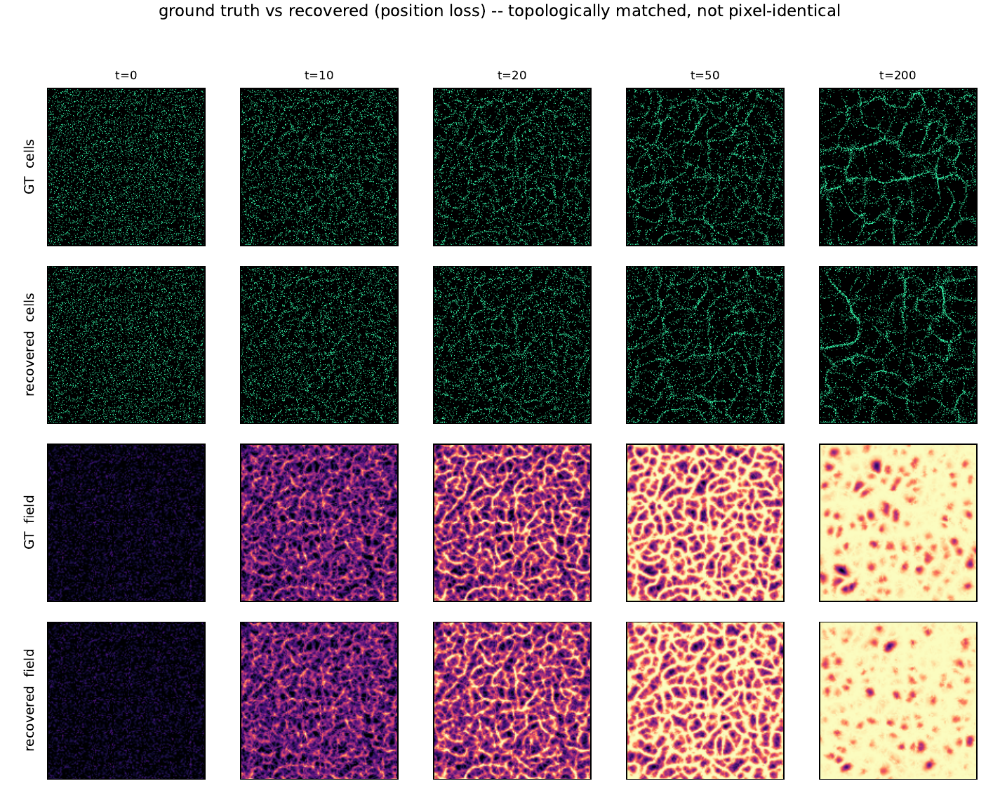{#fig-evolution fig-align="center"}

## Three observations

#### 1. The rollout is a written generative process.

The time-lapse looks like a generative diffusion model: each rollout starts from
spatial **noise** — uniformly random cell positions and an empty field — and tick
by tick condenses that noise into a definite morphology, a path from noise to a
sample on the data manifold. The decisive difference is that the generative law is
**not** a learned black box: the transition kernel $x_{t+1}=\Phi(x_t)$ is the
explicitly written calculus of operators (`deposit`, `diffuse`, `decay`, `sense`,
`advance`), and the prior it samples from is fixed by $\sim\!8$ interpretable
constants. The inverse problem is therefore not "invert a neural sampler" but
"identify the few physical constants of a *known* generative law" — which is
exactly why a handful of gradient steps suffice where amortizing a diffusion prior
would not. The stochasticity (the random seed, the random turn in `sense`) plays
the role of the diffusion noise schedule: any single rollout is one sample,
reproducible only in distribution, never pixel-for-pixel.

#### 2. Parameters encode a topology, not a configuration.

This reframes what "recovering the spec" means. Two rollouts of the *same* spec
under different seeds are never identical point-for-point, yet they are the same
object topologically — the same kind of filament web, with the same branch
density, loop statistics and characteristic length. The parameters do not encode a
particular configuration; they encode a **topology**, equivalently a *dynamical
regime* — the attractor onto which the operator flow condenses noise. Different
parameter regions encode qualitatively different topologies (a space-filling
network vs. isolated clusters vs. a near-lattice), separated by bifurcations of
the operator dynamics. So the inverse map is really *observed topology* → *the
dynamical law whose attractor has that topology*, and the per-parameter
identifiability findings are the precise statement that some topological features
pin some parameters (lateral field structure pins `sensor_angle`; multi-channel
structure pins `cross`) while leaving others free. Recovering the spec is
recovering the **generator** of a topology, not the topology itself — which is the
version of the problem that is both well posed and useful.

#### 3. Why the match is topological, not pointwise.

Because the success criterion is distributional, the correct loss must be too. A
pointwise position loss works only on a short, pre-chaotic horizon; over long
horizons the same spec decorrelates from itself, and the only stable signal is the
topology — which is why behaviour-level, permutation-invariant comparisons (and
the per-frame, short-horizon position loss used here) succeed where long pointwise
rollouts fail. The encoded "dynamics/topology" is thus the invariant the inverse
problem is actually solving for.

::: {.callout-tip appearance="simple"}
**Why this matters for Plexus.** The same explicit, differentiable primitives that
make a behaviour "a new sentence in the language" also make its inverse tractable:
the same spec serves prediction, **inverse inference**, and — next — the
optimization of biological designs. A full static write-up is in
[`prototype/inverse_slime/inverse_slime.pdf`](prototype/inverse_slime/inverse_slime.pdf).
:::

## Gallery: all ground-truth-vs-recovery panels

The panels below reproduce every visual page of the report: the showcase
single-type target (method comparison), three further single-type targets, and
the two-type and four-type cases (cells coloured by type; the multi-channel field
shown as a per-species colour composite). In every panel the **top row is ground
truth** and the rows below are recoveries; columns are time.

### Showcase single-type target

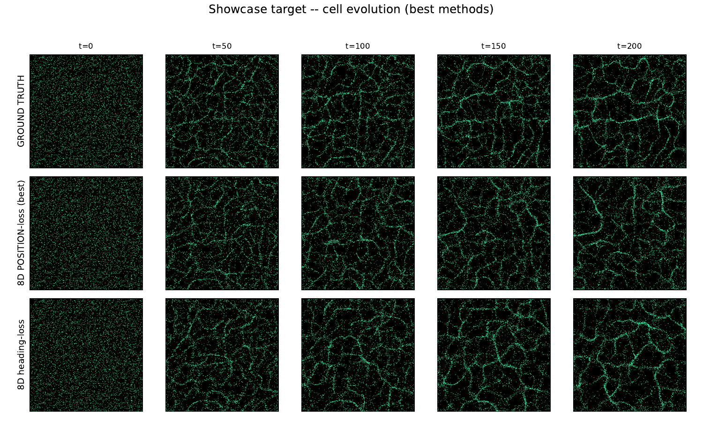{fig-align="center"}

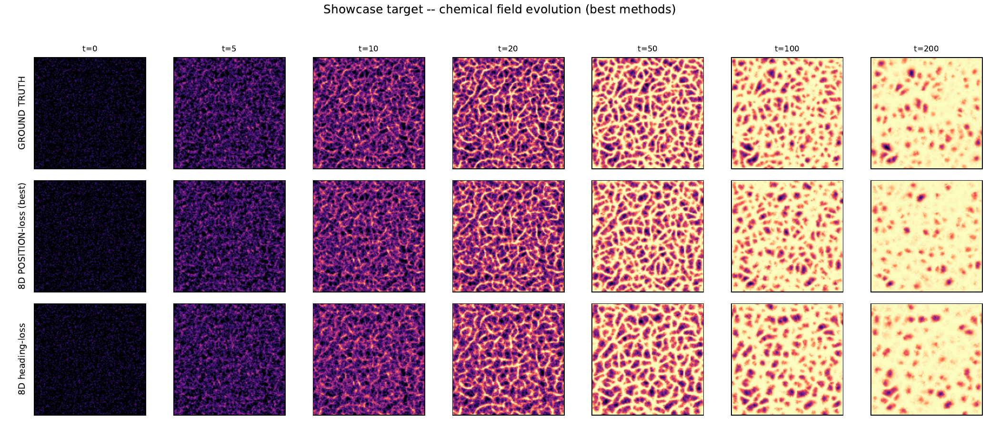{fig-align="center"}

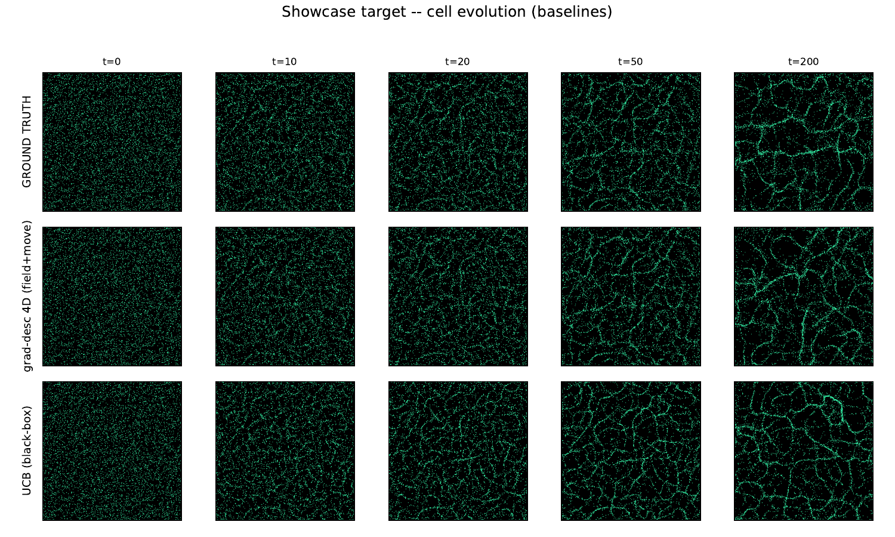{fig-align="center"}

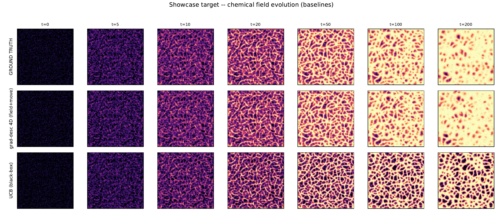{fig-align="center"}

### Three further single-type targets

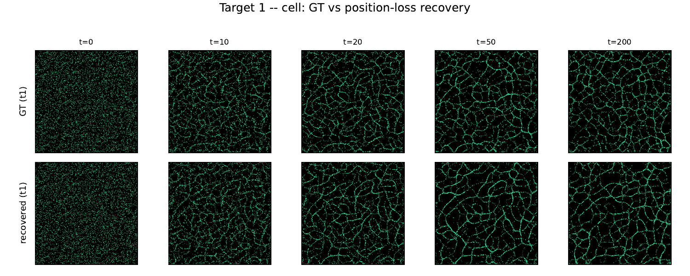{fig-align="center"}

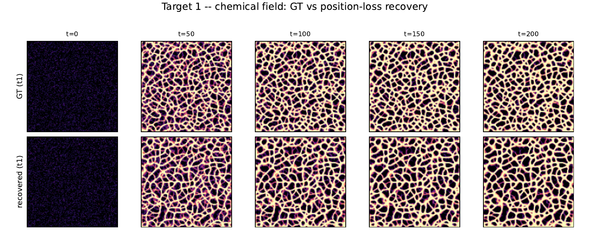{fig-align="center"}

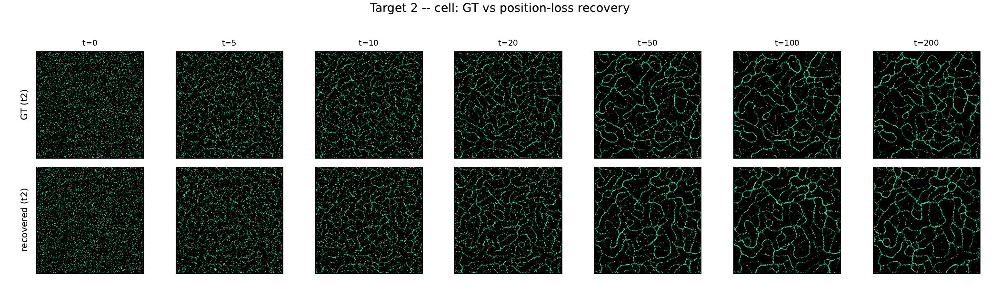{fig-align="center"}

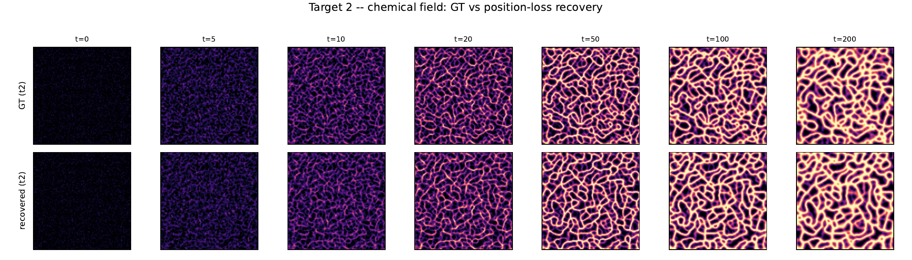{fig-align="center"}

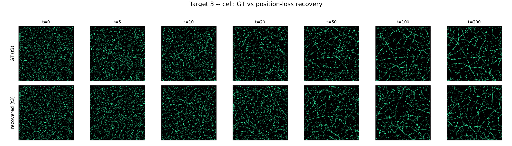{fig-align="center"}

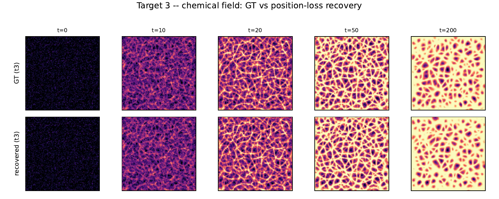{fig-align="center"}

### Two-type and four-type slime — `cross` now recovered

{fig-align="center"}

{fig-align="center"}

{fig-align="center"}

{fig-align="center"}
