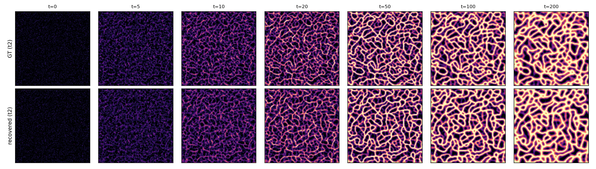
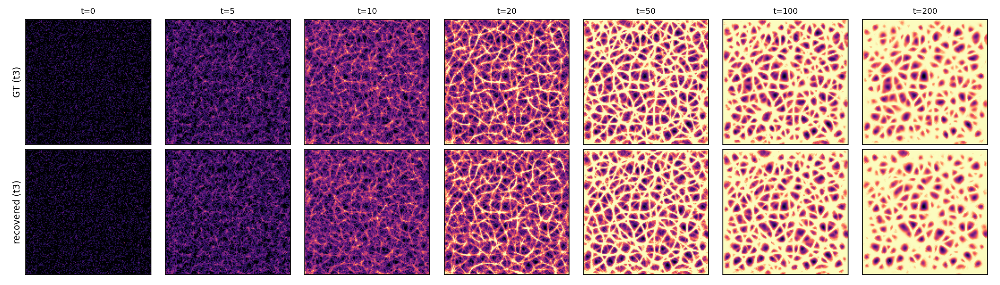

::: {.callout-note appearance="simple"}
**The forward arrow, reversed.** Everywhere else on this site Plexus runs
*forward*: a small typed **spec** (sets, fields, operators, a schedule) is
interpreted by a generic engine into a simulation,
$\text{spec}\to\text{engine}\to\text{trajectory}$. This page inverts that arrow.
Given **only a simulation** — the cell positions and the chemical field over time
— we recover the eight-number spec that generated it. It is the first inverse
result built directly on the Plexus operators, and it works because those
operators are explicit *and* differentiable.
:::

## From the forward model to its inverse

The [slime](index.qmd#what-it-looks-like) spec is **eight continuous numbers**: four on the
field side (`deposit.amount`, `diffuse.rate`, `decay.rate`, `sense.cross`) and
four per-cell motion parameters (`move_speed`, `turn_speed`, `sensor_angle`,
`sensor_dist`). The registered operators make every cell deposit into a chemical
field, sense that field at three forward sensors, turn toward the strongest
reading, and advance; the field meanwhile diffuses and decays. From a
uniform-random start the population condenses into a filament network. The
**inverse** problem is $\text{trajectory}\to\text{spec}$: identify those eight
constants from the observed evolution alone.

## Method

**Decomposed, engine-exact operators.** Each operator is mirrored by one
differentiable `nn.Module` whose parameters are tensors, and each carries a
self-test against the real engine: `deposit`, `diffuse`, `decay` and `advance`
match to $\le 10^{-7}$. `sense` is the one non-differentiable operator (a hard
three-way branch plus a random turn magnitude), so it is replaced by a smooth
mixture surrogate. A fit on these modules is therefore a fit on the *real*
dynamics, not on an approximation of them.

**One-step gradient descent.** The field is linear in its parameters, so a single
teacher-forced step $\text{field}_{t}\to\text{field}_{t+1}$ recovers
(amount, diffuse, decay) to $\sim\!10^{-3}$ and `move_speed` from the
displacement — where a black-box UCB baseline left `diffuse.rate` in the wrong
half of its range. One-step teacher forcing comes out about **224× more
accurate** than that black-box search.

**Loss on particles, not on reconstructed heading.** The sensing parameters were
at first recovered by matching a heading reconstructed as $\operatorname{atan2}$
of the displacement, which biased `sensor_angle` toward large values. Placing the
loss **directly on the predicted particle positions** (free-run sense→advance,
match where the cells are) removes the reconstruction and the bias; one-step beats
a recurrent rollout here, because the rollout accumulates chaos. Likelihood
*profiles* — scanning a parameter with the others fixed — were the diagnostic
that distinguished a "biased objective" from a "genuinely unidentifiable" one.

**Multiple types.** With $C$ cell types the field carries $C$ channels and a cell
reads $(1-\text{cross})\cdot$ its own channel $+\,\text{cross}\cdot$ the total
over channels. The inter-type weight `cross` drives the multi-type dynamics and
so becomes identifiable, with accuracy improving as $C$ grows.

## Results: do we recover the parameters?

The recovery is explicit, parameter by parameter, with values in the unit cube
$u\in[0,1]$. For a single type the
field parameters and `move_speed` are exact; `turn_speed`, `sensor_angle` and
`sensor_dist` recover to a few percent; `cross` is *held* because a single type
cannot constrain it. For **four types every parameter including `cross` is
recovered** (`cross` u-error $0.008$ at four types, $0.012$ at two). Across four
random single-type targets the `sensor_angle` u-error is
$0.015\,/\,0.158\,/\,0.092\,/\,0.051$ — the spread tracks how much lateral field
structure each target presents to the sensors.

The recovered spec does not match the target frame-for-frame — the process is
stochastic — but produces the **same topology**: the same filament network, loop
density and length scale.

![Ground truth vs the best recovery (8D position-loss) across time (*t* = 0 → 200). The top two rows are the **agents** — the ground-truth run and a run from the recovered eight-number spec — and the bottom two rows are those same two runs drawn as the **chemical trail field** the agents deposit and sense. Both start from spatial noise (uniformly random positions, an empty field) and condense tick by tick into a filament network, a path from noise to a sample that reads like a *written* generative process rather than a learned one. Because the dynamics are stochastic — a random seed, and a random turn magnitude in `sense` — the recovered run never matches the target frame-for-frame, so a pixel-for-pixel comparison would be meaningless. What it does reproduce is the target's **topology** — the same branch density, loop statistics and characteristic length scale — which is exactly the invariant the inverse problem solves for.](figures/fig_inverse_evolution.png){fig-align="center"}

## Three observations

#### 1. The rollout is a written generative process.

The time-lapse looks like a generative diffusion model: each rollout starts from
spatial **noise** — uniformly random cell positions and an empty field — and tick
by tick condenses that noise into a definite morphology, a path from noise to a
sample on the data manifold. The decisive difference is that the generative law is
**not** a learned black box: the transition kernel $x_{t+1}=\Phi(x_t)$ is the
explicitly written calculus of operators (`deposit`, `diffuse`, `decay`, `sense`,
`advance`), and the prior it samples from is fixed by $\sim\!8$ interpretable
constants. The inverse problem is therefore not "invert a neural sampler" but
"identify the few physical constants of a *known* generative law" — which is
exactly why a handful of gradient steps suffice where amortizing a diffusion prior
would not. The stochasticity (the random seed, the random turn in `sense`) plays
the role of the diffusion noise schedule: any single rollout is one sample,
reproducible only in distribution, never pixel-for-pixel.

#### 2. Parameters encode a topology, not a configuration.

This reframes what "recovering the spec" means. Two rollouts of the *same* spec
under different seeds are never identical point-for-point, yet they are the same
object topologically — the same kind of filament web, with the same branch
density, loop statistics and characteristic length. The parameters do not encode a
particular configuration; they encode a **topology**, equivalently a *dynamical
regime* — the attractor onto which the operator flow condenses noise. Different
parameter regions encode qualitatively different topologies (a space-filling
network vs. isolated clusters vs. a near-lattice), separated by bifurcations of
the operator dynamics. So the inverse map is really *observed topology* → *the
dynamical law whose attractor has that topology*, and the per-parameter
identifiability findings are the precise statement that some topological features
pin some parameters (lateral field structure pins `sensor_angle`; multi-channel
structure pins `cross`) while leaving others free. Recovering the spec is
recovering the **generator** of a topology, not the topology itself — which is the
version of the problem that is both well posed and useful.

#### 3. Why the match is topological, not pointwise.

Because the success criterion is distributional, the correct loss must be too. A
pointwise position loss works only on a short, pre-chaotic horizon; over long
horizons the same spec decorrelates from itself, and the only stable signal is the
topology — which is why behaviour-level, permutation-invariant comparisons (and
the per-frame, short-horizon position loss used here) succeed where long pointwise
rollouts fail. The encoded "dynamics/topology" is thus the invariant the inverse
problem is actually solving for.

::: {.callout-tip appearance="simple"}
**Why this matters for Plexus.** The same explicit, differentiable primitives that
make a behaviour "a new sentence in the language" also make its inverse tractable:
the same spec serves prediction, **inverse inference**, and — next — the
optimization of biological designs. A full static write-up is in
[`prototype/inverse_slime/inverse_slime.pdf`](prototype/inverse_slime/inverse_slime.pdf).
:::

## Gallery: all ground-truth-vs-recovery panels

The panels below reproduce every visual page of the report: the showcase
single-type target (method comparison), three further single-type targets, and
the two-type and four-type cases (cells coloured by type; the multi-channel field
shown as a per-species colour composite). In every panel the **top row is ground
truth** and the rows below are recoveries; columns are time.

### Showcase single-type target

The showcase target is shown four ways, along two axes: **what is drawn** — the
**cells/agents**, or the **chemical trail field** they deposit and sense — and
**which inverse methods** — the two **best** recoveries (8D gradient-descent) or
the weaker **baselines** (4D gradient-descent and black-box search). In every
montage the **top row is the ground-truth simulation**, the rows beneath are
simulations run from the **recovered** parameters, and **columns are time**
(*t* = 0 → 200).

![**Cells — best methods.** The top row is the ground-truth simulation; the two rows below are agent runs from parameters recovered by the two strongest inverse methods — both full eight-parameter (8D) gradient-descent fits through the differentiable operators, differing only in their loss. **8D position-loss** puts the loss directly on the predicted particle positions — free-running `sense`→`advance` and matching where the cells actually are — which drops the `atan2` heading reconstruction and its bias toward large `sensor_angle`, making it the best method overall. **8D heading-loss** instead matches a heading reconstructed from each cell's displacement, which pushes `sensor_angle` too high, though it still recovers the overall network. Reading left to right (columns are time, *t* = 0 → 200), both recoveries condense from noise into the same filament morphology as the target. The agreement is topological rather than frame-for-frame — the same branch density and length scale, not identical dot positions.](figures/fig_inverse_gal_00.png){fig-align="center"}

![**Chemical field — best methods.** The same three runs as the previous montage — ground truth on top, the two best 8D gradient-descent recoveries below — but drawn as the **chemical trail field** the agents deposit and sense, rather than the agents themselves. The field is the linear, teacher-forced half of the problem: a single step from one field frame to the next recovers `deposit`, `diffuse` and `decay` to about 10⁻³, so both recoveries reproduce the target field almost exactly. Shown as a smooth density (columns are time, *t* = 0 → 200), the deposited-and-diffused trail network is easier to read than the discrete agents. This tight field match is *why* the harder sensing parameters can be identified from the agents at all. Compared with the baseline field montage further down, it shows how sharply the gradient fit reproduces the trail.](figures/fig_inverse_gal_01.png){fig-align="center"}

![**Cells — baselines.** Ground truth on top, with two deliberately weaker recovery methods beneath it for comparison. **4D gradient-descent (field + move)** fits only the four field parameters plus `move_speed` by one-step teacher forcing — the easy, near-linear half of the spec — and leaves the three sensing parameters (`turn_speed`, `sensor_angle`, `sensor_dist`) unconstrained, so its morphology drifts. **UCB black-box search** treats the simulator as an opaque function and explores parameter space with an upper-confidence-bound bandit, using no gradients at all; it left `diffuse.rate` in the wrong half of its range and is about **224× less accurate** than the one-step gradient fit. As the columns advance (*t* = 0 → 200) these baselines wander off the target network where the best 8D fits stay locked onto it. They are shown to make concrete what the gradient-based, operator-exact approach improves on.](figures/fig_inverse_gal_02.png){fig-align="center"}

![**Chemical field — baselines.** The same two baseline recoveries — 4D gradient-descent and UCB black-box search — drawn as the deposited **chemical field** instead of the agents, ground truth on top. Because the field parameters are the most identifiable part of the spec, even these weaker methods reproduce the broad trail structure in the early frames. But the black-box search's misplaced `diffuse.rate` shows up directly as a field that spreads too fast or too slow, so its trail network coarsens or thins away from the target as time advances. The 4D fit fares better on the field but still lacks the sensing parameters that shape the fine network. Set against the best-methods field montage above, this panel shows how much a gradient-based, operator-exact fit tightens the recovered field (columns are time, *t* = 0 → 200).](figures/fig_inverse_gal_03.png){fig-align="center"}

### Three further single-type targets

Three more random single-type targets, in addition to the showcase, each recovered
with the best method — 8D position-loss — and shown both as the cells and as the
chemical field. The layout is the same as above: the **top row is the ground-truth
run**, the **bottom row is a run from the recovered eight-number spec**, and columns
are time (*t* = 0 → 200). How tightly the sensing parameters recover depends on the
target — `sensor_angle` is pinned when the target presents rich lateral field
structure to the sensors and left looser when it does not (across four such targets
its unit-cube error ranged 0.015–0.158) — so these three cases probe the method on
targets of varying difficulty.

{fig-align="center"}

{fig-align="center"}

{fig-align="center"}

{fig-align="center"}

{fig-align="center"}

{fig-align="center"}

### Two-type and four-type slime — `cross` now recovered

A single type cannot constrain the inter-type coupling `cross`, so in the panels
above it is *held* at ground truth. With several cell types the field carries one
channel per type and each cell reads a blend of its own channel and the total over
all channels, weighted by `cross` — so now `cross` drives the dynamics and becomes
identifiable, more sharply as the number of types grows (unit-cube error 0.012 at
two types, 0.008 at four). These montages show the two-type and four-type targets
recovered in **full**: cells are coloured by type and the multi-channel field is
drawn as a per-species colour composite, with ground truth on top, the recovery
below, and time across the columns.

{fig-align="center"}

{fig-align="center"}

{fig-align="center"}

{fig-align="center"}
