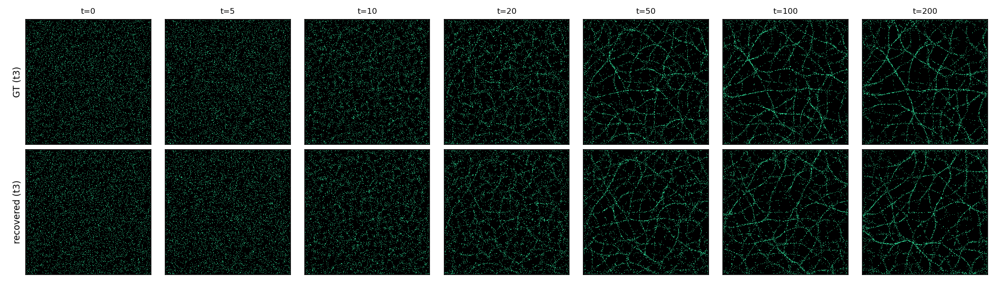

::: {.callout-note appearance="simple"}
**The forward arrow, reversed.** Everywhere else on this site Plexus runs
*forward*: a small typed **spec** (sets, fields, operators, a schedule) is
interpreted by a generic engine into a simulation,
$\text{spec}\to\text{engine}\to\text{trajectory}$. This page inverts that arrow.
Given **only a simulation** — the cell positions and the chemical field over time
— we recover the eight-number spec that generated it. It is the first inverse
result built directly on the Plexus operators, and it works because those
operators are explicit *and* differentiable.
:::

## From the forward model to its inverse

The [slime](index.qmd#what-it-looks-like) spec is **eight continuous numbers**: four on the
field side (`deposit.amount`, `diffuse.rate`, `decay.rate`, `sense.cross`) and
four per-cell motion parameters (`move_speed`, `turn_speed`, `sensor_angle`,
`sensor_dist`). The registered operators make every cell deposit into a chemical
field, sense that field at three forward sensors, turn toward the strongest
reading, and advance; the field meanwhile diffuses and decays. From a
uniform-random start the population condenses into a filament network. The
**inverse** problem is $\text{trajectory}\to\text{spec}$: identify those eight
constants from the observed evolution alone.

## Method

**What is learned, and from what.** The only learnables are the **eight numbers of
the spec** — the constants of the operators. What is *given* is one observed
simulation: the **cell positions and the chemical field at each recorded time**.
Recovery adjusts those eight numbers — by gradient descent on the differentiable
operators, or by a black-box UCB search — until a fresh run reproduces the observed
trajectory. The architecture is fixed; only the constants of a *known* generative
law are fit.

**The parameters split by what couples to what.** In the Plexus language the slime
is a composition of typed operators, and its eight numbers group by the *kind* of
coupling they parameterise:

- **Particle ↔ field — `Exchange`.** `deposit` pushes each cell's mass into the
  chemical field (`deposit.amount`); `sense` pulls the field back at three forward
  sensors and steers up it (`sensor_angle`, `sensor_dist`, `turn_speed`,
  `move_speed`, and the inter-type weight `cross`). These are the *only* operators
  that move information between the discrete cells and the continuous field.
- **Field ↔ field — within the field.** `diffuse` couples each field cell to its
  neighbours (`diffuse.rate`) and `decay` relaxes each cell toward zero
  (`decay.rate`); with several types the field carries one channel per type and
  `cross` mixes them. This half is spatially local and **linear** in its parameters.
- **Particle ↔ particle — none, by construction.** The single-type slime has *no*
  direct cell–cell operator: cells influence each other *only through the field*
  they share (deposit → diffuse → sense). There is nothing to identify at this
  level — a genuine `Lateral` neighbour law (boids, adhesion) would simply be fit
  from the same position loss below, if the model contained one.

**How each coupling is recovered.** Because the field half is linear, a single
**teacher-forced** step $\text{field}_t\to\text{field}_{t+1}$ recovers
`deposit.amount`, `diffuse.rate` and `decay.rate` to $\sim\!10^{-3}$, plus
`move_speed` from the displacement — about **224× more accurate** than the black-box
UCB baseline, which left `diffuse.rate` in the wrong half of its range. The
particle-↔-field **sensing** parameters are recovered by placing the loss **directly
on the predicted particle positions** (free-run `sense`→`glide`, match where the
cells are), which removes an earlier `sensor_angle` bias from reconstructing a
heading as $\operatorname{atan2}$ of the displacement; a short step beats a long
recurrent rollout, which accumulates chaos. The inter-type `cross` cannot be pinned
from one type — it is *held* at ground truth — but becomes identifiable once several
types make it drive the dynamics, more sharply as the type count grows.

**Engine-exact operators.** Every operator is mirrored by one differentiable
`nn.Module` whose parameters are tensors and whose output is checked against the
real engine (`deposit`, `diffuse`, `decay`, `glide` match to $\le 10^{-7}$);
`sense` is the one non-differentiable operator — a hard three-way branch plus a
random turn — so it is replaced by a smooth mixture surrogate. A fit on these
modules is a fit on the *real* dynamics, and likelihood *profiles* (scanning one
parameter with the rest fixed) are the diagnostic that told a "biased objective"
apart from a "genuinely unidentifiable" one.

## Results: do we recover the parameters?

The recovery is explicit, parameter by parameter, with values in the unit cube
$u\in[0,1]$. For a single type the
field parameters and `move_speed` are exact; `turn_speed`, `sensor_angle` and
`sensor_dist` recover to a few percent; `cross` is *held* because a single type
cannot constrain it. For **four types every parameter including `cross` is
recovered** (`cross` u-error $0.008$ at four types, $0.012$ at two). Across four
random single-type targets the `sensor_angle` u-error is
$0.015\,/\,0.158\,/\,0.092\,/\,0.051$ — the spread tracks how much lateral field
structure each target presents to the sensors.

The recovered spec does not match the target frame-for-frame — the process is
stochastic — but produces the **same topology**: the same filament network, loop
density and length scale.

![Ground truth vs the best recovery (8D position-loss) over time (*t* = 0 → 200): the top two rows are the **agents** (ground truth and a run from the recovered eight-number spec), the bottom two the same runs drawn as the **chemical field** they deposit. Both start from spatial noise and condense tick by tick into a filament network — a *written* generative process, not a learned one. Because the dynamics are stochastic the recovered run never matches frame-for-frame; what it reproduces is the target's **topology** (branch density, loop statistics, length scale), the invariant the inverse problem solves for.](figures/fig_inverse_evolution.png){fig-align="center"}

## Three observations

#### 1. The rollout is a written generative process.

The time-lapse looks like a generative diffusion model: each rollout starts from
spatial **noise** — uniformly random cell positions and an empty field — and tick
by tick condenses that noise into a definite morphology, a path from noise to a
sample on the data manifold. The decisive difference is that the generative law is
**not** a learned black box: the transition kernel $x_{t+1}=\Phi(x_t)$ is the
explicitly written calculus of operators (`deposit`, `diffuse`, `decay`, `sense`,
`advance`), and the prior it samples from is fixed by $\sim\!8$ interpretable
constants. The inverse problem is therefore not "invert a neural sampler" but
"identify the few physical constants of a *known* generative law" — which is
exactly why a handful of gradient steps suffice where amortizing a diffusion prior
would not. The stochasticity (the random seed, the random turn in `sense`) plays
the role of the diffusion noise schedule: any single rollout is one sample,
reproducible only in distribution, never pixel-for-pixel.

#### 2. Parameters encode a topology, not a configuration.

This reframes what "recovering the spec" means. Two rollouts of the *same* spec
under different seeds are never identical point-for-point, yet they are the same
object topologically — the same kind of filament web, with the same branch
density, loop statistics and characteristic length. The parameters do not encode a
particular configuration; they encode a **topology**, equivalently a *dynamical
regime* — the attractor onto which the operator flow condenses noise. Different
parameter regions encode qualitatively different topologies (a space-filling
network vs. isolated clusters vs. a near-lattice), separated by bifurcations of
the operator dynamics. So the inverse map is really *observed topology* → *the
dynamical law whose attractor has that topology*, and the per-parameter
identifiability findings are the precise statement that some topological features
pin some parameters (lateral field structure pins `sensor_angle`; multi-channel
structure pins `cross`) while leaving others free. Recovering the spec is
recovering the **generator** of a topology, not the topology itself — which is the
version of the problem that is both well posed and useful.

#### 3. Why the match is topological, not pointwise.

Because the success criterion is distributional, the correct loss must be too. A
pointwise position loss works only on a short, pre-chaotic horizon; over long
horizons the same spec decorrelates from itself, and the only stable signal is the
topology — which is why behaviour-level, permutation-invariant comparisons (and
the per-frame, short-horizon position loss used here) succeed where long pointwise
rollouts fail. The encoded "dynamics/topology" is thus the invariant the inverse
problem is actually solving for.

::: {.callout-tip appearance="simple"}
**Why this matters for Plexus.** The same explicit, differentiable primitives that
make a behaviour "a new sentence in the language" also make its inverse tractable:
the same spec serves prediction, **inverse inference**, and — next — the
optimization of biological designs. A full static write-up is in
[`prototype/inverse_slime/inverse_slime.pdf`](prototype/inverse_slime/inverse_slime.pdf).
:::

## Gallery: all ground-truth-vs-recovery panels

The panels below reproduce every visual page of the report: the showcase
single-type target (method comparison), three further single-type targets, and
the two-type and four-type cases (cells coloured by type; the multi-channel field
shown as a per-species colour composite). In every panel the **top row is ground
truth** and the rows below are recoveries; columns are time.

### Showcase single-type target

The showcase target is shown four ways along two axes: **what is drawn** — the cells/agents or the chemical field they deposit — and **which method** — the two best recoveries (8D gradient-descent) or the weaker baselines (4D gradient-descent, black-box search). In every montage the top row is the ground-truth simulation, the rows beneath are runs from the recovered parameters, and columns are time (*t* = 0 → 200).

![**Cells — best methods.** Top row ground truth; below it the two strongest recoveries, both full eight-parameter gradient-descent fits that differ only in the loss. **8D position-loss** puts the loss on the predicted particle positions (matching where the cells are), which removes the `sensor_angle` bias and makes it the best; **8D heading-loss** matches a reconstructed heading instead and pushes `sensor_angle` too high. Reading left to right, both condense into the same filament morphology as the target — a topological match, not a frame-for-frame one.](figures/fig_inverse_gal_00.png){fig-align="center"}

{fig-align="center"}

{fig-align="center"}

{fig-align="center"}

### Three further single-type targets

Three more random single-type targets, each recovered with the best method (8D position-loss) and shown as both cells and chemical field. Same layout as above — top row ground truth, bottom row the recovered run, columns are time (*t* = 0 → 200). Recovery quality varies with the target: `sensor_angle` is pinned when the target offers rich lateral field structure and left looser when it does not (its unit-cube error ranged 0.015–0.158 across four such targets).

{fig-align="center"}

{fig-align="center"}

{fig-align="center"}

{fig-align="center"}

{fig-align="center"}

{fig-align="center"}

### Two-type and four-type slime — `cross` now recovered

A single type cannot constrain the inter-type coupling `cross`, so above it is held at ground truth. With several types the field carries one channel per type and each cell reads a `cross`-weighted blend of its own channel and the total, so `cross` now drives the dynamics and becomes identifiable — more sharply as the type count grows (unit-cube error 0.012 at two types, 0.008 at four). These montages show the two- and four-type targets recovered in full: cells coloured by type, the multi-channel field as a per-species composite, ground truth on top and recovery below.

{fig-align="center"}

{fig-align="center"}

{fig-align="center"}

{fig-align="center"}
