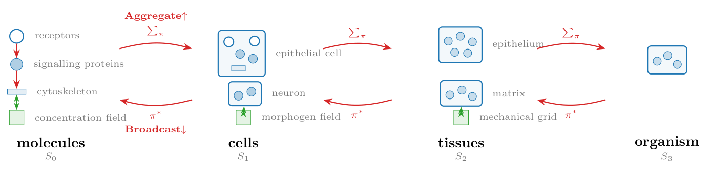

::: {.callout-note appearance="simple"}
We introduce *Plexus*, a typed intermediate representation for biological
mechanisms. Rather than defining yet another simulator, Plexus defines a common
language whose primary objects are biological operators. Every operator specifies
the biological entities it acts upon, the states it requires, the relations between
these entities, and one or more numerical implementations. The Plexus research
program has three objectives. First, to define an algebra of biological operators.
Second, to decompose the existing corpus of simulation models into this common
language. Third, to construct differentiable implementations of these operators so
that mechanistic models can be directly inferred from biological data.
:::

## Introduction

Computational biology has produced a rich ecosystem of simulation frameworks.
Neural simulators model electrical activity, reaction–diffusion systems model
chemical transport, particle and continuum methods model mechanics, while vertex,
Cellular Potts and active-matter models describe multicellular tissues. These
frameworks remain however largely incompatible. Combining electrical signalling,
mechanics, metabolism and development often requires coupling multiple specialized
simulators whose underlying abstractions differ fundamentally. Each simulator
introduces its own representation of biological mechanisms, making models difficult
to compare, compose and extend. This fragmentation is not primarily a numerical
problem but more a language problem.

Instead of treating simulation frameworks as fundamental, we treat biological
mechanisms as the primary objects. To this aim, Plexus introduces an intermediate
representation whose central elements are biological operators. Operators describe
mechanisms such as adhesion, diffusion, division, chemotaxis, electrical
propagation or active stress independently of their numerical implementation. In
this perspective, biological modeling becomes analogous to compiler design. Just as
modern compilers separate programming languages from their implementations through
an intermediate representation, Plexus separates biological mechanisms from their
numerical implementations.

Biological systems must be decomposed not only into operators, but also into the
entities on which those operators act. These entities are heterogeneous — receptors,
signalling proteins, cells, extracellular matrices, tissues, fields — and are organized
across biological levels. Plexus makes this organization explicit as a compositional
hierarchy: each level carries its own entities and states, operators act between entities
within a level, and **Aggregate ↑** and **Broadcast ↓** connect levels by mapping state
upward and downward. Decomposition therefore does not flatten biology into a single
collection of variables; it preserves the organization through which mechanisms at one
level are composed with mechanisms at another.

The purpose of this decomposition is ultimately recomposition: to construct complete
mechanistic models from reusable entities and operators. Making such compositions
executable requires strong structural choices. Plexus separates the language that
specifies the biological model from the code that interprets and executes it. The language
declares entities, states, relations, hierarchy and operators; the interpreter resolves
this description into concrete numerical implementations and schedules their execution.

## The language

Plexus defines a typed language for expressing biological mechanisms independently
of their numerical realization. The language is built around four fundamental
concepts: *operators*, *sets*, *states*, and *fields*. Biological models are
therefore represented as compositions of operators acting on discrete and
continuous biological objects rather than simulator-specific algorithms.

### Operators

Operators are the fundamental objects of the language. An operator represents a
single biological mechanism, such as adhesion, chemotaxis, diffusion, electrical
propagation, active stress, metabolism, growth, or cell division. Every operator is
defined by a typed signature and one or more numerical implementations. The
signature specifies *what* biological transformation is performed, whereas
implementations specify *how* it is numerically realized. The signature specifies

- the input sets,
- the output sets,
- the state variables consumed and produced,
- the maps relating the participating sets.

Maps define the relations required by the mechanism. They determine, for example,
which protein belongs to which cell, which synapses connect which neurons, or how
cells relate to a continuous field. Plexus incorporates maps into the operator,
making operators typed morphisms between biological sets.

### Sets

Sets represent collections of biological entities. Examples include genes, proteins,
cells, neurons, synapses, tissues, organs and organisms. Sets naturally
organize into hierarchies reflecting biological organization. Genes regulate
proteins, proteins determine cellular behaviour, cells assemble into tissues,
tissues form organs, and organs compose organisms. Each level is represented
uniformly as a set, allowing the same language to describe intracellular
signalling, multicellular mechanics, developmental processes and organ-level
physiology.

### States

Every element of a set carries a state describing its current biological condition.
While sets define *what* biological entities exist, states define *what each entity
carries*. The state schema is specific to each set. A protein may carry position,
binding state and the load it bears; a material point position, velocity and
deformation gradient; a neuron membrane voltage and calcium; a cell
polarity, stiffness and gene-expression levels; a synapse conductance and plastic
weight. Operators transform states. They consume selected state variables and
produce updates to others, while leaving the underlying biological entities
unchanged.

### Fields

Fields represent continuous quantities defined over space rather than over discrete
biological entities. Examples include morphogen concentrations, pressure,
extracellular signalling molecules, electric potentials, and material properties.
Fields complement sets. While sets describe discrete biological entities, fields
describe the continuous environment in which these entities evolve. Operators couple
sets and fields through explicit maps relating discrete entities to continuous
spatial representations.

## The operator algebra

The language introduced in the previous section defines the objects manipulated by
Plexus. We now define the elementary operator families from which biological models
are constructed. The central hypothesis of Plexus is that a large fraction of
existing biological simulation models can be expressed as compositions of a small
number of elementary operator families. Rather than introducing a new operator for
every biological phenomenon, Plexus identifies a compact operator algebra that can
be reused across mechanics, signalling, metabolism, development and physiology.

The proposed operator algebra consists of eight elementary kinds (see the figure
below):

- **Lateral**: interactions within a biological set.
- **Aggregate**: many-to-one transformations across biological scales.
- **Broadcast**: one-to-many transformations across biological scales.
- **Exchange**: transformations between sets and fields.
- **Field**: a field's own dynamics — diffusion, decay, reaction.
- **Rewire**: modification of relations between biological entities.
- **Structural**: creation and removal of biological entities — **Divide** and **Die**.
- **Seed**: the initial state, written once and never again.

The first four kinds transform the state of a set while preserving the underlying
biological organization, and Field does the same for a field. Rewire modifies the
interaction graph, whereas Structural modifies the biological entities themselves.
Seed stands apart: it writes what the others then evolve. Together they form the
elementary computational vocabulary of Plexus, and the implementation recognises
exactly these eight.

{width=100% fig-align="center"}

**Lateral.** Lateral operators describe interactions between entities belonging to
the same set. Typical examples include mechanical forces between proteins, adhesion
between neighbouring cells, electrical communication between neurons, or biochemical
interactions within a metabolic network.

**Aggregate.** Aggregate operators propagate information from many entities to a
higher level of biological organization. Examples include computing cellular
properties from their constituent proteins or accumulating synaptic currents acting
on a neuron.

**Broadcast.** Broadcast operators perform the complementary transformation,
propagating information from higher organizational levels toward their constituents.
Aggregate and Broadcast therefore define the upward and downward flow of information
across biological scales.

**Exchange.** Exchange operators couple discrete biological entities with continuous
fields. Typical examples include secretion, sensing, transport, uptake, or
particle–grid transfer.

**Rewire.** Rewire operators modify the relations between biological entities without
changing the entities themselves. They update neighbour graphs, contact networks,
developmental connectivity or other interaction structures, determining which
entities participate in subsequent operator evaluations.

**Structural.** Living systems continuously modify their own composition. This kind has
two operators: Divide creates new biological entities, whereas Die removes existing ones.
They modify the biological organization itself rather than only its state.

**Field.** Field operators are the self-dynamics of a continuous field — diffusion, decay,
reaction — mapping a field to itself without touching any set.

**Seed.** Seed operators write a set's initial state, once. They are gated to the first frame,
so an initial condition cannot silently become a boundary condition applied at every step.

## Composing biological mechanisms

Biological models are expressed as compositions of elementary operators. Rather than
embedding all mechanisms within a monolithic simulator, Plexus represents a model as
an ordered sequence of operator applications. This sequence, called the *schedule*,
specifies both the order and the frequency with which operators are evaluated.
Formally, one simulation step is the composition

$$\Phi = \mathcal{O}_n \circ \cdots \circ \mathcal{O}_1,$$

whose repeated application generates the system dynamics

$$x_{t+1} = \Phi(x_t).$$

The schedule therefore describes the temporal organization of biological mechanisms.
Different operators may evolve on different time scales. Mechanical interactions may
be evaluated every simulation step, whereas diffusion, growth or cell division may
occur less frequently. A biological model therefore becomes a multi-rate composition
of biological mechanisms rather than a monolithic numerical solver.

Operators are pure transformations. Rather than modifying biological state directly,
every operator returns its contribution to the system evolution. If operator
$\mathcal{O}_i$ produces the increment $\Delta_i$, the complete update is obtained by

$$\Delta = \sum_i \Delta_i,$$

before being passed to the numerical implementation. This formulation has two
important consequences. First, biological mechanisms remain independent and
composable: introducing a new mechanism simply requires adding a new operator to the
schedule. Second, the language remains independent of its numerical realization. The
schedule specifies the biological model, whereas the numerical implementation
specifies how that model is evaluated.

## Composing hierarchy

A set may be contained in another — proteins in a cell, cells in a tissue, tissues in
an organism — through an explicit child → parent map. Importantly, a parent may contain
several distinct sets: the same cell can contain receptors, signalling proteins,
cytoskeletal elements and particles. These sets remain distinct objects, with their own
state and operators, while sharing the same parent. Each level can also run at its own
rate: no level is reduced to a parameter of the one above it.

{width=80% fig-align="center"}

Operators can act within a level or across levels. Within a cell, for example, operators
may couple receptors → signalling proteins → cytoskeleton. Across the containment map,
**Aggregate ↑** builds parent state from children — a cell position from its particles, or
a neuron input from its synapses — while **Broadcast ↓** propagates parent state to
children — a material property to every particle owned by a cell, or a constraint imposed
by the parent.

Fields are level-specific too. **Exchange** couples a set to a field at the appropriate
level, allowing a protein concentration field, a cellular morphogen field and a tissue
mechanical grid to coexist as distinct objects.

The consequence is that proteins → cells → tissues is not a pipeline of separate
simulators. It is one compositional graph: multiple sets may coexist inside each parent,
operators connect them locally, and Aggregate/Broadcast connect the levels. The same
operator kinds are reused throughout; adding another biological scale requires no new
engine.

## Numerical implementations

The operator algebra defines the biological semantics of a model independently of
its numerical realization. Every operator may admit multiple implementations
satisfying the same typed signature. These implementations differ in numerical
realization while preserving identical biological semantics. Selecting an
implementation is therefore a numerical decision rather than a biological one.

This abstraction naturally accommodates a broad range of computational methods.
Mechanical operators may be implemented using Material Point Methods, finite
elements, vertex models, phase-field methods, Cellular Potts models or
optimal-transport formulations. Signalling operators may employ Hodgkin–Huxley
equations, graph neural networks or Neural ODEs. Likewise, field operators may use
finite differences, finite elements, neural implicit representations or spectral
methods. These implementations coexist within the same language because they satisfy
identical operator contracts.

Different implementations may also employ different numerical integration schemes.
Depending on the operator, implementations may evolve first-order states such as
concentrations or membrane voltages, second-order states such as mechanical
accelerations, or rely on explicit, implicit or adaptive solvers. These choices
affect computational efficiency and numerical accuracy but not the biological
interpretation of the model.

This distinction fundamentally changes how biological simulations are compared.
Traditional frameworks compare complete simulators, intertwining biological
mechanisms with numerical algorithms. Plexus instead separates these two questions.
Biological models are compared through the operators they compose, whereas numerical
methods are compared through the implementations realizing those operators.

This separation establishes two independent axes of scientific progress. Biological
innovation corresponds to discovering new operators or new operator compositions,
whereas numerical innovation corresponds to developing more efficient or more
accurate implementations of existing operators. Existing simulation frameworks
therefore become complementary backends implementing a common intermediate
representation rather than competing modelling paradigms.

## Mechanistic inverse modelling

One of the primary motivations for introducing a formal language of biological
mechanisms is to identify mechanistic models directly from experimental
observations. Rather than calibrating simulations manually, the objective is to
infer the parameters, spatial organization and constitutive laws governing
biological systems from imaging data.

Plexus makes this possible by associating every biological operator with one or more
differentiable implementations satisfying the same typed signature. Differentiability
therefore becomes a property of the language rather than of a particular simulator.
Regardless of the numerical backend, gradients propagate through compositions of
explicit biological operators rather than through monolithic simulation code.

This distinction fundamentally changes the role of inverse modelling. Traditional
approaches assume that the underlying mechanism is already correct and seek the
parameter values that best reproduce the observations. Such parameter optimization is
effective when the forward model is complete, but it becomes misleading when
important biological mechanisms are absent. Optimizing existing parameters may
improve the fit while merely compensating for missing mechanisms.

In Plexus, parameters remain attached to explicit biological operators rather than to
opaque numerical models. Mechanical properties belong to mechanical operators,
reaction rates to biochemical operators, conductances to signalling operators, and
spatial fields to the mechanisms generating them. Parameter estimation therefore
preserves the mechanistic interpretation of the model.

Residuals likewise acquire a mechanistic interpretation. A persistent mismatch
between simulation and experiment no longer indicates only poor parameter values; it
may also indicate that the current operator composition is unable to explain the
observations. Differentiability thus provides more than efficient optimization: it
enables quantitative comparison between competing mechanistic models while preserving
their explicit biological structure.

## Agentic mechanistic discovery

The explicit representation of biological mechanisms transforms scientific discovery
from a parameter optimization problem into a language exploration problem. Because
mechanisms are represented as explicit operators rather than embedded in
simulator-specific code, they become directly accessible to agentic systems.

Plexus proposes a three-loop strategy for mechanistic discovery. Each loop operates
at a different level of abstraction, progressively moving from existing models toward
new biological knowledge.

**Loop I: Understanding.** The first loop analyses an existing simulation model.
Rather than treating the simulator as opaque code, the agent decomposes it into
Plexus operators, identifies the biological mechanisms it implements, and
reconstructs an explicit mechanistic description. Existing simulation frameworks
therefore become repositories of reusable biological operators.

**Loop II: Fitting.** The second loop estimates the parameters, spatial fields and
initial conditions of the resulting mechanistic model by fitting it directly to
experimental observations. Because every operator admits a differentiable
implementation, optimization preserves an explicit correspondence between parameters
and biological mechanisms.

**Loop III: Discovery.** The third loop analyses the residual remaining after
optimization. Persistent discrepancies are interpreted as evidence that the current
operator composition is incomplete rather than simply poorly parameterized. The agent
therefore proposes alternative operators, compares competing mechanistic hypotheses,
and extends the operator algebra whenever existing mechanisms fail to explain the
observations.

Together, these three loops transform simulation, inverse modelling and hypothesis
generation into successive stages of a single scientific workflow. The language
itself becomes the object of discovery: new biological knowledge is represented by
extending the operator algebra rather than merely adjusting parameter values.
