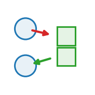

::: {.op-head}
{.op-logo}

[`exchange`]{.op-badge} [`acts on: cell`]{.op-badge} [`prediction: none`]{.op-badge}

Agent_scatter (was agent_to_mpm) (agent set -> mpm_grid): the agents deform the material.
:::

```{=html}
<style>
.op-grid{display:grid;grid-template-columns:repeat(auto-fill,minmax(270px,1fr));gap:.7rem;margin:1rem 0 1.6rem}
.op-card{display:flex;align-items:center;gap:.7rem;padding:.6rem .75rem;border:1px solid var(--bs-border-color,#dee2e6);
  border-radius:10px;text-decoration:none;color:inherit;background:var(--bs-body-bg,#fff);transition:.12s}
.op-card:hover{border-color:#1f77b4;box-shadow:0 2px 8px rgba(31,119,180,.13);transform:translateY(-1px)}
.op-card img{width:42px;height:42px;flex:0 0 42px;object-fit:contain}
.op-card-body{display:flex;flex-direction:column;min-width:0}
.op-card-name{font-weight:600;font-family:var(--bs-font-monospace,monospace);color:#1f77b4}
.op-card-sub{font-size:.8em;color:#6c757d;line-height:1.25;overflow:hidden;display:-webkit-box;-webkit-line-clamp:2;-webkit-box-orient:vertical}
.kind-h{height:1.5em;vertical-align:-.35em;margin-right:.25rem}
.kind-sym{color:#adb5bd;font-weight:400;margin-left:.3rem}
.op-head{display:block;border-left:3px solid #1f77b4;padding:.2rem 0 .2rem 1rem;margin:.5rem 0 1.5rem}
.op-logo{width:74px;height:74px;float:right;margin:-.2rem 0 .4rem 1rem;object-fit:contain}
.op-badge{font-size:.78em;background:rgba(31,119,180,.1);color:#1f77b4;border-radius:5px;padding:.05rem .4rem;margin-right:.2rem;white-space:nowrap}
.op-vid{margin:.4rem 0}.op-vid video{width:100%;max-width:520px;border-radius:8px;background:#000;display:block}
.op-vid figcaption{font-size:.85em;color:#6c757d;margin-top:.3rem;max-width:520px}
</style>
```

## Role in Plexus

- **Kind** &mdash; push / pull **Exchange**: set &harr; field.
- **Acts on** &mdash; `cell` (the set the operator acts on).
- **Reads** &mdash; `to`
- **Writes / returns** &mdash; emits **no integrated force** &mdash; it mutates a field / relation / membership, or feeds a substep.
- **Prediction** &mdash; `none`.
- **Dimensions** &mdash; 2D, 3D.

## Mechanism

The symmetric counterpart of `mpm_to_agent`. Active-matter agents are NOT MLS-MPM particles
(they have no F/C/mass buffers), so they cannot go through p2g. Instead this scatters each
agent's momentum straight onto the SAME background grid the material uses, via the SAME
quadratic B-spline kernel -- an extra momentum source ADDED (index_add_) to what p2g just
deposited. `mpm_grid_update` then solves `v = momentum / mass` over the COMBINED
(material + agent) momentum, and g2p carries that back into the material's velocity/affine
field -> deformation. This is genuine two-way coupling, routed through the grid exactly as
MLS-MPM couples everything else.

Agents have no physical mass, so a coupling is parameterised by `agent_mass` (an effective
per-agent mass, ~ a fluid particle's `p_vol*rho`) times a gain `k`. The scattered velocity is
the agent's propulsion velocity `move_speed * heading` (the same vector `glide` emits).

`kind=exchange`, `EMIT = None`: it writes the grid field in place and returns {} (like
p2g). ORDERING IS CRITICAL: schedule it INSIDE the MPM substep, AFTER p2g (which zeroes and
overwrites g.m/g.mv every substep) and BEFORE mpm_grid_update (which consumes them). Substep:
`[mpm_strain, p2g, agent_to_mpm, mpm_grid_update, g2p]`.

## Parameters

| parameter | role | default |
|---|---|---|
| `to` | &ndash; | **required** |
| `agent_mass` | effective_agent_mass | 1e-4 |
| `k` | push_gain | 1.0 |

## Minimal spec

```yaml
operators:
  - {op: agent_scatter, at: cell, to: ...}
```

## Mechanism-search tags

**Mechanism** &mdash; [`agent_to_grid`]{.op-badge} [`active_stress_source`]{.op-badge}  

## Related operators

Other **exchange** operators: [`deposit`](deposit.qmd), [`sense`](sense.qmd), [`chemotax`](chemotax.qmd), [`active_force`](active_force.qmd), [`pulse_to_contraction`](pulse_to_contraction.qmd), [`active_stress`](active_stress.qmd).

## Source

[`src/plexus/operators/agent_scatter.py`](https://github.com/allierc/Plexus/blob/main/src/plexus/operators/agent_scatter.py) &mdash; the registered operator.

```python
"""agent_scatter (was agent_to_mpm) (agent set -> mpm_grid): the agents deform the material.

The symmetric counterpart of `mpm_to_agent`. Active-matter agents are NOT MLS-MPM particles
(they have no F/C/mass buffers), so they cannot go through p2g. Instead this scatters each
agent's momentum straight onto the SAME background grid the material uses, via the SAME
quadratic B-spline kernel -- an extra momentum source ADDED (index_add_) to what p2g just
deposited. `mpm_grid_update` then solves `v = momentum / mass` over the COMBINED
(material + agent) momentum, and g2p carries that back into the material's velocity/affine
field -> deformation. This is genuine two-way coupling, routed through the grid exactly as
MLS-MPM couples everything else.

Agents have no physical mass, so a coupling is parameterised by `agent_mass` (an effective
per-agent mass, ~ a fluid particle's `p_vol*rho`) times a gain `k`. The scattered velocity is
the agent's propulsion velocity `move_speed * heading` (the same vector `glide` emits).

`kind=exchange`, `EMIT = None`: it writes the grid field in place and returns {} (like
p2g). ORDERING IS CRITICAL: schedule it INSIDE the MPM substep, AFTER p2g (which zeroes and
overwrites g.m/g.mv every substep) and BEFORE mpm_grid_update (which consumes them). Substep:
`[mpm_strain, p2g, agent_to_mpm, mpm_grid_update, g2p]`.
"""
from __future__ import annotations

import torch

from plexus.models.base import Exchange
from plexus.models.registry import register_operator
from plexus.operators.mpm_grid import stencil_offsets, bspline


@register_operator("agent_scatter", "agent_to_mpm", family="coupling", set="cell", kind="exchange")
class AgentScatter(Exchange):              # (alias `agent_to_mpm`, one migration cycle)
    EMIT = None                               # writes the grid; consumed by the MPM substep
    SUPPORTED_DIMS = [2, 3]
    REQUIRES_PARAMS = ["to"]
    MECHANISM_TAGS = ["agent_to_grid", "active_stress_source"]
    PARAM_ROLES = {"agent_mass": "effective_agent_mass", "k": "push_gain"}
    REFERENCE = "Plexus (this work)."

    def __init__(self, params, device="cpu"):
        super().__init__(params, device)
        self.at = params.get("_at", "agent")
        self.to = params.get("to", "mpm_grid")
        self.agent_mass = float(params.get("agent_mass", 1e-4))
        self.k = float(params.get("k", 1.0))

    def forward(self, H, mask=None):
        lvl = H.level(self.at); g = H.field(self.to); dev = lvl.state.device
        X = lvl.get("pos")
        D = X.shape[1]
        periodic = bool(getattr(H, "periodic", False))
        offsets = stencil_offsets(D, dev)
        _, weight, flat = bspline(X, g.inv_dx, offsets, g.shape, periodic)

        h = getattr(lvl, "heading", None)
        if h is not None:
            v_agent = lvl.move_speed[:, None] * h                      # propulsion velocity, like glide
        else:
            v_agent = lvl.get("vel")                                   # fallback: whatever velocity it carries
        m_eff = (self.agent_mass * self.k) * lvl.occ                   # [N] effective mass deposit
        if mask is not None:
            m_eff = m_eff * mask.float()
        mom_pp = m_eff[:, None] * v_agent                             # [N,D] per-agent momentum

        g.m.index_add_(0, flat, (weight * m_eff[:, None]).reshape(-1))
        g.mv.index_add_(0, flat, (weight[..., None] * mom_pp[:, None, :]).reshape(-1, D))
        return {}
```
