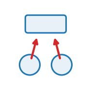

::: {.op-head}
{.op-logo}

[`aggregate`]{.op-badge} [`acts on: cell`]{.op-badge} [`prediction: none`]{.op-badge}

Children -> parent. Reduce a contained set onto its parent.
:::

```{=html}
<style>
.op-grid{display:grid;grid-template-columns:repeat(auto-fill,minmax(270px,1fr));gap:.7rem;margin:1rem 0 1.6rem}
.op-card{display:flex;align-items:center;gap:.7rem;padding:.6rem .75rem;border:1px solid var(--bs-border-color,#dee2e6);
  border-radius:10px;text-decoration:none;color:inherit;background:var(--bs-body-bg,#fff);transition:.12s}
.op-card:hover{border-color:#1f77b4;box-shadow:0 2px 8px rgba(31,119,180,.13);transform:translateY(-1px)}
.op-card img{width:42px;height:42px;flex:0 0 42px;object-fit:contain}
.op-card-body{display:flex;flex-direction:column;min-width:0}
.op-card-name{font-weight:600;font-family:var(--bs-font-monospace,monospace);color:#1f77b4}
.op-card-sub{font-size:.8em;color:#6c757d;line-height:1.25;overflow:hidden;display:-webkit-box;-webkit-line-clamp:2;-webkit-box-orient:vertical}
.kind-h{height:1.5em;vertical-align:-.35em;margin-right:.25rem}
.kind-sym{color:#adb5bd;font-weight:400;margin-left:.3rem}
.op-head{display:block;border-left:3px solid #1f77b4;padding:.2rem 0 .2rem 1rem;margin:.5rem 0 1.5rem}
.op-logo{width:74px;height:74px;float:right;margin:-.2rem 0 .4rem 1rem;object-fit:contain}
.op-badge{font-size:.78em;background:rgba(31,119,180,.1);color:#1f77b4;border-radius:5px;padding:.05rem .4rem;margin-right:.2rem;white-space:nowrap}
.op-vid{margin:.4rem 0}.op-vid video{width:100%;max-width:520px;border-radius:8px;background:#000;display:block}
.op-vid figcaption{font-size:.85em;color:#6c757d;margin-top:.3rem;max-width:520px}
</style>
```

## Role in Plexus

- **Kind** &mdash; $\textstyle\sum_\pi$ **Aggregate**: children &rarr; parent, up the containment $\pi$.
- **Acts on** &mdash; `cell` (the level the operator runs at).
- **Reads** &mdash; &ndash;
- **Writes / returns** &mdash; emits **no integrated force** &mdash; it mutates a field / relation / membership, or feeds a substep.
- **Prediction** &mdash; `none`.
- **Dimensions** &mdash; 2D.

## Mechanism

The `centroid` reduction: a parent's position is the occupancy-weighted mean of its
children's positions (a cell's position = the centroid of its particles). This is a
DERIVED readout, not an integrated force, so it writes the parent's position directly
and declares MAY_MUTATE_INTEGRATED_STATE to opt out of the integration guard; returns {}.

## Minimal spec

```yaml
operators:
  - {op: aggregate, at: cell}
```

## Typical schedules

_Where this operator sits in a pipeline &mdash; to be written._

## Identifiability

_What observations can (and cannot) recover this operator's parameters &mdash; to be written._

## Failure modes

_What breaks under bad parameters &mdash; to be written._

## Related operators

_&ndash;_

## Source

[`src/plexus/operators/aggregate.py`](https://github.com/allierc/Plexus/blob/main/src/plexus/operators/aggregate.py) &mdash; the registered operator.

```python
"""aggregate -- children -> parent. Reduce a contained set onto its parent.

The `centroid` reduction: a parent's position is the occupancy-weighted mean of its
children's positions (a cell's position = the centroid of its particles). This is a
DERIVED readout, not an integrated force, so it writes the parent's position directly
and declares MAY_MUTATE_INTEGRATED_STATE to opt out of the integration guard; returns {}.
"""
from __future__ import annotations

import torch

from plexus.models.base import Aggregate
from plexus.models.registry import register_operator


@register_operator("aggregate", level="cell", kind="aggregate")
class Centroid(Aggregate):
    MAY_MUTATE_INTEGRATED_STATE = True             # writes the parent's derived position (a readout)

    def __init__(self, params, device="cpu"):
        super().__init__(params, device)
        self.at = params.get("_at", "cell")
        self.child = params.get("child")           # optional: which contained set (default: first child)

    def forward(self, H, mask=None):
        parent = H.level(self.at)
        kids = H.children(self.at)
        if not kids:
            return {}
        child = H.level(self.child) if self.child else H.level(kids[0])
        pidx = child.parent                        # [Nc] parent slot per child
        if pidx.numel() == 0:
            return {}
        dev = parent.state.device
        px0, px1 = parent.state_schema["pos"]
        cpos = child.get("pos"); cocc = child.occ
        s = torch.zeros(parent.n, 2, device=dev).index_add_(0, pidx, cpos * cocc[:, None])
        w = torch.zeros(parent.n, device=dev).index_add_(0, pidx, cocc)
        centroid = s / w.clamp(min=1.0)[:, None]
        new = parent.state.clone()                 # only live parents take the readout
        new[:, px0:px1] = torch.where(parent.occ[:, None] > 0, centroid, parent.state[:, px0:px1])
        parent.state = new
        return {}
```
