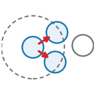

::: {.op-head}
{.op-logo}

[`rewire`]{.op-badge} [`acts on: particle`]{.op-badge} [`prediction: none`]{.op-badge}

Form new crosslinks between nodes that have drifted within range of one another.
:::

```{=html}
<style>
.op-grid{display:grid;grid-template-columns:repeat(auto-fill,minmax(270px,1fr));gap:.7rem;margin:1rem 0 1.6rem}
.op-card{display:flex;align-items:center;gap:.7rem;padding:.6rem .75rem;border:1px solid var(--bs-border-color,#dee2e6);
  border-radius:10px;text-decoration:none;color:inherit;background:var(--bs-body-bg,#fff);transition:.12s}
.op-card:hover{border-color:#1f77b4;box-shadow:0 2px 8px rgba(31,119,180,.13);transform:translateY(-1px)}
.op-card img{width:42px;height:42px;flex:0 0 42px;object-fit:contain}
.op-card-body{display:flex;flex-direction:column;min-width:0}
.op-card-name{font-weight:600;font-family:var(--bs-font-monospace,monospace);color:#1f77b4}
.op-card-sub{font-size:.8em;color:#6c757d;line-height:1.25;overflow:hidden;display:-webkit-box;-webkit-line-clamp:2;-webkit-box-orient:vertical}
.kind-h{height:1.5em;vertical-align:-.35em;margin-right:.25rem}
.kind-sym{color:#adb5bd;font-weight:400;margin-left:.3rem}
.op-head{display:block;border-left:3px solid #1f77b4;padding:.2rem 0 .2rem 1rem;margin:.5rem 0 1.5rem}
.op-logo{width:74px;height:74px;float:right;margin:-.2rem 0 .4rem 1rem;object-fit:contain}
.op-badge{font-size:.78em;background:rgba(31,119,180,.1);color:#1f77b4;border-radius:5px;padding:.05rem .4rem;margin-right:.2rem;white-space:nowrap}
.op-vid{margin:.4rem 0}.op-vid video{width:100%;max-width:520px;border-radius:8px;background:#000;display:block}
.op-vid figcaption{font-size:.85em;color:#6c757d;margin-top:.3rem;max-width:520px}
</style>
```

## Role in Plexus

- **Kind** &mdash; $\mathcal{R}\!:E$ **Rewire**: rebuild the relation $E$ each tick.
- **Acts on** &mdash; `particle` (the set the operator acts on).
- **Reads** &mdash; &ndash;
- **Writes / returns** &mdash; emits **no integrated force** &mdash; it mutates a field / relation / membership, or feeds a substep.
- **Prediction** &mdash; `none`.
- **Dimensions** &mdash; 3D.

## Mechanism

basement_membrane -> basement_membrane: reads pos, extends the bond list.

    a bond forms between i and j when   L_ij < cutoff
    and neither already holds `max_neighbours` bonds

The bond list is otherwise built once and extended only for newly secreted nodes, so two
existing nodes coming within range would never crosslink. That is a real gap in the model, and
this closes it.

IT IS NOT WHY A SHEET HAS HOLES, and it is worth saying so, because the measurement that
suggests it is easy to misread. A large fraction of pairs inside the cutoff have no bond -- but
the bonding rule only ever considers each node's nearest `max_neighbours`, and a node typically
has more neighbours within the cutoff than that cap allows. Most of those unbonded close pairs
were never candidates: the cap working as designed, not a topology that had frozen. Switching
this operator on moves the unbonded fraction, the spacing and the largest gap by almost
nothing. It is correct, and it is not the fix.

The kind is `rewire`, because forming a bond changes the relation and nothing else.

Reference: Plexus (this work); crosslinking of a basement-membrane network within a contact
radius.

## Parameters

| parameter | role | default |
|---|---|---|
| `every` | frames between crosslinking events | 20 |
| `cutoff` | bonding range | 0.008 |
| `max_neighbours` | cap per node | 6 |

## Minimal spec

```yaml
operators:
  - {op: bm_crosslink, at: particle}
```

## Mechanism-search tags

**Mechanism** &mdash; [`crosslinking`]{.op-badge} [`network_repair`]{.op-badge} [`peroxidasin`]{.op-badge}  

## Related operators

Other **rewire** operators: [`radius_graph`](radius_graph.qmd), [`edge_flip`](edge_flip.qmd), [`cell_neighbours`](cell_neighbours.qmd), [`junction_sync`](junction_sync.qmd), [`bm_unbond`](bm_unbond.qmd), [`adhesion_turnover`](adhesion_turnover.qmd).

## Source

[`src/plexus/operators/membrane_ops.py`](https://github.com/allierc/Plexus/blob/main/src/plexus/operators/membrane_ops.py) &mdash; the registered operator.

```python
@register_operator("bm_crosslink", family="topology", set="particle", kind="rewire")
class BasementMembraneCrosslink(Rewire):
    """Form new crosslinks between nodes that have drifted within range of one another.

    basement_membrane -> basement_membrane: reads pos, extends the bond list.

        a bond forms between i and j when   L_ij < cutoff
        and neither already holds `max_neighbours` bonds

    The bond list is otherwise built once and extended only for newly secreted nodes, so two
    existing nodes coming within range would never crosslink. That is a real gap in the model, and
    this closes it.

    IT IS NOT WHY A SHEET HAS HOLES, and it is worth saying so, because the measurement that
    suggests it is easy to misread. A large fraction of pairs inside the cutoff have no bond -- but
    the bonding rule only ever considers each node's nearest `max_neighbours`, and a node typically
    has more neighbours within the cutoff than that cap allows. Most of those unbonded close pairs
    were never candidates: the cap working as designed, not a topology that had frozen. Switching
    this operator on moves the unbonded fraction, the spacing and the largest gap by almost
    nothing. It is correct, and it is not the fix.

    The kind is `rewire`, because forming a bond changes the relation and nothing else.

    Reference: Plexus (this work); crosslinking of a basement-membrane network within a contact
    radius.
    """
    EMIT = None
    SUPPORTED_DIMS = [3]
    DIFFERENTIABLE = False
    MECHANISM_TAGS = ["crosslinking", "network_repair", "peroxidasin"]
    PARAM_ROLES = {"every": "frames between crosslinking events", "cutoff": "bonding range",
                   "max_neighbours": "cap per node"}
    REFERENCE = ("Plexus (this work). Continuous collagen IV crosslinking: Bhave et al. (2017) "
                 "Am. J. Physiol. Renal; Barrientos et al. (2026) Cell (BM turnover sets relaxation).")

    def __init__(self, params, device="cpu"):
        super().__init__(params, device)
        self.at = params.get("_at", "basement_membrane_particle")
        self.every = int(params.get("every", 20))
        self.cutoff = float(params.get("cutoff", 0.008))
        self.max_nb = int(params.get("max_neighbours", 6))
        self._k = 0

    def forward(self, H, mask=None):
        self._k += 1
        if self.every <= 0 or self._k % self.every:
            return {}
        bonds = getattr(H, "membrane_bonds", None)
        if bonds is None:
            return {}
        bi, bj, _, _ = bonds
        lvl = H.level(self.at)
        pos = lvl.get("pos").detach()
        lv = getattr(H, "membrane_alive", None)
        idx = lv.nonzero(as_tuple=True)[0] if lv is not None else torch.arange(pos.shape[0],
                                                                              device=pos.device)
        sub = pos[idx]
        finder = H.__dict__.get("_bm_bond_op")
        if finder is None:
            return {}
        k = min(self.max_nb, max(sub.shape[0] - 1, 1))
        ni, nj = (finder._neighbours_celllist(sub, k) if sub.shape[0] > 20000
                  else finder._build_pairwise(sub, k))
        ni, nj = idx[ni], idx[nj]
        n2 = pos.shape[0] + 1
        cand = torch.unique(torch.minimum(ni, nj) * n2 + torch.maximum(ni, nj))
        has = torch.minimum(bi, bj) * n2 + torch.maximum(bi, bj)
        fresh = cand[~torch.isin(cand, has)]
        if not fresh.numel():
            return {}
        H.membrane_rebond = ((fresh // n2).long(), (fresh % n2).long())
        REBOND_TRACE.append((int(getattr(H, "frame", -1) or -1), int(fresh.numel()), int(bi.numel())))
        return {}
```
