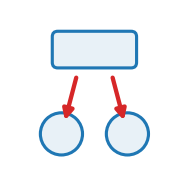

::: {.op-head}
{.op-logo}

[`broadcast`]{.op-badge} [`acts on: particle`]{.op-badge} [`prediction: first_derivative`]{.op-badge}

Parent -> children. Lift a parent quantity onto its children.
:::

```{=html}
<style>
.op-grid{display:grid;grid-template-columns:repeat(auto-fill,minmax(270px,1fr));gap:.7rem;margin:1rem 0 1.6rem}
.op-card{display:flex;align-items:center;gap:.7rem;padding:.6rem .75rem;border:1px solid var(--bs-border-color,#dee2e6);
  border-radius:10px;text-decoration:none;color:inherit;background:var(--bs-body-bg,#fff);transition:.12s}
.op-card:hover{border-color:#1f77b4;box-shadow:0 2px 8px rgba(31,119,180,.13);transform:translateY(-1px)}
.op-card img{width:42px;height:42px;flex:0 0 42px;object-fit:contain}
.op-card-body{display:flex;flex-direction:column;min-width:0}
.op-card-name{font-weight:600;font-family:var(--bs-font-monospace,monospace);color:#1f77b4}
.op-card-sub{font-size:.8em;color:#6c757d;line-height:1.25;overflow:hidden;display:-webkit-box;-webkit-line-clamp:2;-webkit-box-orient:vertical}
.kind-h{height:1.5em;vertical-align:-.35em;margin-right:.25rem}
.kind-sym{color:#adb5bd;font-weight:400;margin-left:.3rem}
.op-head{display:block;border-left:3px solid #1f77b4;padding:.2rem 0 .2rem 1rem;margin:.5rem 0 1.5rem}
.op-logo{width:74px;height:74px;float:right;margin:-.2rem 0 .4rem 1rem;object-fit:contain}
.op-badge{font-size:.78em;background:rgba(31,119,180,.1);color:#1f77b4;border-radius:5px;padding:.05rem .4rem;margin-right:.2rem;white-space:nowrap}
.op-vid{margin:.4rem 0}.op-vid video{width:100%;max-width:520px;border-radius:8px;background:#000;display:block}
.op-vid figcaption{font-size:.85em;color:#6c757d;margin-top:.3rem;max-width:520px}
</style>
```

## Role in Plexus

- **Kind** &mdash; $\pi^*$ **Broadcast**: parent &rarr; children, down the containment $\pi$.
- **Acts on** &mdash; `particle` (the level the operator runs at).
- **Reads** &mdash; `stiffness`
- **Writes / returns** &mdash; returns a **velocity** &mdash; the engine integrates $x \mathrel{+}= \Delta t\,\delta$.
- **Prediction** &mdash; `first_derivative`.
- **Dimensions** &mdash; 2D.

## Mechanism

The `containment` lift: each child gets a velocity delta `stiffness * (parent_pos -
child_pos)` -- pulled toward its parent's (e.g. aggregated centroid) position, so a
cell holds its particles together. Unlike `aggregate` (a derived readout that writes
the parent), this RETURNS a delta on the children that the engine integrates.

## Equation

$$
\dot{\mathbf x}_i \;=\; k\,\big(\mathbf x_{P(i)}-\mathbf x_i\big)
$$
The containment lift: each child is pulled toward its parent $P(i)$'s position with
stiffness $k$ — the down-the-hierarchy dual of `aggregate`.

## Parameters

| parameter | role | default |
|---|---|---|
| `stiffness` | &ndash; | **required** |

## Minimal spec

```yaml
operators:
  - {op: broadcast, at: particle, stiffness: ...}
```

## Typical schedules

_Where this operator sits in a pipeline &mdash; to be written._

## Identifiability

_What observations can (and cannot) recover this operator's parameters &mdash; to be written._

## Failure modes

_What breaks under bad parameters &mdash; to be written._

## Related operators

_&ndash;_

## Source

[`src/plexus/operators/broadcast.py`](https://github.com/allierc/Plexus/blob/main/src/plexus/operators/broadcast.py) &mdash; the registered operator.

```python
"""broadcast -- parent -> children. Lift a parent quantity onto its children.

The `containment` lift: each child gets a velocity delta `stiffness * (parent_pos -
child_pos)` -- pulled toward its parent's (e.g. aggregated centroid) position, so a
cell holds its particles together. Unlike `aggregate` (a derived readout that writes
the parent), this RETURNS a delta on the children that the engine integrates.
"""
from __future__ import annotations

import torch

from plexus.models.base import Broadcast
from plexus.models.registry import register_operator


@register_operator("broadcast", level="particle", kind="broadcast")
class BroadcastLift(Broadcast):
    PREDICTION = "first_derivative"            # emits a velocity; the engine integrates
    REQUIRES_PARAMS = ["stiffness"]

    def __init__(self, params, device="cpu"):
        super().__init__(params, device)
        self.k = float(params.get("stiffness", 1.0))
        self.at = params.get("_at", "particle")

    def forward(self, H, mask=None):
        child = H.level(self.at)
        dev = child.state.device
        pname = getattr(child, "parent_name", None)
        if pname is None:
            return {self.at: torch.zeros(child.n, 2, device=dev)}
        parent = H.level(pname)
        ppos = parent.get("pos")[child.parent]     # each child's parent position
        vel = self.k * (ppos - child.get("pos")) * child.occ[:, None]
        if mask is not None:
            vel = vel * mask[:, None].float()
        return {self.at: vel}
```
