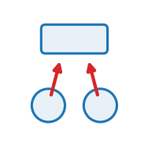

::: {.op-head}
{.op-logo}

[`aggregate`]{.op-badge} [`acts on: cell`]{.op-badge} [`prediction: none`]{.op-badge}

Aggregate the 3D vertex mesh into per-cell scalars: the cross-scale readout the reaction-diffusion runs on.
:::

```{=html}
<style>
.op-grid{display:grid;grid-template-columns:repeat(auto-fill,minmax(270px,1fr));gap:.7rem;margin:1rem 0 1.6rem}
.op-card{display:flex;align-items:center;gap:.7rem;padding:.6rem .75rem;border:1px solid var(--bs-border-color,#dee2e6);
  border-radius:10px;text-decoration:none;color:inherit;background:var(--bs-body-bg,#fff);transition:.12s}
.op-card:hover{border-color:#1f77b4;box-shadow:0 2px 8px rgba(31,119,180,.13);transform:translateY(-1px)}
.op-card img{width:42px;height:42px;flex:0 0 42px;object-fit:contain}
.op-card-body{display:flex;flex-direction:column;min-width:0}
.op-card-name{font-weight:600;font-family:var(--bs-font-monospace,monospace);color:#1f77b4}
.op-card-sub{font-size:.8em;color:#6c757d;line-height:1.25;overflow:hidden;display:-webkit-box;-webkit-line-clamp:2;-webkit-box-orient:vertical}
.kind-h{height:1.5em;vertical-align:-.35em;margin-right:.25rem}
.kind-sym{color:#adb5bd;font-weight:400;margin-left:.3rem}
.op-head{display:block;border-left:3px solid #1f77b4;padding:.2rem 0 .2rem 1rem;margin:.5rem 0 1.5rem}
.op-logo{width:74px;height:74px;float:right;margin:-.2rem 0 .4rem 1rem;object-fit:contain}
.op-badge{font-size:.78em;background:rgba(31,119,180,.1);color:#1f77b4;border-radius:5px;padding:.05rem .4rem;margin-right:.2rem;white-space:nowrap}
.op-vid{margin:.4rem 0}.op-vid video{width:100%;max-width:520px;border-radius:8px;background:#000;display:block}
.op-vid figcaption{font-size:.85em;color:#6c757d;margin-top:.3rem;max-width:520px}
</style>
```

## Role in Plexus

- **Kind** &mdash; $\textstyle\sum_\pi$ **Aggregate**: children &rarr; parent, up the containment $\pi$.
- **Acts on** &mdash; `cell` (the set the operator acts on).
- **Reads** &mdash; &ndash;
- **Writes / returns** &mdash; emits **no integrated force** &mdash; it mutates a field / relation / membership, or feeds a substep.
- **Prediction** &mdash; `none`.
- **Dimensions** &mdash; 3D.

## Mechanism

reaction-diffusion runs on.

vertex -> cell: reads the half-edge table stashed on the vertex set and writes the cell set's
centroid `cen` and area, by scatter-add over half-edges.

    cen_f = (1/n_f) sum_{e in f} x_srce(e)          the face centroid
    A_f   = (1/2) | sum_{e in f} x_srce(e) x x_trgt(e) |

the second being the magnitude of the summed cross products around the face ring, which is
twice the area of a planar polygon in 3D and needs no projection onto a normal.

It is an Aggregate because it is a many-to-one map across the containment relation: many
vertices, one cell. Every operator here that speaks of a cell's position or size depends on it,
so it is scheduled first.

Reference: none -- a geometric readout, not a mechanism. Plexus (this work).

## Parameters

| parameter | role | default |
|---|---|---|
| `vertex_set` | &ndash; | "vertex" |

## Minimal spec

```yaml
operators:
  - {op: cell_geometry, at: cell}
```

## Mechanism-search tags

**Mechanism** &mdash; [`aggregate`]{.op-badge} [`cell_geometry`]{.op-badge} [`cross_scale`]{.op-badge}  

## Related operators

_&ndash;_

## Source

[`src/plexus/operators/diffusion_reaction.py`](https://github.com/allierc/Plexus/blob/main/src/plexus/operators/diffusion_reaction.py) &mdash; the registered operator.

```python
@register_operator("cell_geometry", set="cell", kind="aggregate", family="hierarchy")
class CellGeometry3D(Aggregate):
    """Aggregate the 3D vertex mesh into per-cell scalars: the cross-scale readout the
    reaction-diffusion runs on.

    vertex -> cell: reads the half-edge table stashed on the vertex set and writes the cell set's
    centroid `cen` and area, by scatter-add over half-edges.

        cen_f = (1/n_f) sum_{e in f} x_srce(e)          the face centroid
        A_f   = (1/2) | sum_{e in f} x_srce(e) x x_trgt(e) |

    the second being the magnitude of the summed cross products around the face ring, which is
    twice the area of a planar polygon in 3D and needs no projection onto a normal.

    It is an Aggregate because it is a many-to-one map across the containment relation: many
    vertices, one cell. Every operator here that speaks of a cell's position or size depends on it,
    so it is scheduled first.

    Reference: none -- a geometric readout, not a mechanism. Plexus (this work).
    """
    SUPPORTED_DIMS = [3]; DIFFERENTIABLE = False; MAY_MUTATE_INTEGRATED_STATE = True
    INPUTS = ["vertex"]; OUTPUTS = ["cell"]; READS = ["pos"]; WRITES = ["area", "cen"]
    MECHANISM_TAGS = ["aggregate", "cell_geometry", "cross_scale"]
    REFERENCE = "Plexus (this work)."

    def __init__(self, params, device="cpu"):
        super().__init__(params, device)
        self.at = params.get("_at", "cell"); self.vat = params.get("vertex_set", "vertex")

    def forward(self, H, mask=None):
        from plexus.operators.vertex_ops import face_geometry_3d
        clvl = H.level(self.at); vlvl = H.level(self.vat); m = getattr(vlvl, "_mesh", None)
        if m is None:
            return {}
        pos = vlvl.get("pos")[:m["Nv"]]
        area, _, cen, _ = face_geometry_3d(pos, m["E_srce"], m["E_trgt"], m["E_face"], m["nF"])
        nF = m["nF"]; st = clvl.state.clone(); sch = clvl.state_schema
        if "cen" in sch:
            i0, i1 = sch["cen"]; st[:nF, i0:i1] = cen.detach()
        if "area" in sch:
            i0, i1 = sch["area"]; st[:nF, i0:i1] = area.detach()[:, None]
        clvl.state = st
        if getattr(clvl, "occ", None) is not None:
            occ = torch.zeros(clvl.state.shape[0], device=clvl.state.device); occ[:nF] = 1.0; clvl.occ = occ
        return {}
```
