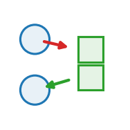

::: {.op-head}
{.op-logo}

[`exchange`]{.op-badge} [`acts on: particle`]{.op-badge} [`prediction: first_derivative`]{.op-badge}

Set <- field. Particles climb (or flee) a field's gradient.
:::

```{=html}
<style>
.op-grid{display:grid;grid-template-columns:repeat(auto-fill,minmax(270px,1fr));gap:.7rem;margin:1rem 0 1.6rem}
.op-card{display:flex;align-items:center;gap:.7rem;padding:.6rem .75rem;border:1px solid var(--bs-border-color,#dee2e6);
  border-radius:10px;text-decoration:none;color:inherit;background:var(--bs-body-bg,#fff);transition:.12s}
.op-card:hover{border-color:#1f77b4;box-shadow:0 2px 8px rgba(31,119,180,.13);transform:translateY(-1px)}
.op-card img{width:42px;height:42px;flex:0 0 42px;object-fit:contain}
.op-card-body{display:flex;flex-direction:column;min-width:0}
.op-card-name{font-weight:600;font-family:var(--bs-font-monospace,monospace);color:#1f77b4}
.op-card-sub{font-size:.8em;color:#6c757d;line-height:1.25;overflow:hidden;display:-webkit-box;-webkit-line-clamp:2;-webkit-box-orient:vertical}
.kind-h{height:1.5em;vertical-align:-.35em;margin-right:.25rem}
.kind-sym{color:#adb5bd;font-weight:400;margin-left:.3rem}
.op-head{display:block;border-left:3px solid #1f77b4;padding:.2rem 0 .2rem 1rem;margin:.5rem 0 1.5rem}
.op-logo{width:74px;height:74px;float:right;margin:-.2rem 0 .4rem 1rem;object-fit:contain}
.op-badge{font-size:.78em;background:rgba(31,119,180,.1);color:#1f77b4;border-radius:5px;padding:.05rem .4rem;margin-right:.2rem;white-space:nowrap}
.op-vid{margin:.4rem 0}.op-vid video{width:100%;max-width:520px;border-radius:8px;background:#000;display:block}
.op-vid figcaption{font-size:.85em;color:#6c757d;margin-top:.3rem;max-width:520px}
</style>
```

## Role in Plexus

- **Kind** &mdash; push / pull **Exchange**: set &harr; field.
- **Acts on** &mdash; `particle` (the level the operator runs at).
- **Reads** &mdash; `from`
- **Writes / returns** &mdash; returns a **velocity** &mdash; the engine integrates $x \mathrel{+}= \Delta t\,\delta$.
- **Prediction** &mdash; `first_derivative`.
- **Dimensions** &mdash; 2D.

## Mechanism

The Keller-Segel coupling: each particle gets a velocity `gain * grad(field)` sampled
at its position (gain<0 to flee). A field->set Exchange that returns a first-derivative
velocity delta -- the ENGINE integrates it, and it simply sums with any other velocity
the particle has (e.g. attraction_repulsion), the framework's "deltas add" rule. The
field may be deposited (slime), reaction-diffused, or prescribed from a video.

$$
\dot{\mathbf x}_i \;=\; g\,\nabla\phi(\mathbf x_i)
$$
The Keller–Segel coupling: climb (or, for $g<0$, flee) the gradient of field $\phi$
sampled at the particle. A first-derivative velocity that simply sums with any other.

## Parameters

| parameter | role | default |
|---|---|---|
| `from` | &ndash; | **required** |
| `gain` | field_sensitivity | 1.0 |
| `channel` | &ndash; | 0 |

## Minimal spec

```yaml
operators:
  - {op: chemotaxis, at: particle, from: ...}
```

## Mechanism-search tags

**Mechanism** &mdash; [`gradient_following`]{.op-badge} [`field_templated_aggregation`]{.op-badge}  
**Morphology prior** &mdash; [`single_cluster`]{.op-badge} [`field_outline`]{.op-badge}

## Related operators

Other **exchange** operators: [`deposit`](deposit.qmd), [`sense`](sense.qmd), [`pulse_to_contraction`](pulse_to_contraction.qmd), [`pulse_to_active_stress`](pulse_to_active_stress.qmd), [`apply_material_map`](apply_material_map.qmd), [`mls_mpm_mechanics`](mls_mpm_mechanics.qmd).

## Source

[`src/plexus/operators/chemotaxis.py`](https://github.com/allierc/Plexus/blob/main/src/plexus/operators/chemotaxis.py) &mdash; the registered operator.

```python
"""chemotaxis -- set <- field. Particles climb (or flee) a field's gradient.

The Keller-Segel coupling: each particle gets a velocity `gain * grad(field)` sampled
at its position (gain<0 to flee). A field->set Exchange that returns a first-derivative
velocity delta -- the ENGINE integrates it, and it simply sums with any other velocity
the particle has (e.g. attraction_repulsion), the framework's "deltas add" rule. The
field may be deposited (slime), reaction-diffused, or prescribed from a video.
"""
from __future__ import annotations

import torch
import torch.nn.functional as Fnn

from plexus.models.base import Exchange
from plexus.models.registry import register_operator


@register_operator("chemotaxis", level="particle", kind="exchange")
class Chemotaxis(Exchange):
    PREDICTION = "first_derivative"             # emits a velocity; the ENGINE integrates
    REQUIRES_PARAMS = ["from"]
    MECHANISM_TAGS = ["gradient_following", "field_templated_aggregation"]
    MORPHOLOGY_PRIOR = ["single_cluster", "field_outline"]
    PARAM_ROLES = {"gain": "field_sensitivity"}

    def __init__(self, params, device="cpu"):
        super().__init__(params, device)
        self.field_name = params.get("from")
        self.gain = float(params.get("gain", 1.0))
        self.channel = int(params.get("channel", 0))
        self.at = params.get("_at", "particle")

    def forward(self, H, mask=None):
        lvl = H.level(self.at)
        dev = lvl.state.device
        pos = lvl.get("pos")
        fld = H.fields[self.field_name]
        g = fld.grid[self.channel]                              # [nx, ny]
        W = float(getattr(H, "world_width", 1.0))
        # boundary-aware central difference (x spans [0,W], y spans [0,1]): wrap under a
        # periodic world, replicate under a wall -- so a wall edge has no artificial gradient.
        mode = "circular" if getattr(H, "periodic", False) else "replicate"
        gp = Fnn.pad(g[None, None], (1, 1, 1, 1), mode=mode)[0, 0]   # [nx+2, ny+2]
        gx = (gp[2:, 1:-1] - gp[:-2, 1:-1]) * 0.5 * (fld.nx / W)     # d/dx, per world unit
        gy = (gp[1:-1, 2:] - gp[1:-1, :-2]) * 0.5 * fld.ny           # d/dy, per world unit
        grad = torch.stack([gx, gy], 0)[None]                       # [1, 2, nx, ny]
        # bilinear sample the gradient at particle positions
        gxn = (pos[:, 0] / W) * 2 - 1
        gyn = (pos[:, 1] / 1.0) * 2 - 1
        grid = torch.stack([gyn, gxn], -1)[None, None]         # grid_sample: last dim (x=ny, y=nx)
        vel = Fnn.grid_sample(grad, grid, mode="bilinear", padding_mode="border",
                              align_corners=True)[0, :, 0].t()  # [N, 2]
        vel = self.gain * vel * lvl.occ[:, None]
        if mask is not None:
            vel = vel * mask[:, None].float()
        return {self.at: vel}
```
