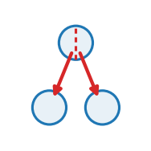

::: {.op-head}
{.op-logo}

[`structural`]{.op-badge} [`acts on: vertex`]{.op-badge} [`prediction: none`]{.op-badge}

The cytokinetic ring: the myosin a division leaves on the junction it just built, debited from the cortex that built it.
:::

```{=html}
<style>
.op-grid{display:grid;grid-template-columns:repeat(auto-fill,minmax(270px,1fr));gap:.7rem;margin:1rem 0 1.6rem}
.op-card{display:flex;align-items:center;gap:.7rem;padding:.6rem .75rem;border:1px solid var(--bs-border-color,#dee2e6);
  border-radius:10px;text-decoration:none;color:inherit;background:var(--bs-body-bg,#fff);transition:.12s}
.op-card:hover{border-color:#1f77b4;box-shadow:0 2px 8px rgba(31,119,180,.13);transform:translateY(-1px)}
.op-card img{width:42px;height:42px;flex:0 0 42px;object-fit:contain}
.op-card-body{display:flex;flex-direction:column;min-width:0}
.op-card-name{font-weight:600;font-family:var(--bs-font-monospace,monospace);color:#1f77b4}
.op-card-sub{font-size:.8em;color:#6c757d;line-height:1.25;overflow:hidden;display:-webkit-box;-webkit-line-clamp:2;-webkit-box-orient:vertical}
.kind-h{height:1.5em;vertical-align:-.35em;margin-right:.25rem}
.kind-sym{color:#adb5bd;font-weight:400;margin-left:.3rem}
.op-head{display:block;border-left:3px solid #1f77b4;padding:.2rem 0 .2rem 1rem;margin:.5rem 0 1.5rem}
.op-logo{width:74px;height:74px;float:right;margin:-.2rem 0 .4rem 1rem;object-fit:contain}
.op-badge{font-size:.78em;background:rgba(31,119,180,.1);color:#1f77b4;border-radius:5px;padding:.05rem .4rem;margin-right:.2rem;white-space:nowrap}
.op-vid{margin:.4rem 0}.op-vid video{width:100%;max-width:520px;border-radius:8px;background:#000;display:block}
.op-vid figcaption{font-size:.85em;color:#6c757d;margin-top:.3rem;max-width:520px}
</style>
```

## Role in Plexus

- **Kind** &mdash; $|S|$ **Structural**: change the entities themselves &mdash; Divide, Die, grow.
- **Acts on** &mdash; `vertex` (the set the operator acts on).
- **Reads** &mdash; &ndash;
- **Writes / returns** &mdash; emits **no integrated force** &mdash; it mutates a field / relation / membership, or feeds a substep.
- **Prediction** &mdash; `none`.
- **Dimensions** &mdash; 3D.

## Mechanism

from the cortex that built it.

vertex -> vertex: reads which vertices are new and the medioapical density, writes the keyed
store and debits m["myo_med"]. Runs after `cell_divide`, before `junction_sync`.

A junction born with BOTH endpoints new is a daughter-daughter interface -- exactly the
distinction the inheritance rule already draws, since a junction merely split by a division
has one new endpoint and one old one. Those junctions are written into the store at

n*_f is the line density the supply into that cell's belt sustains at steady state, so `ring`
is dimensionless: how many times the density of a MATURE junction of that same cell a newborn
daughter-daughter interface starts at. The deposit is debited from the medioapical pool of the
adjacent cell, which is not bookkeeping pedantry -- the ring is assembled from cortical
actomyosin, and a ring appearing from nowhere would be a source term in a model whose whole
point is that myosin is conserved, after which the ledger could no longer detect a leak.

Nothing here decays the deposit, because the junctional equation already does:
dN/dt = J - N/tau_jun pulls the interface from ring * n* back to n* over tau_jun. So `ring`
sets how bright a new junction starts and tau_jun how long it stays that way, and neither
needs a second timescale invented for it.

Without this operator the two-pool model gets the division site backwards twice: the brightest
junctions there are the two halves of a contact the division CUT -- a cell about to divide is
large, has a low perimeter-to-area ratio, holds more cortical myosin and feeds its belts
harder -- while the daughter-daughter interface, the one place a real dividing cell puts
almost all of its myosin, is the dimmest thing in the frame.

Reference: Herszterg, S., Leibfried, A., Bosveld, F., Martin, C. & Bellaiche, Y. (2013).
Interplay between the dividing cell and its neighbors regulates adherens junction formation
during cytokinesis in epithelial tissue. Dev. Cell 24:256-270; Founounou, N., Loyer, N. & Le
Borgne, R. (2013). Septins regulate the contractility of the actomyosin ring to enable
adherens junction remodeling during cytokinesis. Dev. Cell 24:242-255.

## Parameters

| parameter | role | default |
|---|---|---|
| `ring` | newborn_junction_density_as_a_multiple_of_the_local_steady_state | 3.0 |
| `tau_jun` | the_belt_turnover_that_relaxes_it_back | 20.0 |
| `debit` | &ndash; | True |

## Minimal spec

```yaml
operators:
  - {op: cytokinetic_ring, at: vertex}
```

## Mechanism-search tags

**Mechanism** &mdash; [`actomyosin_contraction`]{.op-badge} [`cytokinesis`]{.op-badge} [`junction_state`]{.op-badge} [`conserved_amount`]{.op-badge}  

## Related operators

Other **structural** operators: [`cell_divide`](cell_divide.qmd), [`cell_die`](cell_die.qmd), [`topo_record`](topo_record.qmd), [`cell_grow`](cell_grow.qmd), [`junction_myosin`](junction_myosin.qmd), [`cell_exclude`](cell_exclude.qmd).

## Source

[`src/plexus/operators/junction_ops.py`](https://github.com/allierc/Plexus/blob/main/src/plexus/operators/junction_ops.py) &mdash; the registered operator.

```python
@register_operator("cytokinetic_ring", family="mechanics", set="vertex", kind="structural")
class CytokineticRing(Structural):
    """The cytokinetic ring: the myosin a division leaves on the junction it just built, debited
    from the cortex that built it.

    vertex -> vertex: reads which vertices are new and the medioapical density, writes the keyed
    store and debits m["myo_med"]. Runs after `cell_divide`, before `junction_sync`.

    A junction born with BOTH endpoints new is a daughter-daughter interface -- exactly the
    distinction the inheritance rule already draws, since a junction merely split by a division
    has one new endpoint and one old one. Those junctions are written into the store at

        n_e  = ring * n*_f,        n*_f = tau_jun k_ex rho_f

    n*_f is the line density the supply into that cell's belt sustains at steady state, so `ring`
    is dimensionless: how many times the density of a MATURE junction of that same cell a newborn
    daughter-daughter interface starts at. The deposit is debited from the medioapical pool of the
    adjacent cell, which is not bookkeeping pedantry -- the ring is assembled from cortical
    actomyosin, and a ring appearing from nowhere would be a source term in a model whose whole
    point is that myosin is conserved, after which the ledger could no longer detect a leak.

    Nothing here decays the deposit, because the junctional equation already does:
    dN/dt = J - N/tau_jun pulls the interface from ring * n* back to n* over tau_jun. So `ring`
    sets how bright a new junction starts and tau_jun how long it stays that way, and neither
    needs a second timescale invented for it.

    Without this operator the two-pool model gets the division site backwards twice: the brightest
    junctions there are the two halves of a contact the division CUT -- a cell about to divide is
    large, has a low perimeter-to-area ratio, holds more cortical myosin and feeds its belts
    harder -- while the daughter-daughter interface, the one place a real dividing cell puts
    almost all of its myosin, is the dimmest thing in the frame.

    Reference: Herszterg, S., Leibfried, A., Bosveld, F., Martin, C. & Bellaiche, Y. (2013).
    Interplay between the dividing cell and its neighbors regulates adherens junction formation
    during cytokinesis in epithelial tissue. Dev. Cell 24:256-270; Founounou, N., Loyer, N. & Le
    Borgne, R. (2013). Septins regulate the contractility of the actomyosin ring to enable
    adherens junction remodeling during cytokinesis. Dev. Cell 24:242-255.
    """

    EMIT = None
    SUPPORTED_DIMS = [3]
    REQUIRES_PARAMS = []
    DIFFERENTIABLE = False
    MAY_MUTATE_INTEGRATED_STATE = False
    MECHANISM_TAGS = ["actomyosin_contraction", "cytokinesis", "junction_state", "conserved_amount"]
    PARAM_ROLES = {"ring": "newborn_junction_density_as_a_multiple_of_the_local_steady_state",
                   "tau_jun": "the_belt_turnover_that_relaxes_it_back"}
    REFERENCE = ("Herszterg, S. et al. (2013). Interplay between the dividing cell and its "
                 "neighbors regulates adherens junction formation during cytokinesis in epithelial "
                 "tissue. Dev. Cell 24:256-270; Founounou, N., Loyer, N. & Le Borgne, R. (2013). "
                 "Dev. Cell 24:242-255.")

    def __init__(self, params, device="cpu"):
        super().__init__(params, device)
        self.at = params.get("_at", "vertex")
        self.ring = float(params.get("ring", 3.0))
        self.tau_jun = float(params.get("tau_jun", 20.0))
        self.debit = bool(params.get("debit", True))
        self._said = False

    def forward(self, H, mask=None):
        lvl = H.level(self.at)
        m = getattr(lvl, "_mesh", None)
        if m is None or m.get("myo_keys") is None or m.get("myo_nstar_per_tau") is None:
            return {}
        pos = lvl.get("pos")
        dev, dt_ = pos.device, pos.dtype
        es, live, vi, vj, stride, key, length = _live_edges(m, pos)
        if not bool(live.any()):
            return {}
        vseen = m.get("myo_vseen")
        if vseen is None:
            return {}
        # BOTH ENDPOINTS NEW = the interface between the two daughters. One new and one old is a split
        # half of a pre-existing contact, which has a history and must not be overwritten with a ring.
        oi = vseen[vi.clamp(max=vseen.numel() - 1)] & (vi < vseen.numel())
        oj = vseen[vj.clamp(max=vseen.numel() - 1)] & (vj < vseen.numel())
        fresh = (~oi) & (~oj)
        if not bool(fresh.any()):
            RING_TRACE.append((0, 0.0))
            return {}
        nF = int(m["nF"])
        ef = m["E_face"][live].long()
        nsp = m["myo_nstar_per_tau"]
        if nsp.shape[0] < nF:
            # THE CARRY DID NOT HAPPEN, which means this operator is scheduled somewhere `cell_divide`
            # has grown the face count without `_carry_face_state` running. Said rather than clamped:
            # a clamp here would silently give every new face the last old face's supply.
            raise RuntimeError(
                f"cytokinetic_ring: myo_nstar_per_tau has {nsp.shape[0]} entries against {nF} faces. "
                f"`medioapical_myosin` must declare it in m['face_carry'] and the topology operators "
                f"must run `_carry_face_state`.")
        # TWO-SIDED, as in `junction_myosin[two_pool]`: the belt a ring hands its myosin to is fed by
        # both daughters, so the mature density it should be measured against is the sum over the two.
        uq, inv = torch.unique(key[fresh], return_inverse=True)
        z = torch.zeros(uq.numel(), device=dev, dtype=dt_)
        cnt = z.clone().index_add(0, inv, torch.ones_like(length[fresh]))
        n_star_j = self.tau_jun * z.clone().index_add(0, inv, nsp[ef[fresh]])
        n_j = self.ring * n_star_j
        l_j = z.clone().index_add(0, inv, length[fresh]) / cnt.clamp_min(1.0)
        n_ring = torch.zeros_like(length)
        n_ring[fresh] = n_j[inv] / cnt.clamp_min(1.0)[inv]     # each side pays for its own half

        # THE DEBIT, ON THE CELLS THAT BUILT IT. The amount deposited on a junction is n*l; each of the
        # two half-edges belongs to one of the two daughters, so each daughter pays for its own side.
        if self.debit:
            rho = m.get("myo_med")
            if rho is not None and rho.shape[0] >= nF:
                # THE AREA IS RECOMPUTED, NOT READ. `myo_area` on the mesh is the pre-division one and
                # an area is extensive, so it is not carried across the rebuild; the daughters' areas
                # are what this debit must be spread over.
                area, _, _, _ = face_geometry_3d(pos, m["E_srce"].long(), m["E_trgt"].long(),
                                                 m["E_face"].long().clamp(max=nF - 1), nF,
                                                 live.to(dt_))
                area = area.clamp_min(1e-9)
                paid = (n_ring * length)[fresh]
                per_face = torch.zeros(nF, device=dev, dtype=dt_).index_add(0, ef[fresh], paid)
                rho = (rho[:nF] - per_face / area).clamp_min(0.0)
                m["myo_med"] = rho.detach()
                m["myo_med_total"] = float((rho * area).sum())

        # APPENDED TO THE STORE, not written to `m["myo"]`: the store is what the next frame's
        # `junction_myosin` reads and what `junction_sync` renders from, so putting the deposit
        # there is what makes it survive to both. Existing keys are kept; a fresh junction cannot
        # collide with one, since its key contains a vertex index that did not exist before.
        m["myo_keys"] = torch.cat([m["myo_keys"], uq.detach()])
        m["myo_vals"] = torch.cat([m["myo_vals"], n_j.detach().to(m["myo_vals"].dtype)])
        RING_TRACE.append((int(uq.numel()), float((n_j * l_j).sum())))
        if not self._said:
            print(f"[cytokinetic_ring] {int(uq.numel())} newborn interface(s) seeded at {self.ring}x "
                  f"the local steady state, debited from the medioapical pool", flush=True)
            self._said = True
        return {}
```
