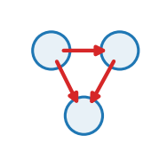

::: {.op-head}
{.op-logo}

[`lateral`]{.op-badge} [`acts on: cell`]{.op-badge} [`prediction: none`]{.op-badge}

A uniform body force at the cell level.
:::

```{=html}
<style>
.op-grid{display:grid;grid-template-columns:repeat(auto-fill,minmax(270px,1fr));gap:.7rem;margin:1rem 0 1.6rem}
.op-card{display:flex;align-items:center;gap:.7rem;padding:.6rem .75rem;border:1px solid var(--bs-border-color,#dee2e6);
  border-radius:10px;text-decoration:none;color:inherit;background:var(--bs-body-bg,#fff);transition:.12s}
.op-card:hover{border-color:#1f77b4;box-shadow:0 2px 8px rgba(31,119,180,.13);transform:translateY(-1px)}
.op-card img{width:42px;height:42px;flex:0 0 42px;object-fit:contain}
.op-card-body{display:flex;flex-direction:column;min-width:0}
.op-card-name{font-weight:600;font-family:var(--bs-font-monospace,monospace);color:#1f77b4}
.op-card-sub{font-size:.8em;color:#6c757d;line-height:1.25;overflow:hidden;display:-webkit-box;-webkit-line-clamp:2;-webkit-box-orient:vertical}
.kind-h{height:1.5em;vertical-align:-.35em;margin-right:.25rem}
.kind-sym{color:#adb5bd;font-weight:400;margin-left:.3rem}
.op-head{display:block;border-left:3px solid #1f77b4;padding:.2rem 0 .2rem 1rem;margin:.5rem 0 1.5rem}
.op-logo{width:74px;height:74px;float:right;margin:-.2rem 0 .4rem 1rem;object-fit:contain}
.op-badge{font-size:.78em;background:rgba(31,119,180,.1);color:#1f77b4;border-radius:5px;padding:.05rem .4rem;margin-right:.2rem;white-space:nowrap}
.op-vid{margin:.4rem 0}.op-vid video{width:100%;max-width:520px;border-radius:8px;background:#000;display:block}
.op-vid figcaption{font-size:.85em;color:#6c757d;margin-top:.3rem;max-width:520px}
</style>
```

## Role in Plexus

- **Kind** &mdash; $\mathcal{O}_E$ **Lateral**: within-set interaction over a relation $E$.
- **Acts on** &mdash; `cell` (the level the operator runs at).
- **Reads** &mdash; &ndash;
- **Writes / returns** &mdash; emits **no integrated force** &mdash; it mutates a field / relation / membership, or feeds a substep.
- **Prediction** &mdash; `none`.
- **Dimensions** &mdash; 2D.

## Mechanism

Applies the same acceleration to every selected cell and RETURNS it as a delta
`{cell: a}`. In an MPM scene the cell is a derived aggregate (its position is the
centroid of its particles), so the engine does not integrate it; instead the
`mls_mpm_mechanics` operator reads the cell's accumulated delta and feeds it into
the substep as the external body force `a_ext`. So gravity is an ordinary operator
-- it does not touch `pos`/`vel`, it just contributes a force.

The *bounce* of a dropped soft body is NOT a force here: it is the emergent elastic
response when the body compresses against the reflective floor (grid velocity into a
wall is clamped to zero, the fixed-corotated stress springs it back). Stiffer
`youngs` -> livelier bounce; `drag` on the mpm operator sets how fast it decays.

Default direction is -y (down). Override `gx`/`gy` for an incline or sideways pull
(e.g. a tilted-gravity slosh).

## Parameters

| parameter | role | default |
|---|---|---|
| `g` | gravity_magnitude | 10.0 |
| `gx` | gravity_x | 0.0 |
| `gy` | gravity_y | -self.g |

## Minimal spec

```yaml
operators:
  - {op: gravity, at: cell}
```

## Typical schedules

_Where this operator sits in a pipeline &mdash; to be written._

## Identifiability

_What observations can (and cannot) recover this operator's parameters &mdash; to be written._

## Failure modes

_What breaks under bad parameters &mdash; to be written._

## Mechanism-search tags

**Mechanism** &mdash; [`body_force`]{.op-badge} [`uniform_acceleration`]{.op-badge}  

## Related operators

Other **lateral** operators: [`attraction_repulsion`](attraction_repulsion.qmd), [`Coulomb`](Coulomb.qmd), [`cohesion`](cohesion.qmd), [`alignment`](alignment.qmd), [`separation`](separation.qmd), [`drag`](drag.qmd).

## Source

[`src/plexus/operators/gravity.py`](https://github.com/allierc/Plexus/blob/main/src/plexus/operators/gravity.py) &mdash; the registered operator.

```python
"""gravity -- a uniform body force at the cell level.

Applies the same acceleration to every selected cell and RETURNS it as a delta
`{cell: a}`. In an MPM scene the cell is a derived aggregate (its position is the
centroid of its particles), so the engine does not integrate it; instead the
`mls_mpm_mechanics` operator reads the cell's accumulated delta and feeds it into
the substep as the external body force `a_ext`. So gravity is an ordinary operator
-- it does not touch `pos`/`vel`, it just contributes a force.

The *bounce* of a dropped soft body is NOT a force here: it is the emergent elastic
response when the body compresses against the reflective floor (grid velocity into a
wall is clamped to zero, the fixed-corotated stress springs it back). Stiffer
`youngs` -> livelier bounce; `drag` on the mpm operator sets how fast it decays.

Default direction is -y (down). Override `gx`/`gy` for an incline or sideways pull
(e.g. a tilted-gravity slosh).
"""
from __future__ import annotations

import torch

from plexus.models.base import Lateral
from plexus.models.registry import register_operator


@register_operator("gravity", level="cell", kind="lateral")
class GravityOperator(Lateral):
    # PREDICTION is intentionally None: gravity emits a force the MPM substep consumes,
    # it is NOT integrated on the cell (the cell is a centroid readout). So `cell` never
    # enters H.predict and the engine never advects it under gravity.
    PARAM_ROLES = {"g": "gravity_magnitude", "gx": "gravity_x", "gy": "gravity_y"}
    MECHANISM_TAGS = ["body_force", "uniform_acceleration"]

    def __init__(self, params, device="cpu"):
        super().__init__(params, device)
        self.at = params.get("_at", "cell")              # the set this acts on (engine-injected)
        self.g = float(params.get("g", 10.0))            # magnitude (world units / time^2)
        self.gx = float(params.get("gx", 0.0))           # x-component (default 0)
        self.gy = float(params.get("gy", -self.g))       # y-component (default -g: down)

    def forward(self, H, mask=None):
        cell = H.level(self.at)
        dev = cell.state.device
        accel = torch.zeros(cell.n, 2, device=dev)
        accel[:, 0] = self.gx
        accel[:, 1] = self.gy
        if mask is not None:
            accel = accel * mask.float()[:, None]
        return {cell.name: accel}
```
