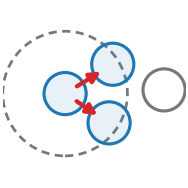

::: {.op-head}
{.op-logo}

[`rewire`]{.op-badge} [`acts on: particle`]{.op-badge} [`prediction: none`]{.op-badge}

Relation-building (rewire) operators: construct a Level's `edge_index`.
:::

```{=html}
<style>
.op-grid{display:grid;grid-template-columns:repeat(auto-fill,minmax(270px,1fr));gap:.7rem;margin:1rem 0 1.6rem}
.op-card{display:flex;align-items:center;gap:.7rem;padding:.6rem .75rem;border:1px solid var(--bs-border-color,#dee2e6);
  border-radius:10px;text-decoration:none;color:inherit;background:var(--bs-body-bg,#fff);transition:.12s}
.op-card:hover{border-color:#1f77b4;box-shadow:0 2px 8px rgba(31,119,180,.13);transform:translateY(-1px)}
.op-card img{width:42px;height:42px;flex:0 0 42px;object-fit:contain}
.op-card-body{display:flex;flex-direction:column;min-width:0}
.op-card-name{font-weight:600;font-family:var(--bs-font-monospace,monospace);color:#1f77b4}
.op-card-sub{font-size:.8em;color:#6c757d;line-height:1.25;overflow:hidden;display:-webkit-box;-webkit-line-clamp:2;-webkit-box-orient:vertical}
.kind-h{height:1.5em;vertical-align:-.35em;margin-right:.25rem}
.kind-sym{color:#adb5bd;font-weight:400;margin-left:.3rem}
.op-head{display:block;border-left:3px solid #1f77b4;padding:.2rem 0 .2rem 1rem;margin:.5rem 0 1.5rem}
.op-logo{width:74px;height:74px;float:right;margin:-.2rem 0 .4rem 1rem;object-fit:contain}
.op-badge{font-size:.78em;background:rgba(31,119,180,.1);color:#1f77b4;border-radius:5px;padding:.05rem .4rem;margin-right:.2rem;white-space:nowrap}
.op-vid{margin:.4rem 0}.op-vid video{width:100%;max-width:520px;border-radius:8px;background:#000;display:block}
.op-vid figcaption{font-size:.85em;color:#6c757d;margin-top:.3rem;max-width:520px}
</style>
```

## Role in Plexus

- **Kind** &mdash; $\mathcal{R}\!:E$ **Rewire**: rebuild the relation $E$ each tick.
- **Acts on** &mdash; `particle` (the level the operator runs at).
- **Reads** &mdash; `radius`
- **Writes / returns** &mdash; emits **no integrated force** &mdash; it mutates a field / relation / membership, or feeds a substep.
- **Prediction** &mdash; `none`.
- **Dimensions** &mdash; 2D, 3D.

## Mechanism

A `rewire` operator rebuilds the within-set relation E each tick so it tracks the
live configuration, then emits no delta -- lateral operators (interaction,
springs, ...) read the edges it leaves on the Level. Separating "who interacts"
(rewire) from "how they interact" (lateral) is what lets a dense pairwise law
become O(E) message passing.

## Parameters

| parameter | role | default |
|---|---|---|
| `radius` | &ndash; | **required** |
| `min_radius` | &ndash; | 0.0 |
| `block` | &ndash; | 2048 |

## Minimal spec

```yaml
operators:
  - {op: radius_graph, at: particle, radius: ...}
```

## Typical schedules

_Where this operator sits in a pipeline &mdash; to be written._

## Identifiability

_What observations can (and cannot) recover this operator's parameters &mdash; to be written._

## Failure modes

_What breaks under bad parameters &mdash; to be written._

## Related operators

_&ndash;_

## Source

[`src/plexus/operators/graph.py`](https://github.com/allierc/Plexus/blob/main/src/plexus/operators/graph.py) &mdash; the registered operator.

```python
"""Relation-building (rewire) operators: construct a Level's `edge_index`.

A `rewire` operator rebuilds the within-set relation E each tick so it tracks the
live configuration, then emits no delta -- lateral operators (interaction,
springs, ...) read the edges it leaves on the Level. Separating "who interacts"
(rewire) from "how they interact" (lateral) is what lets a dense pairwise law
become O(E) message passing.
"""
from __future__ import annotations

from plexus.models.base import Rewire
from plexus.models.registry import register_operator
from plexus.geometry import radius_edges


@register_operator("radius_graph", level="particle", kind="rewire")
class RadiusGraph(Rewire):
    """Set `Level.edge_index` to all live pairs within `radius` (optionally beyond
    `min_radius`). Blockwise build -> scales to 1e4-1e5 nodes; minimum-image under
    periodic BC. Run before a pairwise lateral operator in the schedule."""
    SUPPORTED_DIMS = [2, 3]                      # pairwise distances are dimension-generic
    REQUIRES_PARAMS = ["radius"]

    def __init__(self, params, device="cpu"):
        super().__init__(params, device)
        self.r_max = float(params["radius"])
        self.r_min = float(params.get("min_radius", 0.0))
        self.block = int(params.get("block", 2048))
        self.at = params.get("_at", "particle")

    def forward(self, H, mask=None):
        lvl = H.level(self.at)
        lvl.edge_index = radius_edges(
            lvl.get("pos"), lvl.occ, self.r_min, self.r_max,
            periodic=getattr(H, "periodic", False),
            world_width=getattr(H, "world_size", getattr(H, "world_width", 1.0)), block=self.block,
        )
        return {}
```
