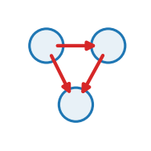

::: {.op-head}
{.op-logo}

[`lateral`]{.op-badge} [`acts on: neuron`]{.op-badge} [`prediction: none`]{.op-badge}

Passive connectome signalling on a neuron set.
:::

```{=html}
<style>
.op-grid{display:grid;grid-template-columns:repeat(auto-fill,minmax(270px,1fr));gap:.7rem;margin:1rem 0 1.6rem}
.op-card{display:flex;align-items:center;gap:.7rem;padding:.6rem .75rem;border:1px solid var(--bs-border-color,#dee2e6);
  border-radius:10px;text-decoration:none;color:inherit;background:var(--bs-body-bg,#fff);transition:.12s}
.op-card:hover{border-color:#1f77b4;box-shadow:0 2px 8px rgba(31,119,180,.13);transform:translateY(-1px)}
.op-card img{width:42px;height:42px;flex:0 0 42px;object-fit:contain}
.op-card-body{display:flex;flex-direction:column;min-width:0}
.op-card-name{font-weight:600;font-family:var(--bs-font-monospace,monospace);color:#1f77b4}
.op-card-sub{font-size:.8em;color:#6c757d;line-height:1.25;overflow:hidden;display:-webkit-box;-webkit-line-clamp:2;-webkit-box-orient:vertical}
.kind-h{height:1.5em;vertical-align:-.35em;margin-right:.25rem}
.kind-sym{color:#adb5bd;font-weight:400;margin-left:.3rem}
.op-head{display:block;border-left:3px solid #1f77b4;padding:.2rem 0 .2rem 1rem;margin:.5rem 0 1.5rem}
.op-logo{width:74px;height:74px;float:right;margin:-.2rem 0 .4rem 1rem;object-fit:contain}
.op-badge{font-size:.78em;background:rgba(31,119,180,.1);color:#1f77b4;border-radius:5px;padding:.05rem .4rem;margin-right:.2rem;white-space:nowrap}
.op-vid{margin:.4rem 0}.op-vid video{width:100%;max-width:520px;border-radius:8px;background:#000;display:block}
.op-vid figcaption{font-size:.85em;color:#6c757d;margin-top:.3rem;max-width:520px}
</style>
```

## Role in Plexus

- **Kind** &mdash; $\mathcal{O}_E$ **Lateral**: within-set interaction over a relation $E$.
- **Acts on** &mdash; `neuron` (the level the operator runs at).
- **Reads** &mdash; `tau`, `edge_set`
- **Writes / returns** &mdash; emits **no integrated force** &mdash; it mutates a field / relation / membership, or feeds a substep.
- **Prediction** &mdash; `none`.
- **Dimensions** &mdash; 2D, 3D.

## Mechanism

A fixed-connectome Lateral operator: each neuron integrates a first-order voltage ODE
driven by weighted, activated input from its presynaptic neighbours,

    tau * dv_i/dt = -v_i + b_i + sum_{e: post(e)=i} W_e * phi(v_{pre(e)}) .

"Passive" means the synaptic weight `W_e` is a fixed edge parameter -- no synapse state
(a stateful `synapse_ode` is a later PR). The connectome is read as a `synapse` EDGE-SET
(PR2): gather phi(v) along the `pre` incidence map, weight by the synapse `w` block, and
scatter onto the `post` neuron via `H.scatter_along` (an Aggregate along an incidence
map). First-order in voltage, so EMIT=velocity; the engine integrates the neuron's
`voltage` coordinate (PR1's schema-driven, boundary-free integration).

This is the paper's degenerate case: drop the synapse state and the edge-set collapses
to a plain weighted connectome, one Lateral operator on the neuron set.

## Parameters

| parameter | role | default |
|---|---|---|
| `tau` | membrane_time_constant | **required** |
| `edge_set` | connectome_synapse_set | **required** |
| `activation` | presynaptic_nonlinearity | "relu" |
| `bias` | resting_drive | 0.0 |
| `weight` | synapse_weight_block | "w" |
| `block` | &ndash; | "voltage" |

## Minimal spec

```yaml
operators:
  - {op: signal, at: neuron, tau: ..., edge_set: ...}
```

## Mechanism-search tags

**Mechanism** &mdash; [`signal_propagation`]{.op-badge} [`connectome`]{.op-badge} [`recurrent`]{.op-badge}  

## Related operators

Other **lateral** operators: [`attraction_repulsion`](attraction_repulsion.qmd), [`squared_law`](squared_law.qmd), [`attractor_flow`](attractor_flow.qmd), [`cohesion`](cohesion.qmd), [`velocity_align`](velocity_align.qmd), [`alignment`](alignment.qmd).

## Source

[`src/plexus/operators/signal.py`](https://github.com/allierc/Plexus/blob/main/src/plexus/operators/signal.py) &mdash; the registered operator.

```python
"""signal -- passive connectome signalling on a neuron set.

A fixed-connectome Lateral operator: each neuron integrates a first-order voltage ODE
driven by weighted, activated input from its presynaptic neighbours,

    tau * dv_i/dt = -v_i + b_i + sum_{e: post(e)=i} W_e * phi(v_{pre(e)}) .

"Passive" means the synaptic weight `W_e` is a fixed edge parameter -- no synapse state
(a stateful `synapse_ode` is a later PR). The connectome is read as a `synapse` EDGE-SET
(PR2): gather phi(v) along the `pre` incidence map, weight by the synapse `w` block, and
scatter onto the `post` neuron via `H.scatter_along` (an Aggregate along an incidence
map). First-order in voltage, so EMIT=velocity; the engine integrates the neuron's
`voltage` coordinate (PR1's schema-driven, boundary-free integration).

This is the paper's degenerate case: drop the synapse state and the edge-set collapses
to a plain weighted connectome, one Lateral operator on the neuron set.
"""
from __future__ import annotations

import torch
import torch.nn.functional as F

from plexus.models.base import Lateral
from plexus.models.registry import register_operator

_ACT = {
    "relu": torch.relu,
    "tanh": torch.tanh,
    "softplus": F.softplus,
    "sigmoid": torch.sigmoid,
    "identity": lambda x: x,
}


@register_operator("signal", family="interaction", level="neuron", kind="lateral")
class Signal(Lateral):
    EMIT = "velocity"                     # first-order voltage ODE (dv/dt); engine integrates the `voltage` coordinate
    SUPPORTED_DIMS = [2, 3]               # voltage is scalar -- the operator ignores spatial dimension
    REQUIRES_PARAMS = ["tau", "edge_set"]
    MECHANISM_TAGS = ["signal_propagation", "connectome", "recurrent"]
    PARAM_ROLES = {
        "tau": "membrane_time_constant",
        "edge_set": "connectome_synapse_set",
        "activation": "presynaptic_nonlinearity",
        "bias": "resting_drive",
        "weight": "synapse_weight_block",
    }

    def __init__(self, params, device="cpu"):
        super().__init__(params, device)
        self.tau = float(params["tau"])
        self.edge_set = params["edge_set"]
        self.act = _ACT[params.get("activation", "relu")]
        self.bias = float(params.get("bias", 0.0))
        self.weight_block = params.get("weight", "w")     # synapse state block holding W_e
        self.block = params.get("block", "voltage")       # the neuron state block to evolve
        self.at = params.get("_at", "neuron")

    def forward(self, H, mask=None):
        neuron = H.level(self.at)
        v = neuron.get(self.block)                                 # [N, 1]  membrane voltage
        es = H.level(self.edge_set)
        v_pre = H.gather(self.edge_set, "pre", self.block)         # [E, 1]  presynaptic voltage per edge (lift along `pre`)
        w = es.get(self.weight_block)                              # [E, 1]  fixed synaptic weight W_e
        edge_msg = w * self.act(v_pre)                             # [E, 1]  W_e * phi(v_pre)
        current = H.scatter_along(self.edge_set, "post", edge_msg) # [N, 1]  synaptic current onto post neuron (Aggregate along `post`)
        dv = (-v + self.bias + current) / self.tau                 # [N, 1]  first-order voltage derivative
        dv = dv * neuron.occ[:, None]                              # dormant neurons do not move
        if mask is not None:
            dv = dv * mask[:, None].float()
        return {self.at: dv}
```
