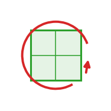

::: {.op-head}
{.op-logo}

[`field`]{.op-badge} [`frame: video`]{.op-badge}

A scalar field *prescribed* from an external video, plus the
:::

```{=html}
<style>
.op-grid{display:grid;grid-template-columns:repeat(auto-fill,minmax(270px,1fr));gap:.7rem;margin:1rem 0 1.6rem}
.op-card{display:flex;align-items:center;gap:.7rem;padding:.6rem .75rem;border:1px solid var(--bs-border-color,#dee2e6);
  border-radius:10px;text-decoration:none;color:inherit;background:var(--bs-body-bg,#fff);transition:.12s}
.op-card:hover{border-color:#1f77b4;box-shadow:0 2px 8px rgba(31,119,180,.13);transform:translateY(-1px)}
.op-card img{width:42px;height:42px;flex:0 0 42px;object-fit:contain}
.op-card-body{display:flex;flex-direction:column;min-width:0}
.op-card-name{font-weight:600;font-family:var(--bs-font-monospace,monospace);color:#1f77b4}
.op-card-sub{font-size:.8em;color:#6c757d;line-height:1.25;overflow:hidden;display:-webkit-box;-webkit-line-clamp:2;-webkit-box-orient:vertical}
.kind-h{height:1.5em;vertical-align:-.35em;margin-right:.25rem}
.kind-sym{color:#adb5bd;font-weight:400;margin-left:.3rem}
.op-head{display:block;border-left:3px solid #1f77b4;padding:.2rem 0 .2rem 1rem;margin:.5rem 0 1.5rem}
.op-logo{width:74px;height:74px;float:right;margin:-.2rem 0 .4rem 1rem;object-fit:contain}
.op-badge{font-size:.78em;background:rgba(31,119,180,.1);color:#1f77b4;border-radius:5px;padding:.05rem .4rem;margin-right:.2rem;white-space:nowrap}
.op-vid{margin:.4rem 0}.op-vid video{width:100%;max-width:520px;border-radius:8px;background:#000;display:block}
.op-vid figcaption{font-size:.85em;color:#6c757d;margin-top:.3rem;max-width:520px}
</style>
```

## Role in Plexus

- **Frame** &mdash; `video` (how the continuum is discretized).
- **Couples to** &mdash; any set, via an `exchange` operator.
- **Used by** &mdash; `exchange` operators (scatter / gather) and `field` self-dynamics.

## Description

`playback` operator that advances it frame by frame.

Some fields are not evolved by a PDE (diffuse/decay) but read from data: a recorded
movie becomes a time-varying scalar field over the domain. The field is pure state
(it holds the video buffer and the current grid); `playback` sets the grid to the
current tick's frame (a field self-update, returns {}). A coupling operator such as
`chemotaxis` then drives the particles from it -- the same set<->field Exchange the
slime trail used, but the field is supplied rather than deposited.

This is the Plexus form of ParticleGraph's `node_value_map: video_bisons.tif`.

## Source

[`src/plexus/operators/video_field.py`](https://github.com/allierc/Plexus/blob/main/src/plexus/operators/video_field.py)

```python
@register_field("video", frame="video")
class VideoField(Field):
    """A 1-channel scalar field whose grid is read from a video `[T, ny, nx]` (tif).
    Pure state: the `video` buffer `[T, nx, ny]`, the current `grid` `[1, nx, ny]`,
    and the world<->pixel geometry. No dynamics -- `playback` drives it."""

    def __init__(self, name, source=None, res=None, width=1.0, device="cpu"):
        super().__init__(name)                                 # a video binds to no set (no couples_to)
        import tifffile
        path = source if os.path.isabs(source) else graphs_data_path(source)
        vid = tifffile.imread(path).astype("float32")          # [T, ny, nx] (image rows top->bottom)
        vid = vid[:, ::-1, :].copy()                           # flip vertically: image-top -> domain-top
        v = torch.tensor(vid, device=device).permute(0, 2, 1).contiguous()  # -> [T, nx, ny]
        self.C = 1
        self.T = v.shape[0]
        self.nx, self.ny = v.shape[1], v.shape[2]
        self.width = float(width)
        self.R = self.nx / self.width                          # pixels per world unit (x)
        self.register_buffer("video", v)                       # [T, nx, ny]
        self.register_buffer("grid", v[0:1].clone())           # [1, nx, ny]

    def pix(self, x, y):
        gx = (x.clamp(0, self.width - 1e-6) / self.width * self.nx).long().clamp(0, self.nx - 1)
        gy = (y.clamp(0, 1 - 1e-6) * self.ny).long().clamp(0, self.ny - 1)
        return gx, gy
```
