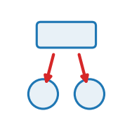

```{=html}
<style>
.op-grid{display:grid;grid-template-columns:repeat(auto-fill,minmax(270px,1fr));gap:.7rem;margin:1rem 0 1.6rem}
.op-card{display:flex;align-items:center;gap:.7rem;padding:.6rem .75rem;border:1px solid var(--bs-border-color,#dee2e6);
  border-radius:10px;text-decoration:none;color:inherit;background:var(--bs-body-bg,#fff);transition:.12s}
.op-card:hover{border-color:#1f77b4;box-shadow:0 2px 8px rgba(31,119,180,.13);transform:translateY(-1px)}
.op-card img{width:42px;height:42px;flex:0 0 42px;object-fit:contain}
.op-card-body{display:flex;flex-direction:column;min-width:0}
.op-card-name{font-weight:600;font-family:var(--bs-font-monospace,monospace);color:#1f77b4}
.op-card-sub{font-size:.8em;color:#6c757d;line-height:1.25;overflow:hidden;display:-webkit-box;-webkit-line-clamp:2;-webkit-box-orient:vertical}
.kind-h{height:1.5em;vertical-align:-.35em;margin-right:.25rem}
.kind-sym{color:#adb5bd;font-weight:400;margin-left:.3rem}
.op-head{display:block;border-left:3px solid #1f77b4;padding:.2rem 0 .2rem 1rem;margin:.5rem 0 1.5rem}
.op-logo{width:74px;height:74px;float:right;margin:-.2rem 0 .4rem 1rem;object-fit:contain}
.op-badge{font-size:.78em;background:rgba(31,119,180,.1);color:#1f77b4;border-radius:5px;padding:.05rem .4rem;margin-right:.2rem;white-space:nowrap}
.op-vid{margin:.4rem 0}.op-vid video{width:100%;max-width:520px;border-radius:8px;background:#000;display:block}
.op-vid figcaption{font-size:.85em;color:#6c757d;margin-top:.3rem;max-width:520px}
</style>
```


Each operator belongs to one of the elementary **families** of the [operator algebra](language.qmd) &mdash; Lateral, Aggregate, Broadcast, Exchange, Rewire, Divide and Die; the logo marks the family (`paper/fig_ops.tex`). The registry also exposes a **field** self-dynamics kind (a field&rsquo;s own update).

##  Lateral <span class="kind-sym">$\mathcal{O}_E$</span>

*Within-set interaction over a relation $E$.*

::: {.op-grid}
<a class="op-card" href="library/alignment.html"><span class="op-card-body"><span class="op-card-name">alignment</span><span class="op-card-sub">Velocity_align (was alignment) -- Vicsek-style neighbour velocity alignment (the NOMINAL model);</span></span></a>
<a class="op-card" href="library/attraction_repulsion.html"><span class="op-card-body"><span class="op-card-name">attraction_repulsion</span><span class="op-card-sub">Analytic attraction-repulsion: a smooth, per-type pairwise interaction law.</span></span></a>
<a class="op-card" href="library/attractor_flow.html"><span class="op-card-body"><span class="op-card-name">attractor_flow</span><span class="op-card-sub">Ride a set along a strange-attractor vector field dx/dt = f(x).</span></span></a>
<a class="op-card" href="library/bounce.html"><span class="op-card-body"><span class="op-card-name">bounce</span><span class="op-card-sub">Set. Reflect a self-propelled agent off the domain walls / obstacles.</span></span></a>
<a class="op-card" href="library/cohesion.html"><span class="op-card-body"><span class="op-card-name">cohesion</span><span class="op-card-sub">A boids steering rule (Lateral, second-derivative).</span></span></a>
<a class="op-card" href="library/cruise.html"><span class="op-card-body"><span class="op-card-name">cruise</span><span class="op-card-sub">Velocity_cruise (was cruise) -- Vicsek active-matter self-propulsion: drive the velocity toward a cruising speed (inertial, second-order; the velocity-dynamic sibling of `glide`).</span></span></a>
<a class="op-card" href="library/drag.html"><span class="op-card-body"><span class="op-card-name">drag</span><span class="op-card-sub">Viscous friction as a composable operator (not an integration knob).</span></span></a>
<a class="op-card" href="library/glide.html"><span class="op-card-body"><span class="op-card-name">glide</span><span class="op-card-sub">Set (lateral). Self-propulsion: glide along the heading at constant speed (overdamped, first-order; the heading-kinematic sibling of `cruise`).</span></span></a>
<a class="op-card" href="library/gravity.html"><span class="op-card-body"><span class="op-card-name">gravity</span><span class="op-card-sub">A uniform body force at the cell level.</span></span></a>
<a class="op-card" href="library/mpm_anchor.html"><span class="op-card-body"><span class="op-card-name">mpm_anchor</span><span class="op-card-sub">A substrate/boundary rest-anchor body force for MLS-MPM particles.</span></span></a>
<a class="op-card" href="library/mpm_spin.html"><span class="op-card-body"><span class="op-card-name">mpm_spin</span><span class="op-card-sub">Drive an MLS-MPM body toward slow solid-body rotation (a body force).</span></span></a>
<a class="op-card" href="library/mpm_strain.html"><span class="op-card-body"><span class="op-card-name">mpm_strain</span><span class="op-card-sub">Mpm_strain (particle -> particle): the MLS-MPM deformation-gradient + material update.</span></span></a>
<a class="op-card" href="library/sediment.html"><span class="op-card-body"><span class="op-card-name">sediment</span><span class="op-card-sub">A per-agent constant directional drift (a first-order body force at</span></span></a>
<a class="op-card" href="library/separation.html"><span class="op-card-body"><span class="op-card-name">separation</span><span class="op-card-sub">A boids steering rule (Lateral, second-derivative).</span></span></a>
<a class="op-card" href="library/signal.html"><span class="op-card-body"><span class="op-card-name">signal</span><span class="op-card-sub">Passive connectome signalling on a neuron set.</span></span></a>
<a class="op-card" href="library/squared_law.html"><span class="op-card-body"><span class="op-card-name">squared_law</span><span class="op-card-sub">The inverse-square law between particles: electrostatics (Coulomb) OR gravity (Newton).</span></span></a>
<a class="op-card" href="library/velocity_align.html"><span class="op-card-body"><span class="op-card-name">velocity_align</span><span class="op-card-sub">Velocity_align (was alignment) -- Vicsek-style neighbour velocity alignment (the NOMINAL model);</span></span></a>
<a class="op-card" href="library/velocity_cruise.html"><span class="op-card-body"><span class="op-card-name">velocity_cruise</span><span class="op-card-sub">Velocity_cruise (was cruise) -- Vicsek active-matter self-propulsion: drive the velocity toward a cruising speed (inertial, second-order; the velocity-dynamic sibling of `glide`).</span></span></a>
:::

##  Aggregate <span class="kind-sym">$\textstyle\sum_\pi$</span>

*Children &rarr; parent, up the containment $\pi$.*

::: {.op-grid}
<a class="op-card" href="library/aggregate.html"><span class="op-card-body"><span class="op-card-name">aggregate</span><span class="op-card-sub">Children -> parent. Reduce a contained set onto its parent.</span></span></a>
:::

##  Broadcast <span class="kind-sym">$\pi^*$</span>

*Parent &rarr; children, down the containment $\pi$.*

::: {.op-grid}
<a class="op-card" href="library/broadcast.html"><span class="op-card-body"><span class="op-card-name">broadcast</span><span class="op-card-sub">Parent -> children. Lift a parent quantity onto its children.</span></span></a>
:::

##  Exchange <span class="kind-sym">push / pull</span>

*Set &harr; field.*

::: {.op-grid}
<a class="op-card" href="library/active_force.html"><span class="op-card-body"><span class="op-card-name">active_force</span><span class="op-card-sub">The FORCE constitutive law: an activation field -> per-particle MPM body force.</span></span></a>
<a class="op-card" href="library/active_stress.html"><span class="op-card-body"><span class="op-card-name">active_stress</span><span class="op-card-sub">The STRESS constitutive law: an activation field -> per-particle active stress.</span></span></a>
<a class="op-card" href="library/agent_gather.html"><span class="op-card-body"><span class="op-card-name">agent_gather</span><span class="op-card-sub">Agent_gather (was mpm_to_agent) (mpm_grid -> agent set): the material drags the agents, and the fluid's</span></span></a>
<a class="op-card" href="library/agent_remodel.html"><span class="op-card-body"><span class="op-card-name">agent_remodel</span><span class="op-card-sub">Agent_remodel (agent set -> mpm_particle stiffness): cells remodel the tissue.</span></span></a>
<a class="op-card" href="library/agent_scatter.html"><span class="op-card-body"><span class="op-card-name">agent_scatter</span><span class="op-card-sub">Agent_scatter (was agent_to_mpm) (agent set -> mpm_grid): the agents deform the material.</span></span></a>
<a class="op-card" href="library/agent_to_mpm.html"><span class="op-card-body"><span class="op-card-name">agent_to_mpm</span><span class="op-card-sub">Agent_scatter (was agent_to_mpm) (agent set -> mpm_grid): the agents deform the material.</span></span></a>
<a class="op-card" href="library/apply_material_map.html"><span class="op-card-body"><span class="op-card-name">apply_material_map</span><span class="op-card-sub">A static image FIELD read from a TIFF, plus `apply_material_map`,</span></span></a>
<a class="op-card" href="library/chemotax.html"><span class="op-card-body"><span class="op-card-name">chemotax</span><span class="op-card-sub">Set <- field. Nodes follow (or flee) a field's gradient.</span></span></a>
<a class="op-card" href="library/deposit.html"><span class="op-card-body"><span class="op-card-name">deposit</span><span class="op-card-sub">Set -> field. Each agent adds to the field at its own pixel.</span></span></a>
<a class="op-card" href="library/flow_align.html"><span class="op-card-body"><span class="op-card-name">flow_align</span><span class="op-card-sub">Polarity_flow_align (was flow_align) (mpm_grid -> agent heading): polarity-velocity alignment to the tissue FLOW.</span></span></a>
<a class="op-card" href="library/g2p.html"><span class="op-card-body"><span class="op-card-name">g2p</span><span class="op-card-sub">Mpm_gather (was g2p) (mpm_grid -> particle): the MLS-MPM grid-to-particle gather + advection.</span></span></a>
<a class="op-card" href="library/heading_align.html"><span class="op-card-body"><span class="op-card-name">heading_align</span><span class="op-card-sub">Polarity_align (was heading_align) (agent set -> agent heading): FIRST-ORDER Vicsek polar alignment.</span></span></a>
<a class="op-card" href="library/mls_mpm_mechanics.html"><span class="op-card-body"><span class="op-card-name">mls_mpm_mechanics</span><span class="op-card-sub">A FENCED TRANSITIONAL operator wrapping the MLS-MPM solver.</span></span></a>
<a class="op-card" href="library/mpm_gather.html"><span class="op-card-body"><span class="op-card-name">mpm_gather</span><span class="op-card-sub">Mpm_gather (was g2p) (mpm_grid -> particle): the MLS-MPM grid-to-particle gather + advection.</span></span></a>
<a class="op-card" href="library/mpm_scatter.html"><span class="op-card-body"><span class="op-card-name">mpm_scatter</span><span class="op-card-sub">Mpm_scatter (was p2g) (particle -> mpm_grid): the MLS-MPM particle-to-grid scatter.</span></span></a>
<a class="op-card" href="library/mpm_to_agent.html"><span class="op-card-body"><span class="op-card-name">mpm_to_agent</span><span class="op-card-sub">Agent_gather (was mpm_to_agent) (mpm_grid -> agent set): the material drags the agents, and the fluid's</span></span></a>
<a class="op-card" href="library/p2g.html"><span class="op-card-body"><span class="op-card-name">p2g</span><span class="op-card-sub">Mpm_scatter (was p2g) (particle -> mpm_grid): the MLS-MPM particle-to-grid scatter.</span></span></a>
<a class="op-card" href="library/polarity_align.html"><span class="op-card-body"><span class="op-card-name">polarity_align</span><span class="op-card-sub">Polarity_align (was heading_align) (agent set -> agent heading): FIRST-ORDER Vicsek polar alignment.</span></span></a>
<a class="op-card" href="library/polarity_flow_align.html"><span class="op-card-body"><span class="op-card-name">polarity_flow_align</span><span class="op-card-sub">Polarity_flow_align (was flow_align) (mpm_grid -> agent heading): polarity-velocity alignment to the tissue FLOW.</span></span></a>
<a class="op-card" href="library/pulse_to_active_stress.html"><span class="op-card-body"><span class="op-card-name">pulse_to_active_stress</span><span class="op-card-sub">The STRESS constitutive law: an activation field -> per-particle active stress.</span></span></a>
<a class="op-card" href="library/pulse_to_contraction.html"><span class="op-card-body"><span class="op-card-name">pulse_to_contraction</span><span class="op-card-sub">The FORCE constitutive law: an activation field -> per-particle MPM body force.</span></span></a>
<a class="op-card" href="library/sense.html"><span class="op-card-body"><span class="op-card-name">sense</span><span class="op-card-sub">Field -> set. Sample the field on a sensor fan around the heading, steer.</span></span></a>
:::

##  Rewire <span class="kind-sym">$\mathcal{R}\!:E$</span>

*Rebuild the relation $E$ each tick.*

::: {.op-grid}
<a class="op-card" href="library/radius_graph.html"><span class="op-card-body"><span class="op-card-name">radius_graph</span><span class="op-card-sub">Relation-building (rewire) operators: construct a Level's `edge_index`.</span></span></a>
:::

##  Structural <span class="kind-sym">$|S|$</span>

*Change the entities themselves &mdash; Divide, Die, grow.*

::: {.op-grid}
<a class="op-card" href="library/cell_divide.html"><span class="op-card-body"><span class="op-card-name">cell_divide</span><span class="op-card-sub">Cell_divide (agent set, structural): proliferation on a fixed buffer via occupancy.</span></span></a>
<a class="op-card" href="library/cell_grow.html"><span class="op-card-body"><span class="op-card-name">cell_grow</span><span class="op-card-sub">Cell_grow (cell, structural): CELL rest-VOLUME growth -- the biological growth primitive.</span></span></a>
:::

##  Field <span class="kind-sym">$\partial_t\phi$</span>

*A field's own self-dynamics.*

::: {.op-grid}
<a class="op-card" href="library/activation_pulse.html"><span class="op-card-body"><span class="op-card-name">activation_pulse</span><span class="op-card-sub">Paint a clocked activation field. ONE operator, two timing modes,</span></span></a>
<a class="op-card" href="library/decay.html"><span class="op-card-body"><span class="op-card-name">decay</span><span class="op-card-sub">Field -> field. Linear evaporation of a scalar field.</span></span></a>
<a class="op-card" href="library/diffuse.html"><span class="op-card-body"><span class="op-card-name">diffuse</span><span class="op-card-sub">Field -> field. One discrete diffusion step on a scalar field.</span></span></a>
<a class="op-card" href="library/mpm_grid_update.html"><span class="op-card-body"><span class="op-card-name">mpm_grid_update</span><span class="op-card-sub">Mpm_grid_update (mpm_grid -> mpm_grid): the MLS-MPM grid solve.</span></span></a>
<a class="op-card" href="library/pacemaker.html"><span class="op-card-body"><span class="op-card-name">pacemaker</span><span class="op-card-sub">A clocked scalar SOURCE: a periodic activation signal p(t).</span></span></a>
<a class="op-card" href="library/playback.html"><span class="op-card-body"><span class="op-card-name">playback</span><span class="op-card-sub">A scalar field *prescribed* from external data (currently a</span></span></a>
:::
