# Scenario gallery

Every archived scenario: thumbnail (start→end), exact spec, seed, and generic metrics (path = mean per-cell distance travelled; aspect = cell elongation; nnd = nearest-neighbour distance / clustering). Regenerate with `python archive.py scenarios/*.yaml`.

### aggregate

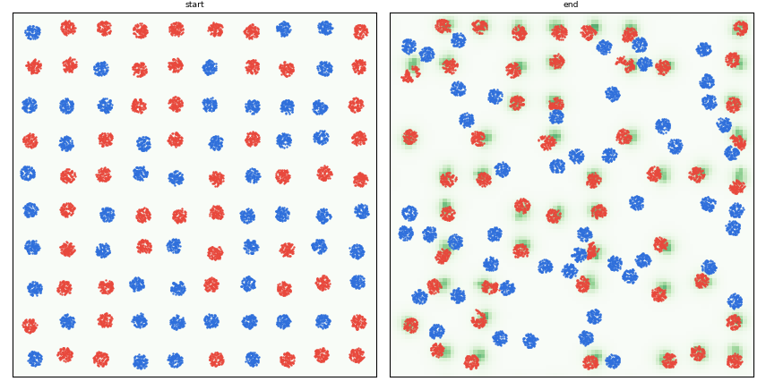

100 cells × 100 particles, 63 frames, finite=True. [spec](archive/aggregate/scenario.yaml)

- soft: path 0.96, aspect 1.10->1.19, nnd 0.101->0.102; stiff: path 0.21, aspect 1.12->1.12, nnd 0.101->0.079

### ant

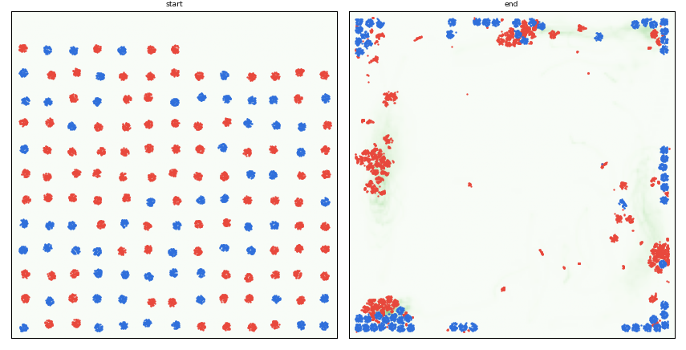

150 cells × 60 particles, 251 frames, finite=True. [spec](archive/ant/scenario.yaml)

- soft: path 7.21, aspect 1.14->9.55, nnd 0.074->0.028; stiff: path 3.97, aspect 1.15->1.53, nnd 0.082->0.033

### chase

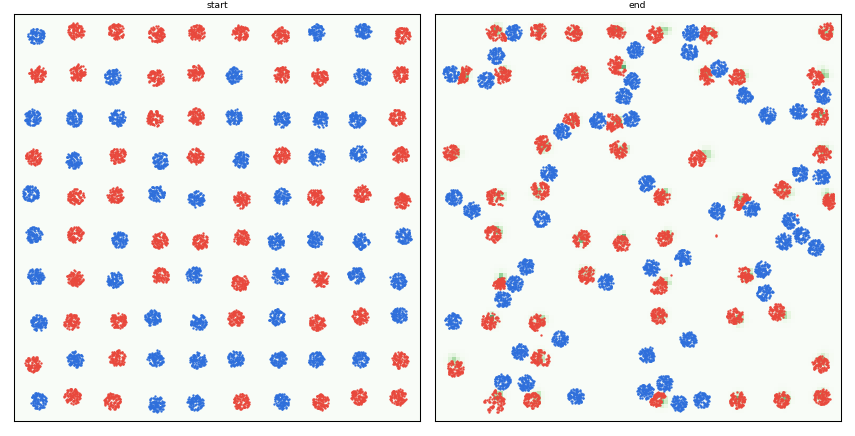

100 cells × 100 particles, 63 frames, finite=True. [spec](archive/chase/scenario.yaml)

- soft: path 0.78, aspect 1.10->1.26, nnd 0.101->0.098; stiff: path 0.42, aspect 1.12->1.12, nnd 0.101->0.072

### clusters

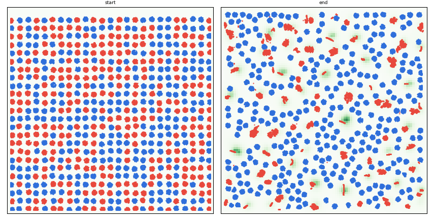

600 cells × 100 particles, 601 frames, finite=True. [spec](archive/clusters/scenario.yaml)

- soft: path 2.51, aspect 1.13->153.85, nnd 0.040->0.008; stiff: path 0.37, aspect 1.12->1.12, nnd 0.040->0.037

### collapse

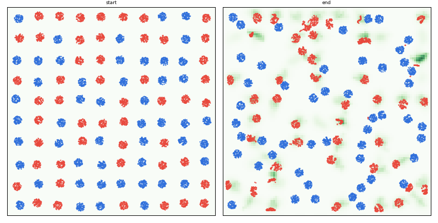

100 cells × 100 particles, 63 frames, finite=True. [spec](archive/collapse/scenario.yaml)

- soft: path 1.25, aspect 1.10->16.11, nnd 0.101->0.077; stiff: path 0.17, aspect 1.12->1.12, nnd 0.101->0.082

### crystal

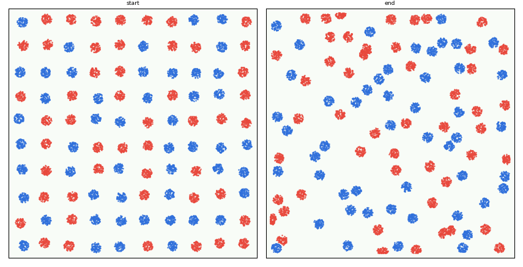

100 cells × 100 particles, 63 frames, finite=True. [spec](archive/crystal/scenario.yaml)

- soft: path 0.38, aspect 1.10->1.19, nnd 0.101->0.091; stiff: path 0.38, aspect 1.12->1.12, nnd 0.101->0.093

### disperse

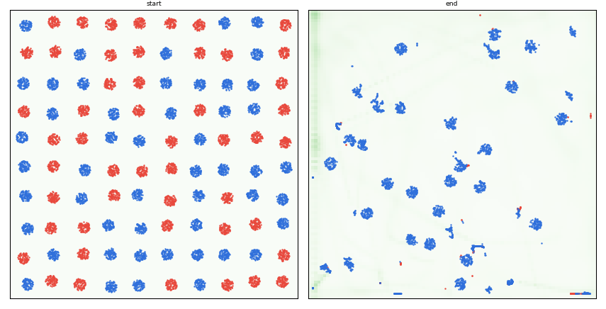

100 cells × 100 particles, 63 frames, finite=True. [spec](archive/disperse/scenario.yaml)

- soft: path 3.60, aspect 1.10->23342.75, nnd 0.101->0.019; stiff: path 2.07, aspect 1.12->1623.25, nnd 0.101->0.064

### mixed

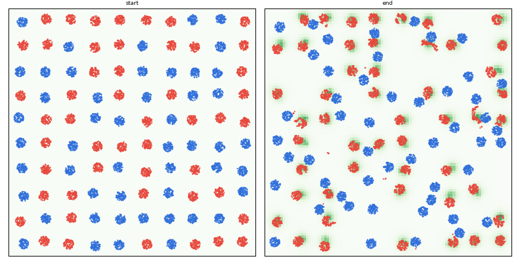

100 cells × 100 particles, 63 frames, finite=True. [spec](archive/mixed/scenario.yaml)

- soft: path 0.95, aspect 1.10->1.36, nnd 0.101->0.099; stiff: path 0.25, aspect 1.12->1.12, nnd 0.101->0.095

### sort

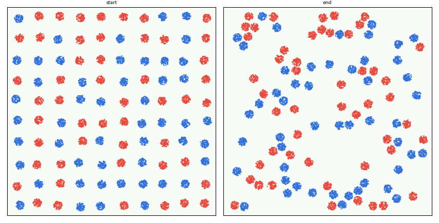

100 cells × 100 particles, 63 frames, finite=True. [spec](archive/sort/scenario.yaml)

- soft: path 0.32, aspect 1.10->1.10, nnd 0.101->0.077; stiff: path 0.29, aspect 1.12->1.12, nnd 0.101->0.075

### squish

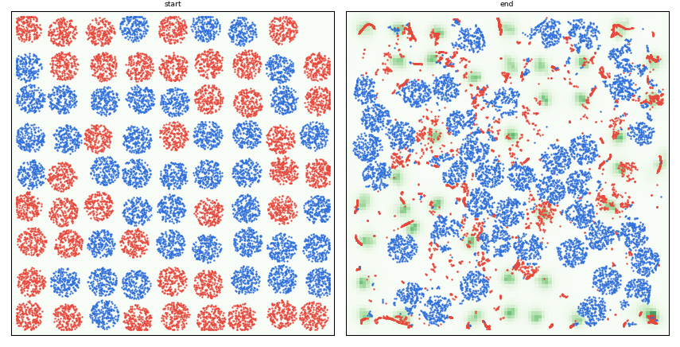

80 cells × 200 particles, 63 frames, finite=True. [spec](archive/squish/scenario.yaml)

- soft: path 1.34, aspect 1.08->2.99, nnd 0.115->0.104; stiff: path 0.20, aspect 1.07->1.33, nnd 0.110->0.104

### swarm

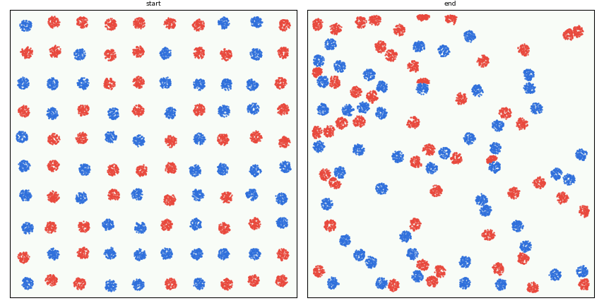

100 cells × 100 particles, 63 frames, finite=True. [spec](archive/swarm/scenario.yaml)

- soft: path 0.52, aspect 1.10->1.22, nnd 0.101->0.084; stiff: path 0.50, aspect 1.12->1.12, nnd 0.101->0.081

### wander

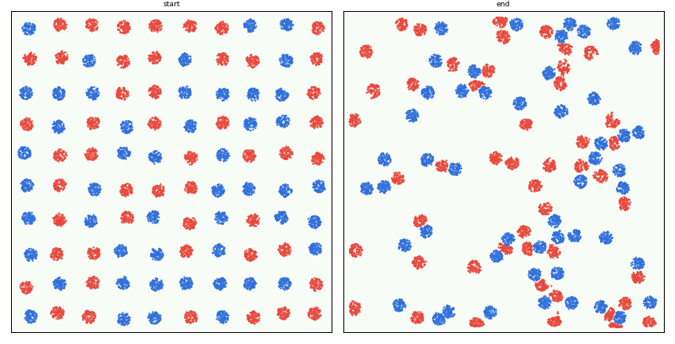

100 cells × 100 particles, 63 frames, finite=True. [spec](archive/wander/scenario.yaml)

- soft: path 0.59, aspect 1.10->1.30, nnd 0.101->0.090; stiff: path 0.59, aspect 1.12->1.12, nnd 0.101->0.078
